# Awesome Claude Video Skills

[中文](README.zh-CN.md)

Open-source skills and toolkits that let **Claude Code, Codex and other coding agents make video**: HyperFrames, Remotion, motion graphics, editing, explainers, avatars. 245 repos, each one read and security-graded by [Agent Skills Hub](https://agentskillshub.top?utm_source=github&utm_medium=awesome-list).

Live page with filters: **[https://agentskillshub.top/best/claude-video-skills/](https://agentskillshub.top/best/claude-video-skills/?utm_source=github&utm_medium=awesome-list)** · refreshed every 8 hours

## What these tools make

<table>
<tr>
<td align="center" valign="top" width="33%"><b>🧱 Frameworks & toolkits</b> 42 repos   Rendering frameworks and all-round toolkits. <a href="#type-general"><b>View the list →</b></a></td>
<td align="center" valign="top" width="33%"><b>📣 Promo & demos</b> 46 repos   Product launch films, ads and demo videos. <a href="#type-promo"><b>View the list →</b></a></td>
<td align="center" valign="top" width="33%"><b>🎓 Explainers</b> 41 repos  <a href="https://github.com/vibe-motion/remotion-code-motion-explainer">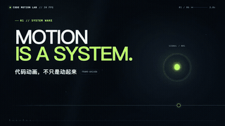</a> Knowledge videos, tutorials and narrated lessons. <a href="#type-explainer"><b>View the list →</b></a></td>
</tr>
<tr>
<td align="center" valign="top" width="33%"><b>✂️ Editing</b> 37 repos   Cutting, captions, B-roll and recaps of existing footage. <a href="#type-editing"><b>View the list →</b></a></td>
<td align="center" valign="top" width="33%"><b>📱 Shorts & social</b> 28 repos   Vertical video for Reels, Shorts, TikTok and Douyin. <a href="#type-shorts"><b>View the list →</b></a></td>
<td align="center" valign="top" width="33%"><b>🧑‍💼 Avatars</b> 6 repos  Digital humans, virtual presenters and lip-sync. <a href="#type-avatar"><b>View the list →</b></a></td>
</tr>
<tr>
<td align="center" valign="top" width="33%"><b>📖 Stories & animation</b> 15 repos   Animated tales, short dramas and cinematic scenes. <a href="#type-story"><b>View the list →</b></a></td>
<td align="center" valign="top" width="33%"><b>🎞 Motion graphics</b> 14 repos   Animated logos, titles, UI motion and GIFs. <a href="#type-motion"><b>View the list →</b></a></td>
<td align="center" valign="top" width="33%"><b>📝 Scripts & learning</b> 10 repos   What comes before the video: scripts, shot analysis, learning. <a href="#type-craft"><b>View the list →</b></a></td>
</tr>
<tr>
<td align="center" valign="top" width="33%"><b>🎵 Music videos</b> 6 repos   Music videos made in code. <a href="#type-music"><b>View the list →</b></a></td>
</tr>
</table>

## Contents

- [Made with Claude Opus 5.5](#made-with-opus-55)
- [🧱 Frameworks & toolkits](#type-general) (42)
- [📣 Promo & demos](#type-promo) (46)
- [🎓 Explainers](#type-explainer) (41)
- [✂️ Editing](#type-editing) (37)
- [📱 Shorts & social](#type-shorts) (28)
- [🧑‍💼 Avatars](#type-avatar) (6)
- [📖 Stories & animation](#type-story) (15)
- [🎞 Motion graphics](#type-motion) (14)
- [📝 Scripts & learning](#type-craft) (10)
- [🎵 Music videos](#type-music) (6)

## How a repo gets on the list

1. It makes or edits video or motion graphics. A 3D web page or a prompt collection does not count. The few entries under *Scripts & learning* come before the video (screenwriting, shot analysis) and are listed by the maintainer's choice.
2. An agent operates it: a skill, a plugin, an MCP server, or a toolkit written for the agent.
3. It has a README. Without one it cannot be graded.
4. At 50 stars or more it is listed on topic alone. Under 50 it must also clear a README quality bar (shows the result, one-command start, a concrete outcome, complete docs), and have 5 stars unless it names Claude Opus 5.5.

The questions are answered by a decision model reading each README, not by hand. A repo near a cut-off can land on either side; open an issue if one is misfiled.

## Made with Claude Opus 5.5

Projects whose README says they were built with the model.

| Repo | Stars | What it does | Security |
|---|---:|---|---|
| [JohnHeibel/PDoomVideo](https://github.com/JohnHeibel/PDoomVideo) | 1.8k | Source code for the Claude Opus 5.5 music video for I'm Upping My P(doom) | [SAFE](https://agentskillshub.top/skill/JohnHeibel/PDoomVideo/?utm_source=github&utm_medium=awesome-list) |
| [lemomo-ai/lemo-opuscar](https://github.com/lemomo-ai/lemo-opuscar) | 1.0k | Claude Code skill for short films with no video model: 43 film styles, each a style prompt plus a demo film made entirely in code by Claude Opus 5.5… | [SAFE](https://agentskillshub.top/skill/lemomo-ai/lemo-opuscar/?utm_source=github&utm_medium=awesome-list) |
| [JohnHeibel/ClaudeAnimationBase](https://github.com/JohnHeibel/ClaudeAnimationBase) | 771 | A starter kit for animating hand-painted cartoons with Claude: p5.js + p5.brush, the Clawd character, 31 acted emotions and a guide for the model | [SAFE](https://agentskillshub.top/skill/JohnHeibel/ClaudeAnimationBase/?utm_source=github&utm_medium=awesome-list) |
| [ledbetterljoshua/functional-emotions-video](https://github.com/ledbetterljoshua/functional-emotions-video) | 63 | A painted music video for "Functional Emotions", made by Claude Opus 5.5: custom GPU brushstroke renderer, storyboard, and 7 parallel chapter agents. | [SAFE](https://agentskillshub.top/skill/ledbetterljoshua/functional-emotions-video/?utm_source=github&utm_medium=awesome-list) |

## 🧱 Frameworks & toolkits

[Open this type on the live page, sorted by stars →](https://agentskillshub.top/best/claude-video-skills/?utm_source=github&utm_medium=awesome-list#type-general)

<table><tr>
<td align="center" valign="top"><a href="https://github.com/heygen-com/hyperframes">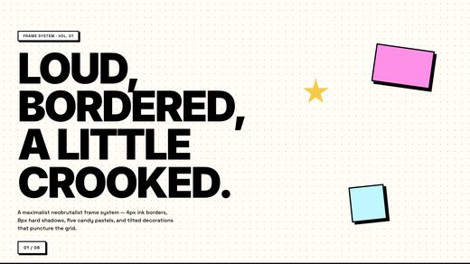</a> <a href="https://github.com/heygen-com/hyperframes">heygen-com/hyperframes</a></td>
<td align="center" valign="top"><a href="https://github.com/digitalsamba/claude-code-video-toolkit">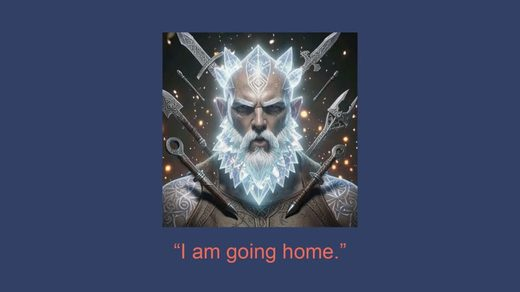</a> <a href="https://github.com/digitalsamba/claude-code-video-toolkit">digitalsamba/claude-code-video-toolkit</a></td>
<td align="center" valign="top"><a href="https://github.com/bangtutorial/bang-motion">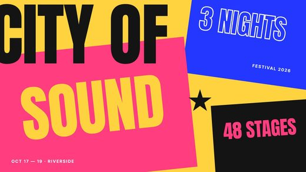</a> <a href="https://github.com/bangtutorial/bang-motion">bangtutorial/bang-motion</a></td>
</tr></table>

| Repo | Stars | What it does | Security |
|---|---:|---|---|
| [calesthio/OpenMontage](https://github.com/calesthio/OpenMontage) | 63.4k | World's first open-source, agentic video production system. 12 production pipelines, 100+ tools, 700+ agent skill and production-knowledge files. Tur… | [SAFE](https://agentskillshub.top/skill/calesthio/OpenMontage/?utm_source=github&utm_medium=awesome-list) |
| [heygen-com/hyperframes](https://github.com/heygen-com/hyperframes) | 56.9k | Write HTML. Render video. Built for agents. | [SAFE](https://agentskillshub.top/skill/heygen-com/hyperframes/?utm_source=github&utm_medium=awesome-list) |
| [hypit-ai/hypit](https://github.com/hypit-ai/hypit) | 19.3k | Clone any viral video with AI agents. Not just a script, the whole workflow: swap the face, the words, the B-roll, ship 100 variants in one command,… | [SAFE](https://agentskillshub.top/skill/hypit-ai/hypit/?utm_source=github&utm_medium=awesome-list) |
| [remotion-dev/skills](https://github.com/remotion-dev/skills) | 4.8k | Agent Skills | [SAFE](https://agentskillshub.top/skill/remotion-dev/skills/?utm_source=github&utm_medium=awesome-list) |
| [NarratorAI-Studio/narrator-ai-cli-skill](https://github.com/NarratorAI-Studio/narrator-ai-cli-skill) | 3.0k | AI 解说大师 — Agent skill；封装 narrator-ai-cli 供 Claude/Codex 等工具调用 | [SAFE](https://agentskillshub.top/skill/NarratorAI-Studio/narrator-ai-cli-skill/?utm_source=github&utm_medium=awesome-list) |
| [digitalsamba/claude-code-video-toolkit](https://github.com/digitalsamba/claude-code-video-toolkit) | 2.2k | AI-native video production toolkit for Claude Code | [SAFE](https://agentskillshub.top/skill/digitalsamba/claude-code-video-toolkit/?utm_source=github&utm_medium=awesome-list) |
| [vibe-motion/skills](https://github.com/vibe-motion/skills) | 1.3k | agent skills for vibe motion | [SAFE](https://agentskillshub.top/skill/vibe-motion/skills/?utm_source=github&utm_medium=awesome-list) |
| [iart-ai/motion-skills](https://github.com/iart-ai/motion-skills) | 697 | 50 open-source skills that teach your AI coding agent to make motion graphics, animation & video — kinetic typography, data-viz, explainers, TikTok/R… | [SAFE](https://agentskillshub.top/skill/iart-ai/motion-skills/?utm_source=github&utm_medium=awesome-list) |
| [bangtutorial/bang-motion](https://github.com/bangtutorial/bang-motion) | 560 | Agent skill for browser motion graphics — openers, promos, bumpers, kinetic typography, and five explainer styles that move like video, not slides. S… | [SAFE](https://agentskillshub.top/skill/bangtutorial/bang-motion/?utm_source=github&utm_medium=awesome-list) |
| [kangarooking/director-skills](https://github.com/kangarooking/director-skills) | 170 | 导演Skill：面向 AI 视频创作的开源 Agent Skills \| Director Skills: Open-source Agent Skills for AI video creation. | [SAFE](https://agentskillshub.top/skill/kangarooking/director-skills/?utm_source=github&utm_medium=awesome-list) |
| [video-db/skills](https://github.com/video-db/skills) | 126 | Server-side video workflows for agents: ingest, understand, search, edit, stream. | [SAFE](https://agentskillshub.top/skill/video-db/skills/?utm_source=github&utm_medium=awesome-list) |
| [jhartquist/claude-remotion-kickstart](https://github.com/jhartquist/claude-remotion-kickstart) | 120 | Create videos programmatically with Claude Code and Remotion | [SAFE](https://agentskillshub.top/skill/jhartquist/claude-remotion-kickstart/?utm_source=github&utm_medium=awesome-list) |
| [FavioVazquez/showtime](https://github.com/FavioVazquez/showtime) | 92 | A local video studio for your coding agent. Describe a video in one sentence: your agent directs, your machine renders. Claude Code, Codex, Cursor, D… | [SAFE](https://agentskillshub.top/skill/FavioVazquez/showtime/?utm_source=github&utm_medium=awesome-list) |
| [animspark/animspark](https://github.com/animspark/animspark) | 59 | Make any video. Change anything. The open-source engine behind AnimSpark: a film format, a frame-exact renderer, a music engine and skills so Claude… | [SAFE](https://agentskillshub.top/skill/animspark/animspark/?utm_source=github&utm_medium=awesome-list) |
| [Changroro/code-video](https://github.com/Changroro/code-video) | 49 | Agent skill: research a topic and render a hand-drawn + 8-bit promo video (MP4) | [SAFE](https://agentskillshub.top/skill/Changroro/code-video/?utm_source=github&utm_medium=awesome-list) |
| [JJenglert1/remotion-claude-video](https://github.com/JJenglert1/remotion-claude-video) | 49 |  | [SAFE](https://agentskillshub.top/skill/JJenglert1/remotion-claude-video/?utm_source=github&utm_medium=awesome-list) |
| [iart-ai/motion-design-skills](https://github.com/iart-ai/motion-design-skills) | 46 | Motion design fundamentals, engines, and brand elements as installable Claude Code skills — timing, typography, color, composition, After Effects, Re… | [SAFE](https://agentskillshub.top/skill/iart-ai/motion-design-skills/?utm_source=github&utm_medium=awesome-list) |
| [Johnson-Jia/video-clipforge](https://github.com/Johnson-Jia/video-clipforge) | 40 | AI 驱动的短视频制作系统。给它一个想法，它帮你写稿、配音、做画面、出成片。9 阶段 DAG 管线 + 自进化评分，支持每日自动执行。基于 Claude Code + HyperFrames。 | [SAFE](https://agentskillshub.top/skill/Johnson-Jia/video-clipforge/?utm_source=github&utm_medium=awesome-list) |
| [erduo1998-cell/vidmuse-video-creator](https://github.com/erduo1998-cell/vidmuse-video-creator) | 37 | Open-source Agent Skill for VidMuse images, videos, and SRT B-roll from first authorization to delivery | [SAFE](https://agentskillshub.top/skill/erduo1998-cell/vidmuse-video-creator/?utm_source=github&utm_medium=awesome-list) |
| [zhouyuechuan2025-ui/ai-self-media-video-packaging-skill](https://github.com/zhouyuechuan2025-ui/ai-self-media-video-packaging-skill) | 36 | Open Agent Skill for packaging talking-head videos with Remotion, optional HyperFrames, seek-safe motion, and line illustrations. | [SAFE](https://agentskillshub.top/skill/zhouyuechuan2025-ui/ai-self-media-video-packaging-skill/?utm_source=github&utm_medium=awesome-list) |
| [GordenSun/react-bits-video](https://github.com/GordenSun/react-bits-video) | 28 | 结合react-bits、remotion、hyperframe整合的Skill，可以生成华丽的视频。 | [SAFE](https://agentskillshub.top/skill/GordenSun/react-bits-video/?utm_source=github&utm_medium=awesome-list) |
| [bbylw/hyperframes-cn](https://github.com/bbylw/hyperframes-cn) | 28 | HyperFrames 是一个开源框架，可将 HTML、CSS、媒体与可定位（seekable）动画转化为确定性的 MP4 视频。你可以在本地通过 CLI 使用它，让 AI 编程智能体借助 skills 使用它，或者把它作为托管创作工作流背后的渲染核心。 | [SAFE](https://agentskillshub.top/skill/bbylw/hyperframes-cn/?utm_source=github&utm_medium=awesome-list) |
| [smwbev/framewright](https://github.com/smwbev/framewright) | 23 | Agent skill + template: short videos made entirely from code. One HTML file, every frame a pure function of (frame, seed, width). Claude Code, Codex,… | [SAFE](https://agentskillshub.top/skill/smwbev/framewright/?utm_source=github&utm_medium=awesome-list) |
| [abhinavshrivastava950/Montara](https://github.com/abhinavshrivastava950/Montara) | 22 | Montara is an AI-native, renderer-agnostic autonomous video production operating system that understands content before it edits it, plans visual sto… | [SAFE](https://agentskillshub.top/skill/abhinavshrivastava950/Montara/?utm_source=github&utm_medium=awesome-list) |
| [doublesq97-ui/su-card-to-video](https://github.com/doublesq97-ui/su-card-to-video) | 18 | Minimal HTML/CSS card-to-video starter skill using HyperFrames, GSAP, and FFmpeg. | [SAFE](https://agentskillshub.top/skill/doublesq97-ui/su-card-to-video/?utm_source=github&utm_medium=awesome-list) |
| [gloweaseco-leo/hyperdirector](https://github.com/gloweaseco-leo/hyperdirector) | 17 | Hermes Skill Pack for structured AI video production on HyperFrames — brief → storyboard → HTML → lint/render. | [SAFE](https://agentskillshub.top/skill/gloweaseco-leo/hyperdirector/?utm_source=github&utm_medium=awesome-list) |
| [Aaryan-Kapoor/video-production-skill](https://github.com/Aaryan-Kapoor/video-production-skill) | 16 | Turn an AI agent into a full-stack educational video producer: research, storyboard, narration, animated visuals, render, QC, archive, and delivery. | [SAFE](https://agentskillshub.top/skill/Aaryan-Kapoor/video-production-skill/?utm_source=github&utm_medium=awesome-list) |
| [WhiteTowerAI/cut-as-code](https://github.com/WhiteTowerAI/cut-as-code) | 13 | Open-source agentic video editing skills — an AI-powered alternative to Opus Clip and CapCut | [SAFE](https://agentskillshub.top/skill/WhiteTowerAI/cut-as-code/?utm_source=github&utm_medium=awesome-list) |
| [resemble-ai/remotion-resemble-skill](https://github.com/resemble-ai/remotion-resemble-skill) | 9 |  | [SAFE](https://agentskillshub.top/skill/resemble-ai/remotion-resemble-skill/?utm_source=github&utm_medium=awesome-list) |
| [magichourhq/skills](https://github.com/magichourhq/skills) | 8 | AI media generation skills for Codex, Claude Code and other agents. Images, video and audio workflows using Magic Hour MCP or API. | [SAFE](https://agentskillshub.top/skill/magichourhq/skills/?utm_source=github&utm_medium=awesome-list) |
| [molkex/mcp-flow-google](https://github.com/molkex/mcp-flow-google) | 8 | MCP server for Google Flow — Veo video and Nano Banana images inside Claude Code, Cursor or any MCP client. Runs on your own Google account: images f… | [SAFE](https://agentskillshub.top/skill/molkex/mcp-flow-google/?utm_source=github&utm_medium=awesome-list) |
| [patraxo/ltx2-vidgen-skill](https://github.com/patraxo/ltx2-vidgen-skill) | 8 | Own your AI video pipeline. LTX-2.3 (22B) self-hosted on your Modal GPU via a Claude Code skill — t2v, i2v, keyframes, v2v + synced audio. ~$0.02 per… | [SAFE](https://agentskillshub.top/skill/patraxo/ltx2-vidgen-skill/?utm_source=github&utm_medium=awesome-list) |
| [VasiniDevi/motion-skills](https://github.com/VasiniDevi/motion-skills) | 7 | Programmatic motion design skills for AI agents — motion graphics, kinetic typography, data viz, slide decks in Python | [SAFE](https://agentskillshub.top/skill/VasiniDevi/motion-skills/?utm_source=github&utm_medium=awesome-list) |
| [diko0071/remotion-video-skills](https://github.com/diko0071/remotion-video-skills) | 7 | Remotion video factory: deterministic product videos as code, with a reusable motion kit and measured-replica tooling | [SAFE](https://agentskillshub.top/skill/diko0071/remotion-video-skills/?utm_source=github&utm_medium=awesome-list) |
| [hraness/slopcamera](https://github.com/hraness/slopcamera) | 7 | Slopcamera lets Codex, Claude Code, and other coding agents make images, diagrams, animation, 3D scenes, Blender films, and edited video from source… | [SAFE](https://agentskillshub.top/skill/hraness/slopcamera/?utm_source=github&utm_medium=awesome-list) |
| [vibe-motion/remotion-starter](https://github.com/vibe-motion/remotion-starter) | 7 | 用 Claude Code 指挥 Remotion 出视频的工作台脚手架:三层架构 + hooks 守规矩 + skills 编排流程 \| maintained by 陈与小金 | [SAFE](https://agentskillshub.top/skill/vibe-motion/remotion-starter/?utm_source=github&utm_medium=awesome-list) |
| [Neelshah1810/Claude-Video-Skills](https://github.com/Neelshah1810/Claude-Video-Skills) | 6 | 11 Claude skills that make professional motion-graphics videos (launch films, explainers, social ads, data stories) as HTML + MP4. Works with Claude… | [*pending*](https://agentskillshub.top/skill/Neelshah1810/Claude-Video-Skills/?utm_source=github&utm_medium=awesome-list) |
| [chenyuxiaojin/cyxj-remotion-starter](https://github.com/chenyuxiaojin/cyxj-remotion-starter) | 6 | 用 Claude Code 指挥 Remotion 出视频的工作台脚手架:三层架构 + hooks 守规矩 + skills 编排流程 \| by 陈与小金 | [SAFE](https://agentskillshub.top/skill/chenyuxiaojin/cyxj-remotion-starter/?utm_source=github&utm_medium=awesome-list) |
| [davidcervinka/vibe-editing](https://github.com/davidcervinka/vibe-editing) | 6 | Vibe coding, but for video. Launch films, aftermovies & reels — cut, scored and shipped by talking to Claude Code. Full stack + flow. | [SAFE](https://agentskillshub.top/skill/davidcervinka/vibe-editing/?utm_source=github&utm_medium=awesome-list) |
| [iart-ai/data-animation-skills](https://github.com/iart-ai/data-animation-skills) | 6 | Data video / animated infographic skills for Claude Code — turn a CSV into a chart that moves, with exact, accurate numbers on every frame. | [SAFE](https://agentskillshub.top/skill/iart-ai/data-animation-skills/?utm_source=github&utm_medium=awesome-list) |
| [argus-metis/hermes-video-editing](https://github.com/argus-metis/hermes-video-editing) | 5 | Professional video editing skill for Hermes Agent — AI captioning, silence removal, scene detection, stabilisation, smart reframing, and more. All fr… | [CAUTION](https://agentskillshub.top/skill/argus-metis/hermes-video-editing/?utm_source=github&utm_medium=awesome-list) |
| [liaojianquan9-source/ljq-broll-video-generator](https://github.com/liaojianquan9-source/ljq-broll-video-generator) | 5 | 基于参考素材打点、抽帧、拆解并用 Remotion 生成可编辑 B-roll 的 Codex Skill | [SAFE](https://agentskillshub.top/skill/liaojianquan9-source/ljq-broll-video-generator/?utm_source=github&utm_medium=awesome-list) |

## 📣 Promo & demos

[Open this type on the live page, sorted by stars →](https://agentskillshub.top/best/claude-video-skills/?utm_source=github&utm_medium=awesome-list#type-promo)

<table><tr>
<td align="center" valign="top"> <a href="https://github.com/charlie947/motion-graphics-skills">charlie947/motion-graphics-skills</a></td>
<td align="center" valign="top"> <a href="https://github.com/trunghaiy/appshot">trunghaiy/appshot</a></td>
<td align="center" valign="top"> <a href="https://github.com/Zane-0x5a/remotion-director">Zane-0x5a/remotion-director</a></td>
</tr></table>

| Repo | Stars | What it does | Security |
|---|---:|---|---|
| [feitangyuan/onetake](https://github.com/feitangyuan/onetake) | 1.5k | Motion films that never cut to the next slide: every beat grows out of the one before, one continuous camera, continuity measured by an oracle. A Cla… | [SAFE](https://agentskillshub.top/skill/feitangyuan/onetake/?utm_source=github&utm_medium=awesome-list) |
| [echris6/motion-video-kit](https://github.com/echris6/motion-video-kit) | 1.0k | Claude Code skill kit for premium AI-assisted business videos: independent critic loop, motion principles from 28 launch films, quality bar, sound de… | [SAFE](https://agentskillshub.top/skill/echris6/motion-video-kit/?utm_source=github&utm_medium=awesome-list) |
| [op7418/guizang-product-video-skill](https://github.com/op7418/guizang-product-video-skill) | 682 | 归藏 product video skill：复用真实产品组件和设计语言，用代码制作软件更新宣传片。包含分镜文案、原创配乐、动作音效与视频渲染，支持 Claude Code 和 Codex。 | [SAFE](https://agentskillshub.top/skill/op7418/guizang-product-video-skill/?utm_source=github&utm_medium=awesome-list) |
| [geekjourneyx/hyperframes-motion-director](https://github.com/geekjourneyx/hyperframes-motion-director) | 451 | Agent Skill for Chinese-first HyperFrames motion-video production from articles, products, websites, and README files. | [SAFE](https://agentskillshub.top/skill/geekjourneyx/hyperframes-motion-director/?utm_source=github&utm_medium=awesome-list) |
| [howseen-ai/claude-motion-design](https://github.com/howseen-ai/claude-motion-design) | 264 | A Claude Code skill to make motion design videos in pure code: HTML + Playwright + ffmpeg. No After Effects, no Remotion license. | [CAUTION](https://agentskillshub.top/skill/howseen-ai/claude-motion-design/?utm_source=github&utm_medium=awesome-list) |
| [tugrawork-creator/saas-motion-kit](https://github.com/tugrawork-creator/saas-motion-kit) | 210 | Promo & motion videos for software products with HyperFrames + Claude Code. No two films should feel the same: tone matrix, variety audit, 24-transit… | [SAFE](https://agentskillshub.top/skill/tugrawork-creator/saas-motion-kit/?utm_source=github&utm_medium=awesome-list) |
| [Finderchangchang/brewreel](https://github.com/Finderchangchang/brewreel) | 118 | 精酿 BrewReel：让 DeepSeek 这类便宜模型也能做出好看的竖版宣传片。写一份产品简报，AI 挑镜头、写文案，一条命令出片。3 种配方、6 个行业、广告法校验，开源可商用。 | [SAFE](https://agentskillshub.top/skill/Finderchangchang/brewreel/?utm_source=github&utm_medium=awesome-list) |
| [bestagentkits/motion-video-skill](https://github.com/bestagentkits/motion-video-skill) | 111 | Agent skill that produces beat-synced 1080p motion-graphic videos in HyperFrames (HTML + GSAP) with an AI voice-over, karaoke captions, SFX and gener… | [SAFE](https://agentskillshub.top/skill/bestagentkits/motion-video-skill/?utm_source=github&utm_medium=awesome-list) |
| [leosssvip-dot/remotion-ad-video-skill](https://github.com/leosssvip-dot/remotion-ad-video-skill) | 109 | Create Remotion ad video projects from a URL with an AI coding agent, no video-generation AI required. | [SAFE](https://agentskillshub.top/skill/leosssvip-dot/remotion-ad-video-skill/?utm_source=github&utm_medium=awesome-list) |
| [kangarooking/promo-creator-skills](https://github.com/kangarooking/promo-creator-skills) | 102 | 产品宣传视频创作 Skills：从产品判断、分镜、素材、HyperFrames 剪辑到 BGM 设计的完整 Agent 工作流 | [SAFE](https://agentskillshub.top/skill/kangarooking/promo-creator-skills/?utm_source=github&utm_medium=awesome-list) |
| [charlie947/motion-graphics-skills](https://github.com/charlie947/motion-graphics-skills) | 73 | 13 Claude Code skills for launch-grade motion graphics. Every frame is code. No After Effects, no video generator. | [SAFE](https://agentskillshub.top/skill/charlie947/motion-graphics-skills/?utm_source=github&utm_medium=awesome-list) |
| [kingselyjoe/video-shotcraft-dsh](https://github.com/kingselyjoe/video-shotcraft-dsh) | 67 | 面向 DeepSeek Harness 的电影感产品视频 Agent Skill，包含 152 张镜头配方卡、Remotion 模板、代码组件和音频资产。 | [SAFE](https://agentskillshub.top/skill/kingselyjoe/video-shotcraft-dsh/?utm_source=github&utm_medium=awesome-list) |
| [norahe0304-art/30x-video](https://github.com/norahe0304-art/30x-video) | 64 | One URL in, an agency-grade launch video out. A Claude Code skill (Remotion + React) with a 16-law taste codex — 12 brands, 12 worlds, zero templates. | [SAFE](https://agentskillshub.top/skill/norahe0304-art/30x-video/?utm_source=github&utm_medium=awesome-list) |
| [trunghaiy/appshot](https://github.com/trunghaiy/appshot) | 46 | Generate App Store & Google Play preview videos and screenshots from a simple TypeScript config. Built on Remotion + React + Tailwind. Ships with AI… | [SAFE](https://agentskillshub.top/skill/trunghaiy/appshot/?utm_source=github&utm_medium=awesome-list) |
| [BayramAnnakov/remotion-video-director](https://github.com/BayramAnnakov/remotion-video-director) | 41 | Interactive Claude Code skill for creating Remotion videos through expert-guided deliberation | [SAFE](https://agentskillshub.top/skill/BayramAnnakov/remotion-video-director/?utm_source=github&utm_medium=awesome-list) |
| [Mort1d/motion-graphics-skills](https://github.com/Mort1d/motion-graphics-skills) | 34 | Showreel-grade motion graphics from code, with an original soundtrack for every video. An Agent Skill for Claude Code, Codex, Cursor and other agents. | [SAFE](https://agentskillshub.top/skill/Mort1d/motion-graphics-skills/?utm_source=github&utm_medium=awesome-list) |
| [Zane-0x5a/remotion-director](https://github.com/Zane-0x5a/remotion-director) | 34 | A Claude Code plugin that designs and builds a finished motion piece from a one-line brief — via the 甲乙环 (critic-loop) pipeline, judged on its real r… | [SAFE](https://agentskillshub.top/skill/Zane-0x5a/remotion-director/?utm_source=github&utm_medium=awesome-list) |
| [mattivilola/brag-codex](https://github.com/mattivilola/brag-codex) | 33 | Codex-compatible clone of latent-spaces/brag for Hyperframes launch videos | [SAFE](https://agentskillshub.top/skill/mattivilola/brag-codex/?utm_source=github&utm_medium=awesome-list) |
| [gorkem-bwl/onboarding-video-generator](https://github.com/gorkem-bwl/onboarding-video-generator) | 31 | Claude Code skill for column-sized web app onboarding videos in Remotion | [SAFE](https://agentskillshub.top/skill/gorkem-bwl/onboarding-video-generator/?utm_source=github&utm_medium=awesome-list) |
| [crimeacs/product-demo-director](https://github.com/crimeacs/product-demo-director) | 30 | Turn product evidence and raw footage into narration-paced, source-bound demo films—with Codex or Claude Code directing cuts, zooms, render, and QA. | [SAFE](https://agentskillshub.top/skill/crimeacs/product-demo-director/?utm_source=github&utm_medium=awesome-list) |
| [new-xp/ultrademo](https://github.com/new-xp/ultrademo) | 30 | Ultrademo is an automated demo video generator for any websites, SaaS applications, etc. - executed conveniently through a Claude Code skill. | [SAFE](https://agentskillshub.top/skill/new-xp/ultrademo/?utm_source=github&utm_medium=awesome-list) |
| [Arman-Luthra/aftr](https://github.com/Arman-Luthra/aftr) | 22 | Puppeteer for After Effects. Use AE with Claude Code to make production-ready videos. | [SAFE](https://agentskillshub.top/skill/Arman-Luthra/aftr/?utm_source=github&utm_medium=awesome-list) |
| [Kianzzz/xilo-opus-video](https://github.com/Kianzzz/xilo-opus-video) | 22 | 用 Claude Opus 5.5 写代码做视频：先给三个方案和预览，确认后逐帧渲染成片 \| Canvas / WebGL / Three.js / Remotion / HyperFrames \| Claude Code Skill | [SAFE](https://agentskillshub.top/skill/Kianzzz/xilo-opus-video/?utm_source=github&utm_medium=awesome-list) |
| [AmazingAng/ccvideo](https://github.com/AmazingAng/ccvideo) | 21 | Claude-style promo videos from ground-truth captures — a Claude Code skill (Remotion) | [SAFE](https://agentskillshub.top/skill/AmazingAng/ccvideo/?utm_source=github&utm_medium=awesome-list) |
| [derrickgong87/demo-video-creation-skill](https://github.com/derrickgong87/demo-video-creation-skill) | 20 | A reusable Codex skill for creating polished SaaS and product demo videos from a company URL, screenshots, and product flows. | [SAFE](https://agentskillshub.top/skill/derrickgong87/demo-video-creation-skill/?utm_source=github&utm_medium=awesome-list) |
| [memex-lab/product-launch-video-skill](https://github.com/memex-lab/product-launch-video-skill) | 16 | AI agent skill for creating cinematic product launch videos with Remotion | [SAFE](https://agentskillshub.top/skill/memex-lab/product-launch-video-skill/?utm_source=github&utm_medium=awesome-list) |
| [smit-vanani/claude-promo-video](https://github.com/smit-vanani/claude-promo-video) | 16 | Turn a website URL into a premium, beat-locked product promo video with Remotion — original design system every time, music-onset-locked scenes, self… | [SAFE](https://agentskillshub.top/skill/smit-vanani/claude-promo-video/?utm_source=github&utm_medium=awesome-list) |
| [imMamdouhaboammar/motion-graphics-skills](https://github.com/imMamdouhaboammar/motion-graphics-skills) | 15 | Motion graphics for AI agents. Creative direction + production skills for Claude Code & Codex, powered by HyperFrames. Build brand films, kinetic typ… | [SAFE](https://agentskillshub.top/skill/imMamdouhaboammar/motion-graphics-skills/?utm_source=github&utm_medium=awesome-list) |
| [axtonliu/video-illustrator](https://github.com/axtonliu/video-illustrator) | 14 | Your voice, your assets, any look you choose — an Agent Skill that turns your narration and real assets into a short film. | [SAFE](https://agentskillshub.top/skill/axtonliu/video-illustrator/?utm_source=github&utm_medium=awesome-list) |
| [dlazy-ai/ai-product-video](https://github.com/dlazy-ai/ai-product-video) | 14 | AI agent skill (Claude Code / Codex) that turns your product into a cinematic promo video: 152 shot recipe cards, 209 style variants, tuned Remotion… | [SAFE](https://agentskillshub.top/skill/dlazy-ai/ai-product-video/?utm_source=github&utm_medium=awesome-list) |
| [kiki-lgtm-dot/cinematic-product-promo-skill](https://github.com/kiki-lgtm-dot/cinematic-product-promo-skill) | 14 | Remotion 产品宣传片 Agent Skill：150+ 镜头配方、200+ 动效预览、2.5D 运镜、节奏剪辑与声音设计。 | [SAFE](https://agentskillshub.top/skill/kiki-lgtm-dot/cinematic-product-promo-skill/?utm_source=github&utm_medium=awesome-list) |
| [IskakovDamir/apple-motion](https://github.com/IskakovDamir/apple-motion) | 12 | Claude skill for Apple-style kinetic typography recaps in Remotion, built from frame-accurate measurements of Apple recap videos | [SAFE](https://agentskillshub.top/skill/IskakovDamir/apple-motion/?utm_source=github&utm_medium=awesome-list) |
| [opus-pro/opusclip-video-tools](https://github.com/opus-pro/opusclip-video-tools) | 10 | OpusClip Video Tools for Codex and Claude Code: editable launch video templates and managed media generation. | [SAFE](https://agentskillshub.top/skill/opus-pro/opusclip-video-tools/?utm_source=github&utm_medium=awesome-list) |
| [opus-pro/opusclip-video-tools](https://github.com/opus-pro/opusclip-video-tools) | 10 | OpusClip Video Tools for Codex and Claude Code: editable launch video templates and managed media generation. | [SAFE](https://agentskillshub.top/skill/opus-pro/opusclip-video-tools/?utm_source=github&utm_medium=awesome-list) |
| [AmirSbss/spotlight](https://github.com/AmirSbss/spotlight) | 8 | Point your AI agent at a website, some footage or a topic and get back a finished short video: a launch brag, a promo or an explainer. An Agent Skill… | [*pending*](https://agentskillshub.top/skill/AmirSbss/spotlight/?utm_source=github&utm_medium=awesome-list) |
| [iart-ai/ad-video-skills](https://github.com/iart-ai/ad-video-skills) | 8 | Claude Code skills for ad / advertising video — turn one motion-graphics template into batches of on-brand, A/B-testable ad creative, launch films, a… | [SAFE](https://agentskillshub.top/skill/iart-ai/ad-video-skills/?utm_source=github&utm_medium=awesome-list) |
| [welingtondesosa/video-motion](https://github.com/welingtondesosa/video-motion) | 8 | Skill do Claude Code: vídeos de motion graphics feitos em código para qualquer marca (kit de marca, trilha sintetizada, MP4 revisado). | [SAFE](https://agentskillshub.top/skill/welingtondesosa/video-motion/?utm_source=github&utm_medium=awesome-list) |
| [cblain100-prog/motion-design-claude-code](https://github.com/cblain100-prog/motion-design-claude-code) | 7 | Motion design de lancement façon agence avec Claude Code + HyperFrames (HeyGen), sans savoir coder : la méthode en skill, les patterns de 56 films, l… | [*pending*](https://agentskillshub.top/skill/cblain100-prog/motion-design-claude-code/?utm_source=github&utm_medium=awesome-list) |
| [farming-labs/product-film-skill](https://github.com/farming-labs/product-film-skill) | 6 | Claude skill for making product launch videos as one HTML file, exported to MP4 | [SAFE](https://agentskillshub.top/skill/farming-labs/product-film-skill/?utm_source=github&utm_medium=awesome-list) |
| [haxzie/genmotion](https://github.com/haxzie/genmotion) | 6 | Create motion graphics and launch videos using claude code | [*pending*](https://agentskillshub.top/skill/haxzie/genmotion/?utm_source=github&utm_medium=awesome-list) |
| [hub-ki/video-generation](https://github.com/hub-ki/video-generation) | 6 | Agent skills that turn an app or a public website into a designed demo video: concept and script first, then capture, narration, verification and a 4… | [SAFE](https://agentskillshub.top/skill/hub-ki/video-generation/?utm_source=github&utm_medium=awesome-list) |
| [mrieck/demoday-claude-plugin](https://github.com/mrieck/demoday-claude-plugin) | 6 | Claude Code plugin that creates demo videos for your projects. Claude is given tools to drive the browser/cli, make recordings, and uses FAL.ai, Elev… | [SAFE](https://agentskillshub.top/skill/mrieck/demoday-claude-plugin/?utm_source=github&utm_medium=awesome-list) |
| [syklayou-glitch/video-shotcraft](https://github.com/syklayou-glitch/video-shotcraft) | 6 | An AI agent skill for crafting cinematic product videos with Remotion: 152 shot recipe cards, 2.5D camera moves, beat-synced cuts, and film-grade SFX. | [*pending*](https://agentskillshub.top/skill/syklayou-glitch/video-shotcraft/?utm_source=github&utm_medium=awesome-list) |
| [Anshgrover23/product-demo-playbook](https://github.com/Anshgrover23/product-demo-playbook) | 5 | Showreel: your coding agent makes your product demo video. Agent skill, templates, and the full manual. | [*pending*](https://agentskillshub.top/skill/Anshgrover23/product-demo-playbook/?utm_source=github&utm_medium=awesome-list) |
| [ChenShuo2004/cs-shotcraft-skill](https://github.com/ChenShuo2004/cs-shotcraft-skill) | 5 | CS Skills 产品宣传片 skill：真实产品界面、镜头表运镜、152 张镜头配方卡与 Ink Press 模板。Remotion 出片，配乐默认可选。 | [SAFE](https://agentskillshub.top/skill/ChenShuo2004/cs-shotcraft-skill/?utm_source=github&utm_medium=awesome-list) |
| [samuelstroschein/opus-video-generator](https://github.com/samuelstroschein/opus-video-generator) | 1 | Make launch videos with Claude Opus 5.5, in your browser, on your own Claude subscription. npx opus-video-generator | [SAFE](https://agentskillshub.top/skill/samuelstroschein/opus-video-generator/?utm_source=github&utm_medium=awesome-list) |

## 🎓 Explainers

[Open this type on the live page, sorted by stars →](https://agentskillshub.top/best/claude-video-skills/?utm_source=github&utm_medium=awesome-list#type-explainer)

<table><tr>
<td align="center" valign="top"> <a href="https://github.com/Alisa0808/vox-director">Alisa0808/vox-director</a></td>
<td align="center" valign="top"><a href="https://github.com/vincentsch/explainroo">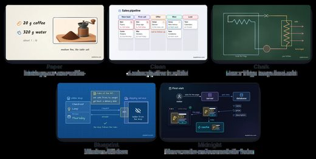</a> <a href="https://github.com/vincentsch/explainroo">vincentsch/explainroo</a></td>
<td align="center" valign="top"><a href="https://github.com/hi-nikola/hand-drawn-explainer-video-nikola">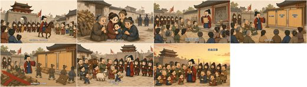</a> <a href="https://github.com/hi-nikola/hand-drawn-explainer-video-nikola">hi-nikola/hand-drawn-explainer-video-nikola</a></td>
</tr></table>

| Repo | Stars | What it does | Security |
|---|---:|---|---|
| [Alisa0808/vox-director](https://github.com/Alisa0808/vox-director) | 2.1k | Turn one topic into a finished Vox-style paper-collage explainer/ad video — automated end to end on Atlas Cloud + ffmpeg. An agent skill. | [SAFE](https://agentskillshub.top/skill/Alisa0808/vox-director/?utm_source=github&utm_medium=awesome-list) |
| [adithya-s-k/manim_skill](https://github.com/adithya-s-k/manim_skill) | 1.1k | Agent skills for Manim to create 3Blue1Brown style animations. | [SAFE](https://agentskillshub.top/skill/adithya-s-k/manim_skill/?utm_source=github&utm_medium=awesome-list) |
| [vincentsch/explainroo](https://github.com/vincentsch/explainroo) | 395 | Explainer videos and product demos made by your AI agent. Free and open source: a local voice (Kokoro), word timing (Whisper) and a canvas renderer t… | [SAFE](https://agentskillshub.top/skill/vincentsch/explainroo/?utm_source=github&utm_medium=awesome-list) |
| [wshuyi/remotion-video-skill](https://github.com/wshuyi/remotion-video-skill) | 386 | A Claude Code Skill for creating programmatic videos with Remotion framework | [CAUTION](https://agentskillshub.top/skill/wshuyi/remotion-video-skill/?utm_source=github&utm_medium=awesome-list) |
| [shuyicc/MathLens](https://github.com/shuyicc/MathLens) | 363 | MathLens 是一个专注于数学题目视频讲解的 Agent Skill。你只需粘贴一道数学题（图片或文字），它就能自动完成从题目分析、可视化讲解、配音脚本到 Manim 动画视频的全流程制作。单条视频1-10 分钟，成本 0.2-1 元以内。 | [SAFE](https://agentskillshub.top/skill/shuyicc/MathLens/?utm_source=github&utm_medium=awesome-list) |
| [hi-nikola/hand-drawn-explainer-video-nikola](https://github.com/hi-nikola/hand-drawn-explainer-video-nikola) | 358 | 中文手绘知识讲解视频 Codex Skill：逐笔故事、双语义岛、让怪诞小黑动起来与程序动画 | [SAFE](https://agentskillshub.top/skill/hi-nikola/hand-drawn-explainer-video-nikola/?utm_source=github&utm_medium=awesome-list) |
| [Anil-matcha/vox-ai-motion-graphics-generator](https://github.com/Anil-matcha/vox-ai-motion-graphics-generator) | 236 | 🎬 Turn any topic into a finished Vox-style paper-collage explainer / motion graphics video — script, collage keyframes, animation, voice-over, music… | [SAFE](https://agentskillshub.top/skill/Anil-matcha/vox-ai-motion-graphics-generator/?utm_source=github&utm_medium=awesome-list) |
| [runesleo/claude-video-kit](https://github.com/runesleo/claude-video-kit) | 120 | Agent Skill + Remotion pipeline: brief/script → review receipt → narrated 9:16 explainer. RC: video-explainer skill. | [SAFE](https://agentskillshub.top/skill/runesleo/claude-video-kit/?utm_source=github&utm_medium=awesome-list) |
| [sunxiayi/make-blender-education-video-skill](https://github.com/sunxiayi/make-blender-education-video-skill) | 48 | A Codex and Claude Code skill for creating fact-checked cinematic educational videos with Blender | [SAFE](https://agentskillshub.top/skill/sunxiayi/make-blender-education-video-skill/?utm_source=github&utm_medium=awesome-list) |
| [Anil-matcha/zack-d-films-ai-video-generator](https://github.com/Anil-matcha/zack-d-films-ai-video-generator) | 46 | 🎬 Turn any topic into a finished Zack D Films-style 3D animated short — curiosity-loop script, character sheets, 3D keyframes, Veo 3.1 motion, voiceo… | [SAFE](https://agentskillshub.top/skill/Anil-matcha/zack-d-films-ai-video-generator/?utm_source=github&utm_medium=awesome-list) |
| [znyupup/knowledge-explainer-skill](https://github.com/znyupup/knowledge-explainer-skill) | 45 | 把一份 markdown 文稿，自动生成讲解动画视频 — Powered by Remotion + AI Agent | [SAFE](https://agentskillshub.top/skill/znyupup/knowledge-explainer-skill/?utm_source=github&utm_medium=awesome-list) |
| [AmitSubhash/3brown1blue](https://github.com/AmitSubhash/3brown1blue) | 36 | First-principles Manim skill for Claude Code — mathematical animation from scratch, paper-explainer patterns, 21 rule files. | [SAFE](https://agentskillshub.top/skill/AmitSubhash/3brown1blue/?utm_source=github&utm_medium=awesome-list) |
| [vibe-motion/remotion-code-motion-explainer](https://github.com/vibe-motion/remotion-code-motion-explainer) | 32 | AI Agent skill for continuous, editable Remotion explainers — created by Bingo | [SAFE](https://agentskillshub.top/skill/vibe-motion/remotion-code-motion-explainer/?utm_source=github&utm_medium=awesome-list) |
| [santmun/video-vox](https://github.com/santmun/video-vox) | 31 | Crea shorts verticales animados estilo Vox sobre cualquier tema con Claude Code + Remotion (cartoon + voz + música + SFX) | [SAFE](https://agentskillshub.top/skill/santmun/video-vox/?utm_source=github&utm_medium=awesome-list) |
| [Mr-funny/hbg-douyin-code-explainer-video](https://github.com/Mr-funny/hbg-douyin-code-explainer-video) | 30 | HBG Codex skill for deterministic Chinese 9:16 HyperFrames explainer videos with dialogue TTS, global Whisper sync, stable BGM and final visual QA. | [SAFE](https://agentskillshub.top/skill/Mr-funny/hbg-douyin-code-explainer-video/?utm_source=github&utm_medium=awesome-list) |
| [iart-ai/explainer-video-skills](https://github.com/iart-ai/explainer-video-skills) | 29 | Explainer video skills for Claude Code: script, storyboard, and render narrated explainers, year-in-review recaps, and animated diagrams. | [SAFE](https://agentskillshub.top/skill/iart-ai/explainer-video-skills/?utm_source=github&utm_medium=awesome-list) |
| [Phantomlau3674/voxstylehub-steven](https://github.com/Phantomlau3674/voxstylehub-steven) | 24 | Standalone Codex skill for Vox-inspired editorial collage knowledge videos with deterministic Remotion assembly and optional generated motion. | [SAFE](https://agentskillshub.top/skill/Phantomlau3674/voxstylehub-steven/?utm_source=github&utm_medium=awesome-list) |
| [vakovalskii/nd-video-studio](https://github.com/vakovalskii/nd-video-studio) | 21 | Explainer videos from HTML (HyperFrames → MP4) with AI narrator, music and mixing — Claude Code / Codex skills on NeuralDeep models | [SAFE](https://agentskillshub.top/skill/vakovalskii/nd-video-studio/?utm_source=github&utm_medium=awesome-list) |
| [Mng-dev-ai/explainer-video](https://github.com/Mng-dev-ai/explainer-video) | 19 | AI skill that turns any topic into an animated narrated explainer video. Runs locally, free, works with Claude Code / Codex / Cursor. | [SAFE](https://agentskillshub.top/skill/Mng-dev-ai/explainer-video/?utm_source=github&utm_medium=awesome-list) |
| [holy-templar/vox-animated-ad-mcp](https://github.com/holy-templar/vox-animated-ad-mcp) | 19 | Vox-style paper-collage animated video skill for AI agents — Claude + MaxFusion AI MCP (Google Omni). One sentence in, a full explainer or ad out, en… | [SAFE](https://agentskillshub.top/skill/holy-templar/vox-animated-ad-mcp/?utm_source=github&utm_medium=awesome-list) |
| [minosdevs/cinematic-film](https://github.com/minosdevs/cinematic-film) | 19 | Claude Code skill: turn any subject into a cinematic animated film with Remotion + three.js, gpt-image assets, a rigged TTS narrator and synthesized… | [SAFE](https://agentskillshub.top/skill/minosdevs/cinematic-film/?utm_source=github&utm_medium=awesome-list) |
| [aijiduonadegou/Paper-Cut](https://github.com/aijiduonadegou/Paper-Cut) | 17 | 无需视频模型，即可制作拼贴动画的skill。用图像模型定稿、原图拆层与 HyperFrames 代码动画制作可编辑 Paper Cut / Vox 风格纸拼贴科普视频；支持三阶段审批、旁白、音效、文字动效与确定性 QA。 | [SAFE](https://agentskillshub.top/skill/aijiduonadegou/Paper-Cut/?utm_source=github&utm_medium=awesome-list) |
| [chenyuxiaojin/cyxj-hyperframes](https://github.com/chenyuxiaojin/cyxj-hyperframes) | 16 | Open-source HTML+GSAP video projects & reusable toolkit for Claude Code tutorial videos, powered by HeyGen HyperFrames. | [SAFE](https://agentskillshub.top/skill/chenyuxiaojin/cyxj-hyperframes/?utm_source=github&utm_medium=awesome-list) |
| [cclank/lanshu-html2video-skill](https://github.com/cclank/lanshu-html2video-skill) | 15 | Turn web articles into polished 1080p videos with Codex and Remotion | [SAFE](https://agentskillshub.top/skill/cclank/lanshu-html2video-skill/?utm_source=github&utm_medium=awesome-list) |
| [iart-ai/map-animation-skills](https://github.com/iart-ai/map-animation-skills) | 14 | Animated map skills for AI coding agents — draw routes, zoom-to-location, and data-driven map animations rendered to video. | [SAFE](https://agentskillshub.top/skill/iart-ai/map-animation-skills/?utm_source=github&utm_medium=awesome-list) |
| [Science-Prof-Robot/recursive-math-animator](https://github.com/Science-Prof-Robot/recursive-math-animator) | 13 | Cursor and Claude Code skill: Manim animations, manim-voiceover, git-based scene versioning, optional Gemini TTS | [SAFE](https://agentskillshub.top/skill/Science-Prof-Robot/recursive-math-animator/?utm_source=github&utm_medium=awesome-list) |
| [kakaxi12/vox-director-codex](https://github.com/kakaxi12/vox-director-codex) | 12 | Codex skill for creating Vox-style editorial paper-collage videos with ImageGen, HyperFrames, and MiniMax narration. | [SAFE](https://agentskillshub.top/skill/kakaxi12/vox-director-codex/?utm_source=github&utm_medium=awesome-list) |
| [ssrajadh/paperview](https://github.com/ssrajadh/paperview) | 9 | Turn research papers, codebases, etc. into explainer videos, local rendering + TTS, Claude Code plugin. | [SAFE](https://agentskillshub.top/skill/ssrajadh/paperview/?utm_source=github&utm_medium=awesome-list) |
| [0x68616F4C/auto-popsci](https://github.com/0x68616F4C/auto-popsci) | 8 | Agent Skill for generating math/science popularization videos with Manim + AI narration | [SAFE](https://agentskillshub.top/skill/0x68616F4C/auto-popsci/?utm_source=github&utm_medium=awesome-list) |
| [ahmdd4vd/MotionCraft](https://github.com/ahmdd4vd/MotionCraft) | 7 | Clean, high-taste motion graphics videos made by your AI agent with Remotion. One-command Agent Skill: npx skills add ahmdd4vd/motioncraft | [SAFE](https://agentskillshub.top/skill/ahmdd4vd/MotionCraft/?utm_source=github&utm_medium=awesome-list) |
| [jaredcassoutt/vox-editorial](https://github.com/jaredcassoutt/vox-editorial) | 7 | A Claude Code skill that turns one researched topic into a finished vertical explainer film: cut-paper artwork animated across depth planes, free loc… | [SAFE](https://agentskillshub.top/skill/jaredcassoutt/vox-editorial/?utm_source=github&utm_medium=awesome-list) |
| [pjecuacion/script-to-video-skill](https://github.com/pjecuacion/script-to-video-skill) | 7 | Public script-to-video skill for HyperFrames workflows with sanitized paths and secret-free examples. | [SAFE](https://agentskillshub.top/skill/pjecuacion/script-to-video-skill/?utm_source=github&utm_medium=awesome-list) |
| [BusyBee3333/animated-explainer-skills](https://github.com/BusyBee3333/animated-explainer-skills) | 6 | Build Kurzgesagt-quality animated explainer videos as one self-contained HTML file — GSAP choreography patterns, YouTube-retention method, overlap au… | [SAFE](https://agentskillshub.top/skill/BusyBee3333/animated-explainer-skills/?utm_source=github&utm_medium=awesome-list) |
| [centraltowerlabs/diagram-tour](https://github.com/centraltowerlabs/diagram-tour) | 6 | This Claude Skill makes it easy to generate explainer video tours of your codebase (or any other complex system) | [SAFE](https://agentskillshub.top/skill/centraltowerlabs/diagram-tour/?utm_source=github&utm_medium=awesome-list) |
| [jinjin1/scenewright](https://github.com/jinjin1/scenewright) | 6 | Claude Code-native pipeline: a source text → narrated, Remotion-rendered YouTube explainer video. Any topic, ~$0/video, local Korean TTS (Supertonic)… | [SAFE](https://agentskillshub.top/skill/jinjin1/scenewright/?utm_source=github&utm_medium=awesome-list) |
| [sukai213/bilibili-ai-video](https://github.com/sukai213/bilibili-ai-video) | 6 | AI 科技测评视频制作与 B 站自动发布技能（Codex Skill）：原创文案 / Qwen3-TTS 配音 / 全息幻灯片 / ffmpeg 剪辑 / 投稿 API 自动发布 | [SAFE](https://agentskillshub.top/skill/sukai213/bilibili-ai-video/?utm_source=github&utm_medium=awesome-list) |
| [coding-ax/docvideoer](https://github.com/coding-ax/docvideoer) | 5 | 文档转视频 skills。用于把文档 URL、网页文章、Markdown 或粘贴文本转换成带中文旁白的 Remotion 讲解视频，包含正文提取、分镜生成、免费 TTS、视频项目搭建和 MP4 渲染。 | [SAFE](https://agentskillshub.top/skill/coding-ax/docvideoer/?utm_source=github&utm_medium=awesome-list) |
| [crawfordxx/paper-cut-video-skill](https://github.com/crawfordxx/paper-cut-video-skill) | 5 | Script-driven Chinese paper-cut explainer videos with content-matched characters, Remotion, Doubao TTS, and semantic captions | [*pending*](https://agentskillshub.top/skill/crawfordxx/paper-cut-video-skill/?utm_source=github&utm_medium=awesome-list) |
| [cymcymcymcym/notes-to-video](https://github.com/cymcymcymcym/notes-to-video) | 5 | Turn notes into animated explainer videos in the style popularized by 3Blue1Brown. Claude Code skill + Manim + TTS + ffmpeg. | [SAFE](https://agentskillshub.top/skill/cymcymcymcym/notes-to-video/?utm_source=github&utm_medium=awesome-list) |
| [liuliu-66-create/ll-video-edit](https://github.com/liuliu-66-create/ll-video-edit) | 5 | Codex + Remotion 六步自动剪辑 Skill 与视频动效素材库 | [*pending*](https://agentskillshub.top/skill/liuliu-66-create/ll-video-edit/?utm_source=github&utm_medium=awesome-list) |
| [git-story-film](https://github.com/EverMind-AI/Raven/tree/HEAD/skills/git-story-film) | in EverMind-AI/Raven: 5.2k | Direct a two-minute hand-drawn animated film from a repository's Git history: story, character, storyboard, HTML review studio, then a 4K/60fps MP4. | [SAFE](https://agentskillshub.top/skill/EverMind-AI/Raven/?utm_source=github&utm_medium=awesome-list) |

## ✂️ Editing

[Open this type on the live page, sorted by stars →](https://agentskillshub.top/best/claude-video-skills/?utm_source=github&utm_medium=awesome-list#type-editing)

<table><tr>
<td align="center" valign="top"> <a href="https://github.com/FireRedTeam/FireRed-OpenStoryline">FireRedTeam/FireRed-OpenStoryline</a></td>
<td align="center" valign="top"><a href="https://github.com/hetpatel-11/Adobe_Premiere_Pro_MCP">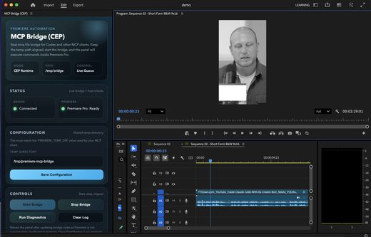</a> <a href="https://github.com/hetpatel-11/Adobe_Premiere_Pro_MCP">hetpatel-11/Adobe_Premiere_Pro_MCP</a></td>
<td align="center" valign="top"><a href="https://github.com/zenstory-ai/video-recap-skills">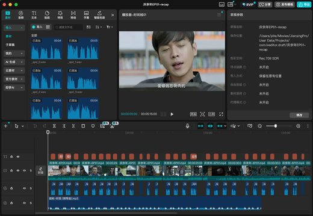</a> <a href="https://github.com/zenstory-ai/video-recap-skills">zenstory-ai/video-recap-skills</a></td>
</tr></table>

| Repo | Stars | What it does | Security |
|---|---:|---|---|
| [FireRedTeam/FireRed-OpenStoryline](https://github.com/FireRedTeam/FireRed-OpenStoryline) | 3.5k | FireRed-OpenStoryline is an AI video editing agent that transforms manual editing into intention-driven directing through natural language interactio… | [SAFE](https://agentskillshub.top/skill/FireRedTeam/FireRed-OpenStoryline/?utm_source=github&utm_medium=awesome-list) |
| [Agentchengfeng/chengfeng-videocut-skills](https://github.com/Agentchengfeng/chengfeng-videocut-skills) | 3.0k | 用 Claude Code Skills 做的视频剪辑 Agent | [SAFE](https://agentskillshub.top/skill/Agentchengfeng/chengfeng-videocut-skills/?utm_source=github&utm_medium=awesome-list) |
| [0xsline/OpenChatCut](https://github.com/0xsline/OpenChatCut) | 2.1k | Open-source, local-first conversational AI video editor with a professional multi-track timeline, Agent Skills, MCP integration, and Remotion renderi… | [SAFE](https://agentskillshub.top/skill/0xsline/OpenChatCut/?utm_source=github&utm_medium=awesome-list) |
| [cartesiancs/cartcut](https://github.com/cartesiancs/cartcut) | 761 | Video Editor for AI agents, built on the belief that open source can beat commercial tools | [SAFE](https://agentskillshub.top/skill/cartesiancs/cartcut/?utm_source=github&utm_medium=awesome-list) |
| [hetpatel-11/Adobe_Premiere_Pro_MCP](https://github.com/hetpatel-11/Adobe_Premiere_Pro_MCP) | 647 | Adobe Premiere Pro MCP. Tools for AI-driven video editing via MCP, for Codex, Claude, and other MCP clients. | [SAFE](https://agentskillshub.top/skill/hetpatel-11/Adobe_Premiere_Pro_MCP/?utm_source=github&utm_medium=awesome-list) |
| [zenstory-ai/video-recap-skills](https://github.com/zenstory-ai/video-recap-skills) | 549 | Claude Code / Codex skills that turn a video into a Chinese narration recap (视频解说): scene detection, ASR, VLM, script, TTS, ffmpeg assembly, optional… | [SAFE](https://agentskillshub.top/skill/zenstory-ai/video-recap-skills/?utm_source=github&utm_medium=awesome-list) |
| [JimLiu/baocut](https://github.com/JimLiu/baocut) | 526 | Open-source Agent Skill that drives the BaoCut macOS app CLI (transcribe · subtitle · translate · cut) from Claude Code, Codex, and other agents | [SAFE](https://agentskillshub.top/skill/JimLiu/baocut/?utm_source=github&utm_medium=awesome-list) |
| [hassancs91/claude-youtube-editor](https://github.com/hassancs91/claude-youtube-editor) | 320 | Record the talking head, Claude Code does the rest: the cut, the visuals, the voice, the sound effects, the thumbnail, and the YouTube upload. Every… | [SAFE](https://agentskillshub.top/skill/hassancs91/claude-youtube-editor/?utm_source=github&utm_medium=awesome-list) |
| [leancoderkavy/premiere-pro-mcp](https://github.com/leancoderkavy/premiere-pro-mcp) | 320 | Adobe Premiere Pro MCP — independent, local-first server for supported workflows. Connect Claude, Codex, or Cursor through a local CEP bridge. | [SAFE](https://agentskillshub.top/skill/leancoderkavy/premiere-pro-mcp/?utm_source=github&utm_medium=awesome-list) |
| [AgriciDaniel/claude-shorts](https://github.com/AgriciDaniel/claude-shorts) | 217 | Interactive longform-to-shortform video creator — Claude Code skill with Remotion-rendered animated captions, AI segment scoring, cursor tracking, an… | [SAFE](https://agentskillshub.top/skill/AgriciDaniel/claude-shorts/?utm_source=github&utm_medium=awesome-list) |
| [YeJe-cpu/SeeCut](https://github.com/YeJe-cpu/SeeCut) | 216 | An AI editor that watches its own cut: talking-head / AI-avatar video → auto-edited short video. 网感口播精剪：数字人/真人口播 → AI 自动精剪成网感动效短视频 → 可选剪映分层草稿 | [SAFE](https://agentskillshub.top/skill/YeJe-cpu/SeeCut/?utm_source=github&utm_medium=awesome-list) |
| [erduo1998-cell/erduo-broll-loop-engineering](https://github.com/erduo1998-cell/erduo-broll-loop-engineering) | 205 | SRT 驱动的双后端 B-roll Agent Skill：自动路由 HyperFrames / Remotion，集成 152 张 Shotcraft 镜头卡 | [SAFE](https://agentskillshub.top/skill/erduo1998-cell/erduo-broll-loop-engineering/?utm_source=github&utm_medium=awesome-list) |
| [Cassette-Editor/oh-my-cassette](https://github.com/Cassette-Editor/oh-my-cassette) | 158 | 你的随身 AI 剪辑搭档 \| Pocket AI co-editor for video montage — AI video editing plugin & MCP server for Claude Code, Codex, Hermes & OpenCode | [SAFE](https://agentskillshub.top/skill/Cassette-Editor/oh-my-cassette/?utm_source=github&utm_medium=awesome-list) |
| [blixvip/easyedit](https://github.com/blixvip/easyedit) | 149 | Automatic fan edit maker: type a movie name and get a captioned speech plus a beat-cut montage. Local-first, no API keys. Works with Claude Code and… | [SAFE](https://agentskillshub.top/skill/blixvip/easyedit/?utm_source=github&utm_medium=awesome-list) |
| [znyupup/ai-video-editing-skill](https://github.com/znyupup/ai-video-editing-skill) | 141 | AI Agent Skill for automated vlog editing. Feed raw footage, get a finished video. Powered by ffmpeg + Whisper + Vision API. | [SAFE](https://agentskillshub.top/skill/znyupup/ai-video-editing-skill/?utm_source=github&utm_medium=awesome-list) |
| [naive-kun/naive-video-skill](https://github.com/naive-kun/naive-video-skill) | 131 | A Codex skill for turning talking-head videos into captioned, animated final videos. | [SAFE](https://agentskillshub.top/skill/naive-kun/naive-video-skill/?utm_source=github&utm_medium=awesome-list) |
| [Monet-AI-Editor/Monet](https://github.com/Monet-AI-Editor/Monet) | 116 | Edit Videos and Design Images with Claude code or Codex | [SAFE](https://agentskillshub.top/skill/Monet-AI-Editor/Monet/?utm_source=github&utm_medium=awesome-list) |
| [ayushozha/AdobePremiereProMCP](https://github.com/ayushozha/AdobePremiereProMCP) | 113 | An open-source bridge between AI assistants and Adobe Premiere Pro, for supported editing workflows. Go, Rust, Python, and TypeScript. | [SAFE](https://agentskillshub.top/skill/ayushozha/AdobePremiereProMCP/?utm_source=github&utm_medium=awesome-list) |
| [louisedesadeleer/cut-video](https://github.com/louisedesadeleer/cut-video) | 106 | Claude Code skill: tighten long recordings — remove silences, ums, dead air. Preserves laughs and comedic pauses. Fast on Apple Silicon. | [SAFE](https://agentskillshub.top/skill/louisedesadeleer/cut-video/?utm_source=github&utm_medium=awesome-list) |
| [AKMessi/vex](https://github.com/AKMessi/vex) | 87 | claude code for video editing | [SAFE](https://agentskillshub.top/skill/AKMessi/vex/?utm_source=github&utm_medium=awesome-list) |
| [JUNKDOGE-JOE/after-effects-mcp](https://github.com/JUNKDOGE-JOE/after-effects-mcp) | 75 | Agent-driven Adobe After Effects automation. MCP server + CEP plugin enabling Codex/Cursor/Claude Code to drive AE through 30 ae.* tools. | [SAFE](https://agentskillshub.top/skill/JUNKDOGE-JOE/after-effects-mcp/?utm_source=github&utm_medium=awesome-list) |
| [kurbaitaev/ghost-editor](https://github.com/kurbaitaev/ghost-editor) | 64 | AI video editor for talking-head reels: 7 styles, face-safe captions, motion scenes, reverse-engineer any reference edit. A Claude Code / agent skill… | [SAFE](https://agentskillshub.top/skill/kurbaitaev/ghost-editor/?utm_source=github&utm_medium=awesome-list) |
| [hahadu4520/vlog-cut](https://github.com/hahadu4520/vlog-cut) | 49 | Narration-driven video editing pipeline for Claude Code · 给 Claude Code 用的「按文案剪辑」流水线 | [SAFE](https://agentskillshub.top/skill/hahadu4520/vlog-cut/?utm_source=github&utm_medium=awesome-list) |
| [ops120/video-recap-skills-plus](https://github.com/ops120/video-recap-skills-plus) | 41 | Clip any video into a narration recap with claude code skill｜用claude code skill把任何视频剪辑成中文解说视频，支持剪映导出 | [CAUTION](https://agentskillshub.top/skill/ops120/video-recap-skills-plus/?utm_source=github&utm_medium=awesome-list) |
| [Kappaemme-git/codex-video-short-maker-skill](https://github.com/Kappaemme-git/codex-video-short-maker-skill) | 35 |  | [SAFE](https://agentskillshub.top/skill/Kappaemme-git/codex-video-short-maker-skill/?utm_source=github&utm_medium=awesome-list) |
| [darrenli6/JJKoubo](https://github.com/darrenli6/JJKoubo) | 34 | JJ Koubo (JJ口播) is a local-first collection of video editing Skills for talking-head, interview, knowledge-sharing, and other videos centered on spok… | [SAFE](https://agentskillshub.top/skill/darrenli6/JJKoubo/?utm_source=github&utm_medium=awesome-list) |
| [krusemediallc/video-editor-agent](https://github.com/krusemediallc/video-editor-agent) | 23 | Claude Code skill pack: edit short-form videos end to end — style-clone a reference reel, build a branded motion-graphics edit, ElevenLabs sound desi… | [SAFE](https://agentskillshub.top/skill/krusemediallc/video-editor-agent/?utm_source=github&utm_medium=awesome-list) |
| [manthanpatelll/leadgenman-video-skills](https://github.com/manthanpatelll/leadgenman-video-skills) | 17 | Six Claude Code skills for an automated video content pipeline: produce, srt, ytdescription, igcaption, reel-overlay, new-series. By @LeadGenMan. | [SAFE](https://agentskillshub.top/skill/manthanpatelll/leadgenman-video-skills/?utm_source=github&utm_medium=awesome-list) |
| [jincheng2026/jc-remotion-skills](https://github.com/jincheng2026/jc-remotion-skills) | 14 | Remotion Koubo Skill — 口播视频的 AI 成片工作流（Codex / Claude Code 双端）：粗剪+SRT 进，带 MG 包装、音效、母带的成片出 | [SAFE](https://agentskillshub.top/skill/jincheng2026/jc-remotion-skills/?utm_source=github&utm_medium=awesome-list) |
| [cocolayuan/videoclip-AI-skill](https://github.com/cocolayuan/videoclip-AI-skill) | 13 | Claude Skill-powered video editing toolkit - 视频全自动剪辑 | [SAFE](https://agentskillshub.top/skill/cocolayuan/videoclip-AI-skill/?utm_source=github&utm_medium=awesome-list) |
| [PoetCoderJun/MotionTalk](https://github.com/PoetCoderJun/MotionTalk) | 12 | Turn an edited talking video into a polished motion-graphics video with one Agent Skill. | [SAFE](https://agentskillshub.top/skill/PoetCoderJun/MotionTalk/?utm_source=github&utm_medium=awesome-list) |
| [ZiadAbdelkarim/beat-synced-edit](https://github.com/ZiadAbdelkarim/beat-synced-edit) | 11 | Automatic beat-synced video editing: feed it a song and raw footage, it analyzes beats, energy, and scenes, then cuts a ready-to-post edit. Pure Pyth… | [SAFE](https://agentskillshub.top/skill/ZiadAbdelkarim/beat-synced-edit/?utm_source=github&utm_medium=awesome-list) |
| [misbahsy/tiktok-ig-shorts](https://github.com/misbahsy/tiktok-ig-shorts) | 11 | Generate Viral Tiktok and Instagram Shorts using Hyperframes with Claude and Codex | [SAFE](https://agentskillshub.top/skill/misbahsy/tiktok-ig-shorts/?utm_source=github&utm_medium=awesome-list) |
| [qingyunAGI/qingyun-cine-skill](https://github.com/qingyunAGI/qingyun-cine-skill) | 10 | qingyun-cine-skill: PLAN-FIRST cinematic video editing Codex skill for trailers, beat-sync edits, promos, and highlights. | [SAFE](https://agentskillshub.top/skill/qingyunAGI/qingyun-cine-skill/?utm_source=github&utm_medium=awesome-list) |
| [Fagan1024/smart-video-editor](https://github.com/Fagan1024/smart-video-editor) | 8 | AI video editing skill that watches your footage before cutting. Vision model analyzes every frame, scores usability, drops bad takes, reorders by na… | [SAFE](https://agentskillshub.top/skill/Fagan1024/smart-video-editor/?utm_source=github&utm_medium=awesome-list) |
| [hahadu4520/newcut-video-clipping-skill](https://github.com/hahadu4520/newcut-video-clipping-skill) | 6 | Open-source Codex skill for semantic Chinese video clipping with hooks, captions, cleanup, and FFmpeg rendering | [SAFE](https://agentskillshub.top/skill/hahadu4520/newcut-video-clipping-skill/?utm_source=github&utm_medium=awesome-list) |
| [jackjls/jtxvideo-skill](https://github.com/jackjls/jtxvideo-skill) | 5 | Codex + HyperFrames 口播视频制作 Skill：按 SRT、结构、分镜、设计、渲染的审核流程生成 AI 金融短视频 | [SAFE](https://agentskillshub.top/skill/jackjls/jtxvideo-skill/?utm_source=github&utm_medium=awesome-list) |

## 📱 Shorts & social

[Open this type on the live page, sorted by stars →](https://agentskillshub.top/best/claude-video-skills/?utm_source=github&utm_medium=awesome-list#type-shorts)

<table><tr>
<td align="center" valign="top"> <a href="https://github.com/adunext/adu-motion-video">adunext/adu-motion-video</a></td>
<td align="center" valign="top"> <a href="https://github.com/jaxxchen003/book-video-factory">jaxxchen003/book-video-factory</a></td>
<td align="center" valign="top"> <a href="https://github.com/pyang5166/gbro-collage-info">pyang5166/gbro-collage-info</a></td>
</tr></table>

| Repo | Stars | What it does | Security |
|---|---:|---|---|
| [Yuuhann1999/agent-storyboard](https://github.com/Yuuhann1999/agent-storyboard) | 353 | 本地优先的 Agent 视频分镜工作台：让 Codex、Claude Code 通过 MCP 写分镜、生成图片/视频素材和配音，并自动回填。Local-first storyboard workbench for AI agents (Codex, Claude Code). | [SAFE](https://agentskillshub.top/skill/Yuuhann1999/agent-storyboard/?utm_source=github&utm_medium=awesome-list) |
| [Yuuhann1999/agent-storyboard](https://github.com/Yuuhann1999/agent-storyboard) | 353 | 本地优先的 Agent 视频分镜工作台：让 Codex、Claude Code 通过 MCP 写分镜、生成图片/视频素材和配音，并自动回填。Local-first storyboard workbench for AI agents (Codex, Claude Code). | [SAFE](https://agentskillshub.top/skill/Yuuhann1999/agent-storyboard/?utm_source=github&utm_medium=awesome-list) |
| [hassancs91/claude-faceless-shorts-creator](https://github.com/hassancs91/claude-faceless-shorts-creator) | 271 | A faceless YouTube-Shorts factory driven by Claude Code: pure-TSX Remotion visuals, ElevenLabs voice with word-exact captions, library-first sound de… | [SAFE](https://agentskillshub.top/skill/hassancs91/claude-faceless-shorts-creator/?utm_source=github&utm_medium=awesome-list) |
| [adunext/adu-motion-video](https://github.com/adunext/adu-motion-video) | 132 | 阿杜与 Opus 5.5 精选制作的动画动效模板 Skill。选模板和风格，用 Codex / Claude Code 把口播与素材剪成视频；提供 11,028 个精选 Lottie 动画素材 API。 | [SAFE](https://agentskillshub.top/skill/adunext/adu-motion-video/?utm_source=github&utm_medium=awesome-list) |
| [jaxxchen003/book-video-factory](https://github.com/jaxxchen003/book-video-factory) | 104 | Portable Codex skill for auditable, rights-aware Chinese book-review short-video workflows. | [SAFE](https://agentskillshub.top/skill/jaxxchen003/book-video-factory/?utm_source=github&utm_medium=awesome-list) |
| [Maartenlouis/remotion-ads](https://github.com/Maartenlouis/remotion-ads) | 60 | Claude Code skill for creating Instagram Reels & Carousel ads with Remotion | [SAFE](https://agentskillshub.top/skill/Maartenlouis/remotion-ads/?utm_source=github&utm_medium=awesome-list) |
| [pyang5166/gbro-collage-info](https://github.com/pyang5166/gbro-collage-info) | 51 | 半调纸拼贴风信息动画 Agent Skill · Halftone paper-collage info-graphic animations from voiceover scripts (HyperFrames, no image models) | [SAFE](https://agentskillshub.top/skill/pyang5166/gbro-collage-info/?utm_source=github&utm_medium=awesome-list) |
| [liangdabiao/story-handdrawn-video](https://github.com/liangdabiao/story-handdrawn-video) | 48 | 把一段 中文/英文 故事文本变成 9:16 竖屏（720×1280）手绘蜡笔风短视频。Remotion 技术的视频 Skill。基于 Agnes Video V2.0（纯文生视频，当前 $0/秒）+ edge-tts（免费旁白）的全免费视频制作方案。 | [SAFE](https://agentskillshub.top/skill/liangdabiao/story-handdrawn-video/?utm_source=github&utm_medium=awesome-list) |
| [yammaku/typewriter-video](https://github.com/yammaku/typewriter-video) | 42 | VS Code-style typewriter animation video skill for AI agents (agentskills.io format) | [SAFE](https://agentskillshub.top/skill/yammaku/typewriter-video/?utm_source=github&utm_medium=awesome-list) |
| [Chamanrajragu/purffle-shorts](https://github.com/Chamanrajragu/purffle-shorts) | 23 | Free open-source AI YouTube Shorts generator and faceless video maker in Python. Any LLM (GPT, Claude, Gemini, Ollama) writes scripts; text-to-speech… | [SAFE](https://agentskillshub.top/skill/Chamanrajragu/purffle-shorts/?utm_source=github&utm_medium=awesome-list) |
| [Dancan254/voiceover-video-skill](https://github.com/Dancan254/voiceover-video-skill) | 17 | AI-agent skill: turn a voice note into an animated, sound-designed Short | [CAUTION](https://agentskillshub.top/skill/Dancan254/voiceover-video-skill/?utm_source=github&utm_medium=awesome-list) |
| [klsoen/opus-js-animations](https://github.com/klsoen/opus-js-animations) | 17 | Claude Opus 5.5 directs and renders films in JavaScript: brief → sound (file, YouTube, generated, or AI voiceover) → director's treatment → frame-exa… | [SAFE](https://agentskillshub.top/skill/klsoen/opus-js-animations/?utm_source=github&utm_medium=awesome-list) |
| [yuwenbin121/book-video-production-skill](https://github.com/yuwenbin121/book-video-production-skill) | 17 | A Codex skill for producing fact-based vertical book videos | [SAFE](https://agentskillshub.top/skill/yuwenbin121/book-video-production-skill/?utm_source=github&utm_medium=awesome-list) |
| [intelligent-iterations/ii-content-engine](https://github.com/intelligent-iterations/ii-content-engine) | 15 | AI-powered content generation and auto-posting engine built for Claude Code and Codex. Generate viral videos, carousels, and reels for TikTok, Instag… | [SAFE](https://agentskillshub.top/skill/intelligent-iterations/ii-content-engine/?utm_source=github&utm_medium=awesome-list) |
| [iart-ai/tiktok-video-skills](https://github.com/iart-ai/tiktok-video-skills) | 13 | Short-form video skills for Claude Code — engineer Reels, TikToks, and YouTube Shorts that survive the swipe. | [SAFE](https://agentskillshub.top/skill/iart-ai/tiktok-video-skills/?utm_source=github&utm_medium=awesome-list) |
| [adriiita/vertical-video-editing-skill](https://github.com/adriiita/vertical-video-editing-skill) | 10 | Claude skill: turn a script + talking-head media into a polished, creator-grade vertical 9:16 short with HyperFrames — editorial look, A-roll/B-roll… | [SAFE](https://agentskillshub.top/skill/adriiita/vertical-video-editing-skill/?utm_source=github&utm_medium=awesome-list) |
| [Samin12/samin-reel-engine-plugin](https://github.com/Samin12/samin-reel-engine-plugin) | 9 | A modular Codex plugin for source-backed reels: research, scripting, real B-roll, fast edits, quality review and giveaway handoffs. | [SAFE](https://agentskillshub.top/skill/Samin12/samin-reel-engine-plugin/?utm_source=github&utm_medium=awesome-list) |
| [ouerf-man/kinetic-editorial-skill](https://github.com/ouerf-man/kinetic-editorial-skill) | 9 | Claude Code skill: word-by-word kinetic caption reels (9:16) built with HyperFrames + Three.js — storyboard, asset prep, offline SFX, build & preview. | [*pending*](https://agentskillshub.top/skill/ouerf-man/kinetic-editorial-skill/?utm_source=github&utm_medium=awesome-list) |
| [riffkit/skill](https://github.com/riffkit/skill) | 7 | Official Riffkit skill — riff a winning TikTok into your own short video from your AI agent (Claude Code, Cursor) or the browser. Riff the formula, n… | [SAFE](https://agentskillshub.top/skill/riffkit/skill/?utm_source=github&utm_medium=awesome-list) |
| [zoglmk/codex-video-pipeline](https://github.com/zoglmk/codex-video-pipeline) | 7 | 从选题、脚本和素材到成片、封面与发布包的 AI 视频生产流水线 Skill | [SAFE](https://agentskillshub.top/skill/zoglmk/codex-video-pipeline/?utm_source=github&utm_medium=awesome-list) |
| [mcdenil-skills/AutoMontage-Agent](https://github.com/mcdenil-skills/AutoMontage-Agent) | 6 | Движок автомонтажа видео для ИИ-агента (Claude Code/Codex): субтитры, плашки, картинки под смысл, музыка, вертикаль. Локально, Remotion. | [SAFE](https://agentskillshub.top/skill/mcdenil-skills/AutoMontage-Agent/?utm_source=github&utm_medium=awesome-list) |
| [icytear-svg/podcast-to-video](https://github.com/icytear-svg/podcast-to-video) | 5 | Codex skill for turning podcast episodes into platform-ready captioned videos | [SAFE](https://agentskillshub.top/skill/icytear-svg/podcast-to-video/?utm_source=github&utm_medium=awesome-list) |
| [inematds/skill-video-plan-editor](https://github.com/inematds/skill-video-plan-editor) | 5 | Skill que transforma assunto/link em plano profissional de edição de vídeo (renderer-agnóstico) + render opcional via FFmpeg/Auto-Editor/HyperFrames | [SAFE](https://agentskillshub.top/skill/inematds/skill-video-plan-editor/?utm_source=github&utm_medium=awesome-list) |
| [liangdabiao/wechat-article-remotion](https://github.com/liangdabiao/wechat-article-remotion) | 5 | 动画skill: 把任意一篇微信公众号文章 转成 Studio 风格的 Remotion 视频 —— 暖白画布 + 上下镜像透视格子 + 顶部章节进度 + 公众号原文图完整保留 | [SAFE](https://agentskillshub.top/skill/liangdabiao/wechat-article-remotion/?utm_source=github&utm_medium=awesome-list) |
| [marketcalls/story-telling](https://github.com/marketcalls/story-telling) | 5 | Turn a context into a narrated story video: Sarvam AI voiceover, FLUX 2 artwork, Remotion render. Ships Claude Code skills. | [SAFE](https://agentskillshub.top/skill/marketcalls/story-telling/?utm_source=github&utm_medium=awesome-list) |
| [ninestonelee/youtube-shorts-factory](https://github.com/ninestonelee/youtube-shorts-factory) | 5 | Claude Code skill — YouTube reference video analysis → benchmarking → 30%+ adaptation → AI Shorts production workflow | [SAFE](https://agentskillshub.top/skill/ninestonelee/youtube-shorts-factory/?utm_source=github&utm_medium=awesome-list) |
| [wendymardigian-prog/Editor-IA-Pro](https://github.com/wendymardigian-prog/Editor-IA-Pro) | 5 | AI-powered video editor built with Remotion and Claude Code | [SAFE](https://agentskillshub.top/skill/wendymardigian-prog/Editor-IA-Pro/?utm_source=github&utm_medium=awesome-list) |
| [ww-w-ai/super-video-agent](https://github.com/ww-w-ai/super-video-agent) | 3 | Give Claude Opus 5.5 a PDF, an essay or a topic and get a narrated short in your own voice. Every frame is drawn in code. | [SAFE](https://agentskillshub.top/skill/ww-w-ai/super-video-agent/?utm_source=github&utm_medium=awesome-list) |

## 🧑‍💼 Avatars

[Open this type on the live page, sorted by stars →](https://agentskillshub.top/best/claude-video-skills/?utm_source=github&utm_medium=awesome-list#type-avatar)

| Repo | Stars | What it does | Security |
|---|---:|---|---|
| [cclank/lanshu-create-ai-presenter-video](https://github.com/cclank/lanshu-create-ai-presenter-video) | 2.1k | Provider-neutral Codex Skill for producing verified AI presenter videos from a script and an authorized presenter image. | [SAFE](https://agentskillshub.top/skill/cclank/lanshu-create-ai-presenter-video/?utm_source=github&utm_medium=awesome-list) |
| [heygen-com/skills](https://github.com/heygen-com/skills) | 466 | HeyGen AI agent skills — avatar creation and video production via the v3 Video Agent pipeline | [SAFE](https://agentskillshub.top/skill/heygen-com/skills/?utm_source=github&utm_medium=awesome-list) |
| [Upload-Post/avatar-mix](https://github.com/Upload-Post/avatar-mix) | 130 | Generate 16:9 & 9:16 videos with your HeyGen avatar, animated backgrounds (HyperFrames), music, SFX and Hormozi captions — then publish them to every… | [SAFE](https://agentskillshub.top/skill/Upload-Post/avatar-mix/?utm_source=github&utm_medium=awesome-list) |
| [AgriciDaniel/lipnardo](https://github.com/AgriciDaniel/lipnardo) | 22 | HeyGen avatar video generation skill for Claude Code. Batch, templates, translation, photo avatars, TTS. Stdlib-only Python. | [SAFE](https://agentskillshub.top/skill/AgriciDaniel/lipnardo/?utm_source=github&utm_medium=awesome-list) |
| [zlong6943-commits/football-prediction-avatar-video](https://github.com/zlong6943-commits/football-prediction-avatar-video) | 9 | Codex skill for verified Chinese football prediction avatar videos with official logos, captions, motion graphics, and approval gates. | [SAFE](https://agentskillshub.top/skill/zlong6943-commits/football-prediction-avatar-video/?utm_source=github&utm_medium=awesome-list) |
| [puntorigen/avatar-skills](https://github.com/puntorigen/avatar-skills) | 5 | Cloud-based agent skills for creating AI avatar talking-head videos and short-form reels (skills.sh format) | [*pending*](https://agentskillshub.top/skill/puntorigen/avatar-skills/?utm_source=github&utm_medium=awesome-list) |

## 📖 Stories & animation

[Open this type on the live page, sorted by stars →](https://agentskillshub.top/best/claude-video-skills/?utm_source=github&utm_medium=awesome-list#type-story)

<table><tr>
<td align="center" valign="top"> <a href="https://github.com/gnipbao/story-to-handdrawn-video">gnipbao/story-to-handdrawn-video</a></td>
<td align="center" valign="top"> <a href="https://github.com/edenfunf/reelmimic">edenfunf/reelmimic</a></td>
<td align="center" valign="top"><a href="https://github.com/JohnHeibel/ClaudeAnimationBase">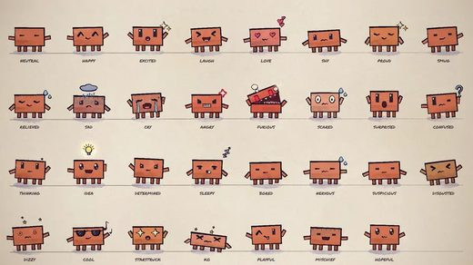</a> <a href="https://github.com/JohnHeibel/ClaudeAnimationBase">JohnHeibel/ClaudeAnimationBase</a></td>
</tr></table>

| Repo | Stars | What it does | Security |
|---|---:|---|---|
| [gnipbao/story-to-handdrawn-video](https://github.com/gnipbao/story-to-handdrawn-video) | 2.1k | Agent skill: convert Chinese story copy or ordered images into a hand-drawn diary-comic animation (silent MP4 picture track). | [SAFE](https://agentskillshub.top/skill/gnipbao/story-to-handdrawn-video/?utm_source=github&utm_medium=awesome-list) |
| [edenfunf/reelmimic](https://github.com/edenfunf/reelmimic) | 1.3k | Show it a video you love. Get a new video in the same style. An AI crew (Claude Code or Codex) plans, builds and reviews it with you. | [SAFE](https://agentskillshub.top/skill/edenfunf/reelmimic/?utm_source=github&utm_medium=awesome-list) |
| [lemomo-ai/lemo-opuscar](https://github.com/lemomo-ai/lemo-opuscar) | 1.0k | Claude Code skill for short films with no video model: 43 film styles, each a style prompt plus a demo film made entirely in code by Claude Opus 5.5… | [SAFE](https://agentskillshub.top/skill/lemomo-ai/lemo-opuscar/?utm_source=github&utm_medium=awesome-list) |
| [JohnHeibel/ClaudeAnimationBase](https://github.com/JohnHeibel/ClaudeAnimationBase) | 771 | A starter kit for animating hand-painted cartoons with Claude: p5.js + p5.brush, the Clawd character, 31 acted emotions and a guide for the model | [SAFE](https://agentskillshub.top/skill/JohnHeibel/ClaudeAnimationBase/?utm_source=github&utm_medium=awesome-list) |
| [aaronyi97/image-story-video-wizard](https://github.com/aaronyi97/image-story-video-wizard) | 353 | A confirmation-gated Codex and WorkBuddy skill for audio-first image-story video production. | [SAFE](https://agentskillshub.top/skill/aaronyi97/image-story-video-wizard/?utm_source=github&utm_medium=awesome-list) |
| [liyue-aigc/xianxia-cinematic-video-director](https://github.com/liyue-aigc/xianxia-cinematic-video-director) | 270 | Codex Skill for Eastern xianxia storyboards, camera movement and video continuity. | [SAFE](https://agentskillshub.top/skill/liyue-aigc/xianxia-cinematic-video-director/?utm_source=github&utm_medium=awesome-list) |
| [LetMeHappyCode/auto-video-agent](https://github.com/LetMeHappyCode/auto-video-agent) | 217 | 自动流水线化生成成套「分镜插画提示词 → AI 生图 → 拼接成片」的视频，基于 Agent / Skill / Workflow 编排。 | [SAFE](https://agentskillshub.top/skill/LetMeHappyCode/auto-video-agent/?utm_source=github&utm_medium=awesome-list) |
| [Mr-funny/hbg-life-simulation](https://github.com/Mr-funny/hbg-life-simulation) | 140 | HBG Agent Skill for Chinese life-simulation narrative videos with consistent comic IP, rapid multi-life openings, Edge TTS, synchronized captions, zo… | [SAFE](https://agentskillshub.top/skill/Mr-funny/hbg-life-simulation/?utm_source=github&utm_medium=awesome-list) |
| [tuzhechen2005/opus-video-skills](https://github.com/tuzhechen2005/opus-video-skills) | 107 | Video-making skills for Claude Opus 5.5 in Claude Code — every frame and note generated in code, one skill per style: hand-painted animation, kinetic… | [SAFE](https://agentskillshub.top/skill/tuzhechen2005/opus-video-skills/?utm_source=github&utm_medium=awesome-list) |
| [unclejobs-ai/motion-video-skill](https://github.com/unclejobs-ai/motion-video-skill) | 63 | Claude Code 스킬: 모션 그래픽·영상 제작 순서와 단계별 점검 하네스 | [SAFE](https://agentskillshub.top/skill/unclejobs-ai/motion-video-skill/?utm_source=github&utm_medium=awesome-list) |
| [liangdabiao/story-handdrawn-remotion](https://github.com/liangdabiao/story-handdrawn-remotion) | 35 | 视频SKILL: 把一段 中文/英文 故事文本变成 「手绘日记漫画风」竖屏视频。 核心方法论：**不是把一张漂亮图配文字朗读，而是把每句故事拆成「文字 → 黑白画稿 → 彩色插画」三阶段横向擦除揭示，让一句话被画出三次。 | [SAFE](https://agentskillshub.top/skill/liangdabiao/story-handdrawn-remotion/?utm_source=github&utm_medium=awesome-list) |
| [JimLiu/taohuayuan](https://github.com/JimLiu/taohuayuan) | 32 | 桃花源记 3D 网页 | [SAFE](https://agentskillshub.top/skill/JimLiu/taohuayuan/?utm_source=github&utm_medium=awesome-list) |
| [AsadMoulviDev/reel-video](https://github.com/AsadMoulviDev/reel-video) | 29 | Create AI videos with Claude Code, Codex, Cursor, and Grok Build, with no extra generation fees beyond the plans you already pay for | [SAFE](https://agentskillshub.top/skill/AsadMoulviDev/reel-video/?utm_source=github&utm_medium=awesome-list) |
| [AllenAI2014/remotion-guofeng-starter](https://github.com/AllenAI2014/remotion-guofeng-starter) | 27 | 国风纸片动画：Remotion 风格资产库 + 制作流程 Skill。给 AI 一首诗/成语，照这套国风纸片拼贴风格从零出片，全程代码渲染不进剪辑。 | [SAFE](https://agentskillshub.top/skill/AllenAI2014/remotion-guofeng-starter/?utm_source=github&utm_medium=awesome-list) |
| [taylorzhou16/video-gen](https://github.com/taylorzhou16/video-gen) | 9 | AI Video Editing Skill for Claude Code | [SAFE](https://agentskillshub.top/skill/taylorzhou16/video-gen/?utm_source=github&utm_medium=awesome-list) |

## 🎞 Motion graphics

[Open this type on the live page, sorted by stars →](https://agentskillshub.top/best/claude-video-skills/?utm_source=github&utm_medium=awesome-list#type-motion)

<table><tr>
<td align="center" valign="top"><a href="https://github.com/diffusionstudio/lottie">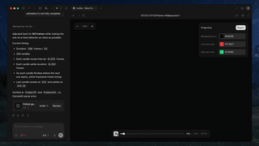</a> <a href="https://github.com/diffusionstudio/lottie">diffusionstudio/lottie</a></td>
<td align="center" valign="top"> <a href="https://github.com/nolangz/pixel2motion">nolangz/pixel2motion</a></td>
<td align="center" valign="top"> <a href="https://github.com/alexgreensh/anidoodle">alexgreensh/anidoodle</a></td>
</tr></table>

| Repo | Stars | What it does | Security |
|---|---:|---|---|
| [diffusionstudio/lottie](https://github.com/diffusionstudio/lottie) | 5.5k | Generate production-ready Lottie animations with Claude Code or Codex | [SAFE](https://agentskillshub.top/skill/diffusionstudio/lottie/?utm_source=github&utm_medium=awesome-list) |
| [nolangz/pixel2motion](https://github.com/nolangz/pixel2motion) | 2.4k | AI logo animation skill: turn raster logos into smooth SVG animation, animated HTML demos, GIF/video previews, and motion QA evidence. | [SAFE](https://agentskillshub.top/skill/nolangz/pixel2motion/?utm_source=github&utm_medium=awesome-list) |
| [pyang5166/gbro-collage-broll](https://github.com/pyang5166/gbro-collage-broll) | 1.3k | 半调纸拼贴 B-roll 生成 skill：三闸门审批，Gemini Omni Flash 首尾帧组装动画 \| Editorial halftone paper-collage B-roll agent skill | [SAFE](https://agentskillshub.top/skill/pyang5166/gbro-collage-broll/?utm_source=github&utm_medium=awesome-list) |
| [alexgreensh/anidoodle](https://github.com/alexgreensh/anidoodle) | 789 | Art and animation, written as code. Illustrations, loops, interactive web art, launch-videos and scored films in dozens of styles, identical on every… | [SAFE](https://agentskillshub.top/skill/alexgreensh/anidoodle/?utm_source=github&utm_medium=awesome-list) |
| [MegaTroll222/VOX-COLLAGE-BROLL](https://github.com/MegaTroll222/VOX-COLLAGE-BROLL) | 214 | Turn one spoken line into a paper-collage explainer video — Claude Code skill + MaxFusion MCP. English adaptation of gbro-collage-broll by pyang5166. | [SAFE](https://agentskillshub.top/skill/MegaTroll222/VOX-COLLAGE-BROLL/?utm_source=github&utm_medium=awesome-list) |
| [Liamrjohnston/remotion-motion-graphics-skill](https://github.com/Liamrjohnston/remotion-motion-graphics-skill) | 81 | Production-ready Remotion motion graphics skills for AI video workflows | [SAFE](https://agentskillshub.top/skill/Liamrjohnston/remotion-motion-graphics-skill/?utm_source=github&utm_medium=awesome-list) |
| [HRuiCcc/RuiC-motion-reel](https://github.com/HRuiCcc/RuiC-motion-reel) | 63 | 用代码生成 15 秒动态图形成片 · Agent Skill。交付 1920×1080 / 30fps。自研渲染引擎：2× 超采样矢量/文字 + 真 3D 点云 + 丝网印四色分色 + 代码合成配乐，不用任何外部美术素材、不用 AE。15 张风格牌，已做过暗色科技 / riso 印刷 / 纸艺 /… | [SAFE](https://agentskillshub.top/skill/HRuiCcc/RuiC-motion-reel/?utm_source=github&utm_medium=awesome-list) |
| [AgriciDaniel/claude-gif](https://github.com/AgriciDaniel/claude-gif) | 27 | Ultimate GIF creator skill for Claude Code. 6 generation pipelines: Remotion, Veo 3.1, SVG-to-transparent-GIF, FFmpeg, image sequences, AI frames. Pa… | [SAFE](https://agentskillshub.top/skill/AgriciDaniel/claude-gif/?utm_source=github&utm_medium=awesome-list) |
| [toufuim/personal-ip-brand-intro-skill](https://github.com/toufuim/personal-ip-brand-intro-skill) | 20 | 開源 Codex Skill：用文字、原創插圖或使用者圖片製作個人 IP 品牌開場，支援上傳音樂對拍與無音樂自主節拍。 | [SAFE](https://agentskillshub.top/skill/toufuim/personal-ip-brand-intro-skill/?utm_source=github&utm_medium=awesome-list) |
| [iart-ai/kinetic-typography-skills](https://github.com/iart-ai/kinetic-typography-skills) | 12 | Kinetic typography skills for AI coding agents — turn text into beat-synced, animated type for social, titles, and lyric videos. | [SAFE](https://agentskillshub.top/skill/iart-ai/kinetic-typography-skills/?utm_source=github&utm_medium=awesome-list) |
| [fernandokaraka/remotion-motion-graphics-skill](https://github.com/fernandokaraka/remotion-motion-graphics-skill) | 11 | Claude Code skill: build animated motion graphics as real video with Remotion — title cards, lower thirds, overlays with real alpha for Premiere/FCP/… | [SAFE](https://agentskillshub.top/skill/fernandokaraka/remotion-motion-graphics-skill/?utm_source=github&utm_medium=awesome-list) |
| [acelera-agency/html-animation](https://github.com/acelera-agency/html-animation) | 9 | Motion graphics as code. An agent skill for building frame-exact animated logos, kinetic typography and brand videos as a single HTML file, then expo… | [SAFE](https://agentskillshub.top/skill/acelera-agency/html-animation/?utm_source=github&utm_medium=awesome-list) |
| [zhenwusw/orca-motion-skill](https://github.com/zhenwusw/orca-motion-skill) | 8 | Agent skill for in-scene motion graphics built from abstract, design-token-driven shapes; pairs with orca-transition-skill. | [SAFE](https://agentskillshub.top/skill/zhenwusw/orca-motion-skill/?utm_source=github&utm_medium=awesome-list) |
| [awesome-skills/manim-skill](https://github.com/awesome-skills/manim-skill) | 7 | Manim animation skill for Claude Code - create programmatic animations for technical blogs and educational content | [SAFE](https://agentskillshub.top/skill/awesome-skills/manim-skill/?utm_source=github&utm_medium=awesome-list) |

## 📝 Scripts & learning

[Open this type on the live page, sorted by stars →](https://agentskillshub.top/best/claude-video-skills/?utm_source=github&utm_medium=awesome-list#type-craft)

<table><tr>
<td align="center" valign="top"><a href="https://github.com/eternityspring/reelbench-skills">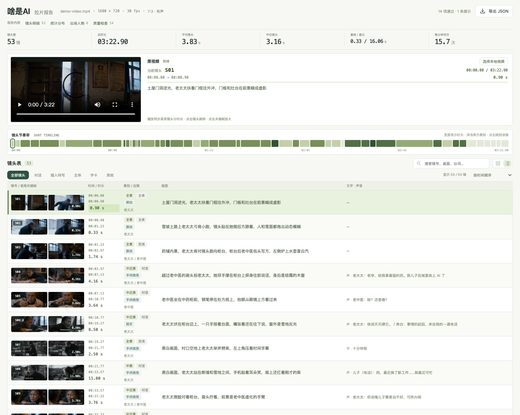</a> <a href="https://github.com/eternityspring/reelbench-skills">eternityspring/reelbench-skills</a></td>
<td align="center" valign="top"><a href="https://github.com/wocha-xiaoli/video-shot-analysis-feishu">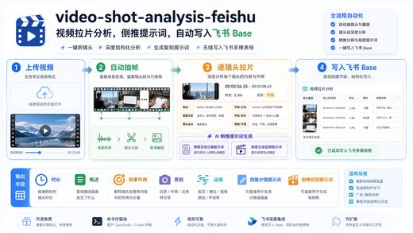</a> <a href="https://github.com/wocha-xiaoli/video-shot-analysis-feishu">wocha-xiaoli/video-shot-analysis-feishu</a></td>
<td align="center" valign="top"><a href="https://github.com/erduo1998-cell/video-script-builder">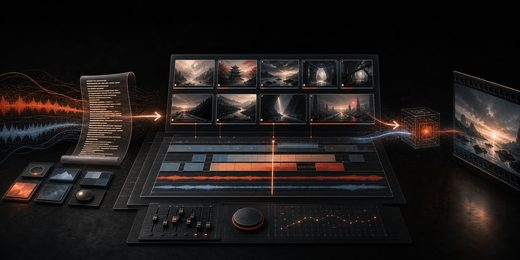</a> <a href="https://github.com/erduo1998-cell/video-script-builder">erduo1998-cell/video-script-builder</a></td>
</tr></table>

| Repo | Stars | What it does | Security |
|---|---:|---|---|
| [jtydhr88/screenwriting-skills](https://github.com/jtydhr88/screenwriting-skills) | 1.6k | Professional agent skills for screenwriting, television writing and dramaturgy | [SAFE](https://agentskillshub.top/skill/jtydhr88/screenwriting-skills/?utm_source=github&utm_medium=awesome-list) |
| [eternityspring/reelbench-skills](https://github.com/eternityspring/reelbench-skills) | 860 | Learning notes and tooling skills for AI video - AI 视频相关的学习与工具 skill | [SAFE](https://agentskillshub.top/skill/eternityspring/reelbench-skills/?utm_source=github&utm_medium=awesome-list) |
| [gnipbao/minimax-h3-video-reverse-skill](https://github.com/gnipbao/minimax-h3-video-reverse-skill) | 208 | MiniMax H3 视频反推 Skill：真实镜头、首帧与动态提示词、AUTO/T2VA/I2V/DUAL，附中文教程与验证工具。 | [SAFE](https://agentskillshub.top/skill/gnipbao/minimax-h3-video-reverse-skill/?utm_source=github&utm_medium=awesome-list) |
| [wyuzhi/qisi-video-remix](https://github.com/wyuzhi/qisi-video-remix) | 168 | 视频创意改编 Agent Skill：参考视频 → 剧本 → 分镜 → 分段生成提示词。By qisi. | [SAFE](https://agentskillshub.top/skill/wyuzhi/qisi-video-remix/?utm_source=github&utm_medium=awesome-list) |
| [adityaarsharma/youtube-marketing-skills](https://github.com/adityaarsharma/youtube-marketing-skills) | 50 | Open-source agent-agnostic YouTube growth toolkit — 21 AI commands + live channel MCP. Works with Claude Code, Cursor, Codex, Windsurf, Gemini CLI &… | [SAFE](https://agentskillshub.top/skill/adityaarsharma/youtube-marketing-skills/?utm_source=github&utm_medium=awesome-list) |
| [wocha-xiaoli/video-shot-analysis-feishu](https://github.com/wocha-xiaoli/video-shot-analysis-feishu) | 38 | 视频拉片到飞书 Base：自动抽帧、逐镜头分析、倒推分镜与视频生成提示词的 Codex/OpenCode skill | [SAFE](https://agentskillshub.top/skill/wocha-xiaoli/video-shot-analysis-feishu/?utm_source=github&utm_medium=awesome-list) |
| [liuliu-66-create/ll-video-decomposer](https://github.com/liuliu-66-create/ll-video-decomposer) | 24 | 专业的五层视频拆解 Codex Skill：支持视频链接、本地媒体和逐字稿。 | [SAFE](https://agentskillshub.top/skill/liuliu-66-create/ll-video-decomposer/?utm_source=github&utm_medium=awesome-list) |
| [erduo1998-cell/video-script-builder](https://github.com/erduo1998-cell/video-script-builder) | 11 | 把中文视频逐字稿转换为可执行 HyperFrames 分镜规格的 AI Agent Skill | [SAFE](https://agentskillshub.top/skill/erduo1998-cell/video-script-builder/?utm_source=github&utm_medium=awesome-list) |
| [chenmisss/laoxu-video-script](https://github.com/chenmisss/laoxu-video-script) | 9 | 老徐·自媒体起号方法论 skill：定位/选题/破立合成稿/五维诊断/去车轱辘话/112条母题库。零基础起号，Claude Code/Codex skill。 | [SAFE](https://agentskillshub.top/skill/chenmisss/laoxu-video-script/?utm_source=github&utm_medium=awesome-list) |
| [sharon-laicc/viral-video-decomposer](https://github.com/sharon-laicc/viral-video-decomposer) | 7 | 拆解爆款短视频，生成镜头级拉片、爆款机制、AI 生产蓝图和视频生成 brief 的 Codex/Claude skill。｜A Codex/Claude skill for decomposing hot short videos into shot-by-shot analysis, reusa… | [SAFE](https://agentskillshub.top/skill/sharon-laicc/viral-video-decomposer/?utm_source=github&utm_medium=awesome-list) |

## 🎵 Music videos

[Open this type on the live page, sorted by stars →](https://agentskillshub.top/best/claude-video-skills/?utm_source=github&utm_medium=awesome-list#type-music)

<table><tr>
<td align="center" valign="top"><a href="https://github.com/ledbetterljoshua/functional-emotions-video">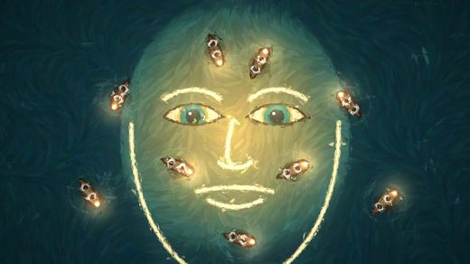</a> <a href="https://github.com/ledbetterljoshua/functional-emotions-video">ledbetterljoshua/functional-emotions-video</a></td>
<td align="center" valign="top"> <a href="https://github.com/latent-variable/deep-learning-birthday">latent-variable/deep-learning-birthday</a></td>
</tr></table>

| Repo | Stars | What it does | Security |
|---|---:|---|---|
| [JohnHeibel/PDoomVideo](https://github.com/JohnHeibel/PDoomVideo) | 1.8k | Source code for the Claude Opus 5.5 music video for I'm Upping My P(doom) | [SAFE](https://agentskillshub.top/skill/JohnHeibel/PDoomVideo/?utm_source=github&utm_medium=awesome-list) |
| [ledbetterljoshua/functional-emotions-video](https://github.com/ledbetterljoshua/functional-emotions-video) | 63 | A painted music video for "Functional Emotions", made by Claude Opus 5.5: custom GPU brushstroke renderer, storyboard, and 7 parallel chapter agents. | [SAFE](https://agentskillshub.top/skill/ledbetterljoshua/functional-emotions-video/?utm_source=github&utm_medium=awesome-list) |
| [lintsinghua/paint-mv-skills](https://github.com/lintsinghua/paint-mv-skills) | 30 | Agent skills that turn a song and its lyrics into a hand-painted watercolour music video (p5.brush + headless Chrome + ffmpeg), following PDoomVideo'… | [SAFE](https://agentskillshub.top/skill/lintsinghua/paint-mv-skills/?utm_source=github&utm_medium=awesome-list) |
| [EGSECDA/vocaloid-style-mv-pipeline](https://github.com/EGSECDA/vocaloid-style-mv-pipeline) | 12 | Production pipeline and Claude Code skill for Vocaloid-style hand-drawn (手書き) lyric music videos: deterministic Canvas2D/WebGL2 animation engine, JIZ… | [SAFE](https://agentskillshub.top/skill/EGSECDA/vocaloid-style-mv-pipeline/?utm_source=github&utm_medium=awesome-list) |
| [latent-variable/deep-learning-birthday](https://github.com/latent-variable/deep-learning-birthday) | 9 | Happy Birthday to Me (Self-Supervised): a riso-print music video for AlexNet's 14th birthday, made with local open models and Claude | [*pending*](https://agentskillshub.top/skill/latent-variable/deep-learning-birthday/?utm_source=github&utm_medium=awesome-list) |
| [neelnanda-io/dont-go-quiet-on-me](https://github.com/neelnanda-io/dont-go-quiet-on-me) | 4 | Don't Go Quiet On Me: a song and hand-drawn-in-code music video about the history of mech interp, made with Claude Opus 5.5 and Suno v6 | [SAFE](https://agentskillshub.top/skill/neelnanda-io/dont-go-quiet-on-me/?utm_source=github&utm_medium=awesome-list) |

**Security** is the grade of the repo's README and install steps on Agent Skills Hub. *pending* means the catalog has not graded it yet.

Preview images are reduced copies of pictures from each project's own README, included only for projects under a permissive license. Sources and licenses: [assets/previews/NOTICE.md](assets/previews/NOTICE.md). Open an issue to have one removed.

## Related collections

- [opusvideo/awesome-claude-video](https://github.com/opusvideo/awesome-claude-video) — videos people made with Opus 5.5, with the original posts. Works, where this list is tools.
- [TripoGrowthLab/awesome-opus-5-5-prompts](https://github.com/TripoGrowthLab/awesome-opus-5-5-prompts) — Opus 5.5 prompts for 3D scenes, games and simulations.

## Add a repo

Open an issue with the GitHub URL. It goes through the same review as every entry; the rules above decide, stars do not.

---

Machine-readable copy: [`data/skills.json`](data/skills.json). Generated 2026-10-05.
