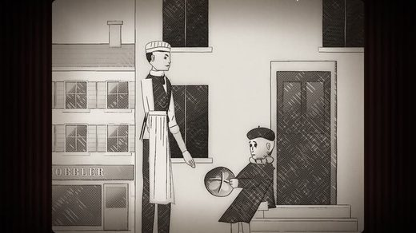

# Awesome Claude Video Skills

[English](README.md)

让 **Claude Code、Codex 等编程 agent 做视频**的开源 skill 和工具包:HyperFrames、Remotion、动效、剪辑、讲解、数字人。共 273 个仓库,每个都由 [Agent Skills Hub](https://agentskillshub.top?utm_source=github&utm_medium=awesome-list) 读过 README 并做了安全评级。

带类型筛选的在线页面:**[https://agentskillshub.top/best/claude-video-skills/](https://agentskillshub.top/best/claude-video-skills/?utm_source=github&utm_medium=awesome-list)** · 每 8 小时刷新

## 这些工具能做出什么

<table>
<tr>
<td align="center" valign="top" width="33%"><b>🧱 框架与通用工具包</b> 45 个仓库   渲染框架和通用工具包。 <a href="#type-general"><b>查看列表 →</b></a></td>
<td align="center" valign="top" width="33%"><b>📣 产品宣传与演示</b> 52 个仓库   产品发布片、广告和演示视频。 <a href="#type-promo"><b>查看列表 →</b></a></td>
<td align="center" valign="top" width="33%"><b>🎓 讲解科普</b> 46 个仓库   知识讲解、教程和旁白课程。 <a href="#type-explainer"><b>查看列表 →</b></a></td>
</tr>
<tr>
<td align="center" valign="top" width="33%"><b>✂️ 剪辑与后期</b> 39 个仓库   对已有素材做剪辑、字幕、B-roll 和解说。 <a href="#type-editing"><b>查看列表 →</b></a></td>
<td align="center" valign="top" width="33%"><b>📱 短视频与口播</b> 33 个仓库   面向 Reels、Shorts、TikTok、抖音的竖屏视频。 <a href="#type-shorts"><b>查看列表 →</b></a></td>
<td align="center" valign="top" width="33%"><b>🧑‍💼 数字人</b> 7 个仓库  数字人、虚拟主播和口型同步。 <a href="#type-avatar"><b>查看列表 →</b></a></td>
</tr>
<tr>
<td align="center" valign="top" width="33%"><b>📖 故事与动画</b> 16 个仓库   动画故事、短剧和电影感场景。 <a href="#type-story"><b>查看列表 →</b></a></td>
<td align="center" valign="top" width="33%"><b>🎞 动效与 Logo</b> 17 个仓库   Logo 动画、标题、界面动效和 GIF。 <a href="#type-motion"><b>查看列表 →</b></a></td>
<td align="center" valign="top" width="33%"><b>📝 剧本与学习</b> 10 个仓库   视频的前期:剧本、拉片和学习。 <a href="#type-craft"><b>查看列表 →</b></a></td>
</tr>
<tr>
<td align="center" valign="top" width="33%"><b>🎵 音乐视频</b> 8 个仓库   用代码做出来的音乐视频。 <a href="#type-music"><b>查看列表 →</b></a></td>
</tr>
</table>

## 目录

- [用 Claude Opus 5.5 做出来的](#made-with-opus-55)
- [🧱 框架与通用工具包](#type-general) (45)
- [📣 产品宣传与演示](#type-promo) (52)
- [🎓 讲解科普](#type-explainer) (46)
- [✂️ 剪辑与后期](#type-editing) (39)
- [📱 短视频与口播](#type-shorts) (33)
- [🧑‍💼 数字人](#type-avatar) (7)
- [📖 故事与动画](#type-story) (16)
- [🎞 动效与 Logo](#type-motion) (17)
- [📝 剧本与学习](#type-craft) (10)
- [🎵 音乐视频](#type-music) (8)

## 什么样的仓库能上榜

1. 它做视频、剪视频或做动效。3D 网页、提示词合集不算。"剧本与学习"一类里的少数条目属于视频的前期(编剧、拉片),由维护者指定收录。
2. 它是给 agent 用的:skill、插件、MCP 服务器,或为 agent 写的工具包。
3. 它有 README。没有 README 就没法评级。
4. 50 星及以上只看是否切题;50 星以下还要过 README 质量线(展示成品、一条命令上手、说清产出、文档完整),并且至少 5 星——点名 Claude Opus 5.5 的除外。

这些问题由决策模型逐个读 README 回答,不是人工挑选。卡在线上的仓库可能判到任一边,归错了请提 issue。

## 用 Claude Opus 5.5 做出来的

README 写明用这个模型做的项目。

| 仓库 | 星数 | 做什么 | 安全评级 |
|---|---:|---|---|
| [JohnHeibel/PDoomVideo](https://github.com/JohnHeibel/PDoomVideo) | 2.0k | Claude Opus 5.5 音乐视频《I'm Upping My P(doom)》的源代码 | [SAFE](https://agentskillshub.top/skill/JohnHeibel/PDoomVideo/?utm_source=github&utm_medium=awesome-list) |
| [lemomo-ai/lemo-opuscar](https://github.com/lemomo-ai/lemo-opuscar) | 1.7k | Opus 5.5 x 39 种影片风格：风格提示词 + 纯代码样片 + 导演与技术指南 | [SAFE](https://agentskillshub.top/skill/lemomo-ai/lemo-opuscar/?utm_source=github&utm_medium=awesome-list) |
| [JohnHeibel/ClaudeAnimationBase](https://github.com/JohnHeibel/ClaudeAnimationBase) | 997 | 用 Claude 制作手绘卡通动画的入门套件：p5.js + p5.brush、Clawd 角色、31 种表演情绪和给模型的指南 | [SAFE](https://agentskillshub.top/skill/JohnHeibel/ClaudeAnimationBase/?utm_source=github&utm_medium=awesome-list) |
| [ledbetterljoshua/functional-emotions-video](https://github.com/ledbetterljoshua/functional-emotions-video) | 68 | Claude Opus 5.5 制作的《Functional Emotions》手绘风音乐视频：自研 GPU 笔触渲染器、7 个并行章节 agent | [SAFE](https://agentskillshub.top/skill/ledbetterljoshua/functional-emotions-video/?utm_source=github&utm_medium=awesome-list) |

## 🧱 框架与通用工具包

[在在线页面打开这一类,按星数排序 →](https://agentskillshub.top/best/claude-video-skills/?utm_source=github&utm_medium=awesome-list#type-general)

<table><tr>
<td align="center" valign="top"> <a href="https://github.com/heygen-com/hyperframes">heygen-com/hyperframes</a></td>
<td align="center" valign="top"> <a href="https://github.com/digitalsamba/claude-code-video-toolkit">digitalsamba/claude-code-video-toolkit</a></td>
<td align="center" valign="top"> <a href="https://github.com/bangtutorial/bang-motion">bangtutorial/bang-motion</a></td>
</tr></table>

| 仓库 | 星数 | 做什么 | 安全评级 |
|---|---:|---|---|
| [calesthio/OpenMontage](https://github.com/calesthio/OpenMontage) | 66.0k | 开源的 agent 视频制作系统：12 条制作流水线、100+ 工具、700+ skill 与知识文件 | [SAFE](https://agentskillshub.top/skill/calesthio/OpenMontage/?utm_source=github&utm_medium=awesome-list) |
| [heygen-com/hyperframes](https://github.com/heygen-com/hyperframes) | 60.1k | 写 HTML，渲染成视频，为 agent 而建 | [SAFE](https://agentskillshub.top/skill/heygen-com/hyperframes/?utm_source=github&utm_medium=awesome-list) |
| [hypit-ai/hypit](https://github.com/hypit-ai/hypit) | 20.7k | 用 AI agent 复刻爆款视频的完整流程：换脸、换文案、换 B-roll，一条命令产出 100 个变体 | [SAFE](https://agentskillshub.top/skill/hypit-ai/hypit/?utm_source=github&utm_medium=awesome-list) |
| [remotion-dev/skills](https://github.com/remotion-dev/skills) | 5.0k | Agent Skills 合集 | [SAFE](https://agentskillshub.top/skill/remotion-dev/skills/?utm_source=github&utm_medium=awesome-list) |
| [NarratorAI-Studio/narrator-ai-cli-skill](https://github.com/NarratorAI-Studio/narrator-ai-cli-skill) | 3.0k | AI 解说大师 Agent skill，封装 narrator-ai-cli 供 Claude、Codex 等工具调用 | [SAFE](https://agentskillshub.top/skill/NarratorAI-Studio/narrator-ai-cli-skill/?utm_source=github&utm_medium=awesome-list) |
| [digitalsamba/claude-code-video-toolkit](https://github.com/digitalsamba/claude-code-video-toolkit) | 2.2k | 面向 Claude Code 的 AI 原生视频制作工具包 | [SAFE](https://agentskillshub.top/skill/digitalsamba/claude-code-video-toolkit/?utm_source=github&utm_medium=awesome-list) |
| [vibe-motion/skills](https://github.com/vibe-motion/skills) | 1.3k | vibe motion 的 agent skills | [SAFE](https://agentskillshub.top/skill/vibe-motion/skills/?utm_source=github&utm_medium=awesome-list) |
| [iart-ai/motion-skills](https://github.com/iart-ai/motion-skills) | 763 | 50 个开源 skill，教 AI 编程 agent 做动态图形、动画和视频，分 14 个安装包 | [SAFE](https://agentskillshub.top/skill/iart-ai/motion-skills/?utm_source=github&utm_medium=awesome-list) |
| [bangtutorial/bang-motion](https://github.com/bangtutorial/bang-motion) | 587 | 浏览器动态图形 agent skill：片头、宣传片、动态排版和五种讲解风格，输出单个 index.html | [SAFE](https://agentskillshub.top/skill/bangtutorial/bang-motion/?utm_source=github&utm_medium=awesome-list) |
| [FavioVazquez/showtime](https://github.com/FavioVazquez/showtime) | 223 | 给编程 agent 的本地视频工作室:一句话描述视频,agent 导演、本机渲染,不需要 API key | [SAFE](https://agentskillshub.top/skill/FavioVazquez/showtime/?utm_source=github&utm_medium=awesome-list) |
| [kangarooking/director-skills](https://github.com/kangarooking/director-skills) | 182 | 导演 Skill：面向 AI 视频创作的开源 Agent Skills | [SAFE](https://agentskillshub.top/skill/kangarooking/director-skills/?utm_source=github&utm_medium=awesome-list) |
| [video-db/skills](https://github.com/video-db/skills) | 128 | 给 agent 用的服务端视频工作流：导入、理解、搜索、剪辑、流式播放 | [SAFE](https://agentskillshub.top/skill/video-db/skills/?utm_source=github&utm_medium=awesome-list) |
| [jhartquist/claude-remotion-kickstart](https://github.com/jhartquist/claude-remotion-kickstart) | 120 | 用 Claude Code 和 Remotion 以编程方式制作视频 | [SAFE](https://agentskillshub.top/skill/jhartquist/claude-remotion-kickstart/?utm_source=github&utm_medium=awesome-list) |
| [iart-ai/motion-design-skills](https://github.com/iart-ai/motion-design-skills) | 102 | 可安装的 Claude Code skills，涵盖动效设计基础、引擎和品牌元素，含 After Effects、Remotion 等 | [SAFE](https://agentskillshub.top/skill/iart-ai/motion-design-skills/?utm_source=github&utm_medium=awesome-list) |
| [Changroro/code-video](https://github.com/Changroro/code-video) | 50 | 调研一个主题,渲染成手绘加 8-bit 风格宣传片(MP4)的 agent skill | [SAFE](https://agentskillshub.top/skill/Changroro/code-video/?utm_source=github&utm_medium=awesome-list) |
| [JJenglert1/remotion-claude-video](https://github.com/JJenglert1/remotion-claude-video) | 49 | Remotion + Claude Code 入门套件:不用时间线和 AE,用提示词写代码做视频 | [SAFE](https://agentskillshub.top/skill/JJenglert1/remotion-claude-video/?utm_source=github&utm_medium=awesome-list) |
| [Johnson-Jia/video-clipforge](https://github.com/Johnson-Jia/video-clipforge) | 41 | AI 短视频制作系统：给一个想法，完成写稿、配音、画面和成片，基于 Claude Code + HyperFrames | [SAFE](https://agentskillshub.top/skill/Johnson-Jia/video-clipforge/?utm_source=github&utm_medium=awesome-list) |
| [erduo1998-cell/vidmuse-video-creator](https://github.com/erduo1998-cell/vidmuse-video-creator) | 37 | VidMuse 的开源 agent skill:从授权到交付,生成图片、视频和 SRT B-roll | [SAFE](https://agentskillshub.top/skill/erduo1998-cell/vidmuse-video-creator/?utm_source=github&utm_medium=awesome-list) |
| [zhouyuechuan2025-ui/ai-self-media-video-packaging-skill](https://github.com/zhouyuechuan2025-ui/ai-self-media-video-packaging-skill) | 37 | 开放的 Agent Skill：用 Remotion（可选 HyperFrames）包装口播视频，含可安全 seek 的动效和线条插画 | [SAFE](https://agentskillshub.top/skill/zhouyuechuan2025-ui/ai-self-media-video-packaging-skill/?utm_source=github&utm_medium=awesome-list) |
| [GordenSun/react-bits-video](https://github.com/GordenSun/react-bits-video) | 28 | 整合 react-bits、Remotion 和 HyperFrames 的视频生成 Skill | [SAFE](https://agentskillshub.top/skill/GordenSun/react-bits-video/?utm_source=github&utm_medium=awesome-list) |
| [bbylw/hyperframes-cn](https://github.com/bbylw/hyperframes-cn) | 28 | HyperFrames 开源框架：将 HTML、CSS、媒体与可定位动画转为确定性的 MP4 视频，可通过 CLI 或 skills 使用 | [SAFE](https://agentskillshub.top/skill/bbylw/hyperframes-cn/?utm_source=github&utm_medium=awesome-list) |
| [smwbev/framewright](https://github.com/smwbev/framewright) | 23 | 完全用代码生成短视频的 agent skill + 模板：单个 HTML 文件，每一帧都是纯函数 | [SAFE](https://agentskillshub.top/skill/smwbev/framewright/?utm_source=github&utm_medium=awesome-list) |
| [abhinavshrivastava950/Montara](https://github.com/abhinavshrivastava950/Montara) | 22 | AI 原生的自主视频制作系统:先理解内容再剪辑,用时间线中间表示规划叙事并调度渲染器和 agent | [SAFE](https://agentskillshub.top/skill/abhinavshrivastava950/Montara/?utm_source=github&utm_medium=awesome-list) |
| [Aaryan-Kapoor/video-production-skill](https://github.com/Aaryan-Kapoor/video-production-skill) | 17 | 把 AI agent 变成教育视频制作者:调研、分镜、旁白、动画、渲染、质检到交付 | [SAFE](https://agentskillshub.top/skill/Aaryan-Kapoor/video-production-skill/?utm_source=github&utm_medium=awesome-list) |
| [doublesq97-ui/su-card-to-video](https://github.com/doublesq97-ui/su-card-to-video) | 17 | 基于 HyperFrames、GSAP 和 FFmpeg 的极简 HTML/CSS 卡片转视频入门 skill | [SAFE](https://agentskillshub.top/skill/doublesq97-ui/su-card-to-video/?utm_source=github&utm_medium=awesome-list) |
| [gloweaseco-leo/hyperdirector](https://github.com/gloweaseco-leo/hyperdirector) | 17 | 基于 HyperFrames 的结构化 AI 视频制作 Hermes Skill Pack：brief → 分镜 → HTML → lint/渲染 | [SAFE](https://agentskillshub.top/skill/gloweaseco-leo/hyperdirector/?utm_source=github&utm_medium=awesome-list) |
| [WhiteTowerAI/cut-as-code](https://github.com/WhiteTowerAI/cut-as-code) | 15 | 开源的 agent 视频剪辑 skill,对标 Opus Clip 和剪映 | [SAFE](https://agentskillshub.top/skill/WhiteTowerAI/cut-as-code/?utm_source=github&utm_medium=awesome-list) |
| [ZLHad/OpenVideoHarness](https://github.com/ZLHad/OpenVideoHarness) | 11 | Claude Code 和 Codex 的视频工作台：agent 编写渲染代码并检查画面，由你审核立意、分镜和剪辑；支持 9 类视频、31 种风格，代码生成配… | [SAFE](https://agentskillshub.top/skill/ZLHad/OpenVideoHarness/?utm_source=github&utm_medium=awesome-list) |
| [magichourhq/skills](https://github.com/magichourhq/skills) | 10 | 面向 Codex、Claude Code 等 agent 的 AI 媒体生成 skills，覆盖图片、视频和音频工作流 | [SAFE](https://agentskillshub.top/skill/magichourhq/skills/?utm_source=github&utm_medium=awesome-list) |
| [diko0071/remotion-video-skills](https://github.com/diko0071/remotion-video-skills) | 9 | Remotion 视频工厂:用代码生成可复现的产品视频,附可复用的动效套件 | [SAFE](https://agentskillshub.top/skill/diko0071/remotion-video-skills/?utm_source=github&utm_medium=awesome-list) |
| [resemble-ai/remotion-resemble-skill](https://github.com/resemble-ai/remotion-resemble-skill) | 9 |  | [SAFE](https://agentskillshub.top/skill/resemble-ai/remotion-resemble-skill/?utm_source=github&utm_medium=awesome-list) |
| [Neelshah1810/Claude-Video-Skills](https://github.com/Neelshah1810/Claude-Video-Skills) | 8 | 11 个 Claude skill，用 HTML + MP4 制作动态图形视频（发布影片、解说视频、社交广告、数据故事），适用于 Claude 和 Claud… | [SAFE](https://agentskillshub.top/skill/Neelshah1810/Claude-Video-Skills/?utm_source=github&utm_medium=awesome-list) |
| [iart-ai/data-animation-skills](https://github.com/iart-ai/data-animation-skills) | 8 | Claude Code 的数据视频/动态信息图 skills：把 CSV 变成动态图表，每一帧数字都准确 | [SAFE](https://agentskillshub.top/skill/iart-ai/data-animation-skills/?utm_source=github&utm_medium=awesome-list) |
| [molkex/mcp-flow-google](https://github.com/molkex/mcp-flow-google) | 8 | Google Flow 的 MCP 服务器：在 Claude Code、Cursor 等客户端里用 Veo 生成视频、Nano Banana 生成图片 | [SAFE](https://agentskillshub.top/skill/molkex/mcp-flow-google/?utm_source=github&utm_medium=awesome-list) |
| [patraxo/ltx2-vidgen-skill](https://github.com/patraxo/ltx2-vidgen-skill) | 8 | 通过 Claude Code skill 在自己的 Modal GPU 上自托管 LTX-2.3：t2v、i2v、关键帧、v2v 和同步音频 | [SAFE](https://agentskillshub.top/skill/patraxo/ltx2-vidgen-skill/?utm_source=github&utm_medium=awesome-list) |
| [VasiniDevi/motion-skills](https://github.com/VasiniDevi/motion-skills) | 7 | 给 AI agent 用的编程式动效设计 skills：用 Python 做动态图形、动态排版、数据可视化和幻灯片 | [SAFE](https://agentskillshub.top/skill/VasiniDevi/motion-skills/?utm_source=github&utm_medium=awesome-list) |
| [davidcervinka/vibe-editing](https://github.com/davidcervinka/vibe-editing) | 7 | 视频版的 vibe coding：通过和 Claude Code 对话完成发布片、活动回顾片和 Reels 的剪辑、配乐与交付 | [SAFE](https://agentskillshub.top/skill/davidcervinka/vibe-editing/?utm_source=github&utm_medium=awesome-list) |
| [hraness/slopcamera](https://github.com/hraness/slopcamera) | 7 | 让 Codex、Claude Code 从可反复修改的源文件生成图片、图表、动画、3D 场景、Blender 影片和剪辑视频 | [SAFE](https://agentskillshub.top/skill/hraness/slopcamera/?utm_source=github&utm_medium=awesome-list) |
| [vibe-motion/remotion-starter](https://github.com/vibe-motion/remotion-starter) | 7 | 用 Claude Code 指挥 Remotion 出视频的工作台脚手架：三层架构 + hooks 守规矩 + skills 编排流程，陈与小金维护 | [SAFE](https://agentskillshub.top/skill/vibe-motion/remotion-starter/?utm_source=github&utm_medium=awesome-list) |
| [argus-metis/hermes-video-editing](https://github.com/argus-metis/hermes-video-editing) | 6 | Hermes Agent 的专业剪辑 skill:AI 字幕、去静音、场景检测、防抖和智能重构图 | [CAUTION](https://agentskillshub.top/skill/argus-metis/hermes-video-editing/?utm_source=github&utm_medium=awesome-list) |
| [chenyuxiaojin/cyxj-remotion-starter](https://github.com/chenyuxiaojin/cyxj-remotion-starter) | 6 | 用 Claude Code 指挥 Remotion 出视频的工作台脚手架：三层架构 + hooks 守规矩 + skills 编排流程，作者陈与小金 | [SAFE](https://agentskillshub.top/skill/chenyuxiaojin/cyxj-remotion-starter/?utm_source=github&utm_medium=awesome-list) |
| [kmilo93sd/agent-video-editor](https://github.com/kmilo93sd/agent-video-editor) | 6 | AI agents 的视频剪辑判断：节奏、剪辑、字幕、音频、色彩、缩略图；适用于各种视频，含 128 个 CC0 音效、26 个 CC0 图形和 meme 权… | [SAFE](https://agentskillshub.top/skill/kmilo93sd/agent-video-editor/?utm_source=github&utm_medium=awesome-list) |
| [Kimeur/motion-launch-videos](https://github.com/Kimeur/motion-launch-videos) | 5 | Claude Code 插件+skill：把短文案生成循环动态排版视频；单文件HTML，纯seek(t)、闭式弹簧、逐字运动、真实运动模糊，Playwrigh… | [SAFE](https://agentskillshub.top/skill/Kimeur/motion-launch-videos/?utm_source=github&utm_medium=awesome-list) |
| [iart-ai/text-message-video-skills](https://github.com/iart-ai/text-message-video-skills) | 5 | 面向 AI 编程 agent 的短信动画 skill，将聊天脚本转换为 iMessage/WhatsApp/SMS 对话视频，由 messages 数组渲染。 | [SAFE](https://agentskillshub.top/skill/iart-ai/text-message-video-skills/?utm_source=github&utm_medium=awesome-list) |
| [liaojianquan9-source/ljq-broll-video-generator](https://github.com/liaojianquan9-source/ljq-broll-video-generator) | 5 | 基于参考素材打点、抽帧、拆解,用 Remotion 生成可编辑 B-roll 的 Codex Skill | [SAFE](https://agentskillshub.top/skill/liaojianquan9-source/ljq-broll-video-generator/?utm_source=github&utm_medium=awesome-list) |

## 📣 产品宣传与演示

[在在线页面打开这一类,按星数排序 →](https://agentskillshub.top/best/claude-video-skills/?utm_source=github&utm_medium=awesome-list#type-promo)

<table><tr>
<td align="center" valign="top"> <a href="https://github.com/charlie947/motion-graphics-skills">charlie947/motion-graphics-skills</a></td>
<td align="center" valign="top"> <a href="https://github.com/Finderchangchang/promo-video-skill">Finderchangchang/promo-video-skill</a></td>
<td align="center" valign="top"> <a href="https://github.com/Tejashmakwana/motionmaxxing">Tejashmakwana/motionmaxxing</a></td>
</tr></table>

| 仓库 | 星数 | 做什么 | 安全评级 |
|---|---:|---|---|
| [feitangyuan/onetake](https://github.com/feitangyuan/onetake) | 2.1k | 一镜到底的动效影片 skill:每个节拍由上一个自然生长,用于产品发布片和功能演示 | [SAFE](https://agentskillshub.top/skill/feitangyuan/onetake/?utm_source=github&utm_medium=awesome-list) |
| [echris6/motion-video-kit](https://github.com/echris6/motion-video-kit) | 1.1k | 商业视频的 Claude Code skill 套件:独立评审循环、28 部发布片提炼的动效原则、音效设计和 Three.js 模式 | [SAFE](https://agentskillshub.top/skill/echris6/motion-video-kit/?utm_source=github&utm_medium=awesome-list) |
| [op7418/guizang-product-video-skill](https://github.com/op7418/guizang-product-video-skill) | 758 | 归藏 product video skill：复用真实产品组件和设计语言，用代码制作软件更新宣传片，支持 Claude Code 和 Codex | [SAFE](https://agentskillshub.top/skill/op7418/guizang-product-video-skill/?utm_source=github&utm_medium=awesome-list) |
| [geekjourneyx/hyperframes-motion-director](https://github.com/geekjourneyx/hyperframes-motion-director) | 454 | 中文优先的 HyperFrames 动效视频制作 Agent Skill，素材可来自文章、产品、网站和 README | [SAFE](https://agentskillshub.top/skill/geekjourneyx/hyperframes-motion-director/?utm_source=github&utm_medium=awesome-list) |
| [howseen-ai/claude-motion-design](https://github.com/howseen-ai/claude-motion-design) | 396 | 用纯代码做动效设计视频的 Claude Code skill:HTML + Playwright + ffmpeg,不用 AE 和 Remotion | [CAUTION](https://agentskillshub.top/skill/howseen-ai/claude-motion-design/?utm_source=github&utm_medium=awesome-list) |
| [tugrawork-creator/saas-motion-kit](https://github.com/tugrawork-creator/saas-motion-kit) | 222 | 用 HyperFrames + Claude Code 为软件产品做宣传和动效视频：调性矩阵、多样性审查、24 种转场、100 个分镜主题 | [SAFE](https://agentskillshub.top/skill/tugrawork-creator/saas-motion-kit/?utm_source=github&utm_medium=awesome-list) |
| [charlie947/motion-graphics-skills](https://github.com/charlie947/motion-graphics-skills) | 163 | 13 个发布级动效 Claude Code skill,每一帧都是代码,不用 AE 和视频生成模型 | [SAFE](https://agentskillshub.top/skill/charlie947/motion-graphics-skills/?utm_source=github&utm_medium=awesome-list) |
| [Finderchangchang/promo-video-skill](https://github.com/Finderchangchang/promo-video-skill) | 161 | 让 DeepSeek 这类便宜模型也能用 Remotion 做竖版宣传片的 skill，覆盖软件、餐饮、电商、教育、美业、文旅，中英双语 | [SAFE](https://agentskillshub.top/skill/Finderchangchang/promo-video-skill/?utm_source=github&utm_medium=awesome-list) |
| [bestagentkits/motion-video-skill](https://github.com/bestagentkits/motion-video-skill) | 118 | 用 HyperFrames（HTML + GSAP）做卡点 1080p 动态图形视频的 agent skill，含 AI 配音、字幕、音效和配乐 | [SAFE](https://agentskillshub.top/skill/bestagentkits/motion-video-skill/?utm_source=github&utm_medium=awesome-list) |
| [leosssvip-dot/remotion-ad-video-skill](https://github.com/leosssvip-dot/remotion-ad-video-skill) | 111 | 让 AI 编程 agent 根据 URL 创建 Remotion 广告视频项目，无需视频生成模型 | [SAFE](https://agentskillshub.top/skill/leosssvip-dot/remotion-ad-video-skill/?utm_source=github&utm_medium=awesome-list) |
| [kangarooking/promo-creator-skills](https://github.com/kangarooking/promo-creator-skills) | 102 | 产品宣传视频创作 Skills：从产品判断、分镜、素材、HyperFrames 剪辑到 BGM 设计的完整 agent 工作流 | [SAFE](https://agentskillshub.top/skill/kangarooking/promo-creator-skills/?utm_source=github&utm_medium=awesome-list) |
| [Tejashmakwana/motionmaxxing](https://github.com/Tejashmakwana/motionmaxxing) | 93 | 用于提升动态设计效果的 agent skill，将 AI slop 视频处理成动态设计师制作的影片。 | [SAFE](https://agentskillshub.top/skill/Tejashmakwana/motionmaxxing/?utm_source=github&utm_medium=awesome-list) |
| [Sunwood-ai-labs/hyperframes-motion-reel-skill](https://github.com/Sunwood-ai-labs/hyperframes-motion-reel-skill) | 85 | Claude Code skill：HyperFrames节拍同步动画（HTML+GSAP+SVG+Canvas），120BPM/60FPS转MP4 | [SAFE](https://agentskillshub.top/skill/Sunwood-ai-labs/hyperframes-motion-reel-skill/?utm_source=github&utm_medium=awesome-list) |
| [kingselyjoe/video-shotcraft-dsh](https://github.com/kingselyjoe/video-shotcraft-dsh) | 72 | 面向 DeepSeek Harness 的电影感产品视频 Agent Skill，含 152 张镜头配方卡、Remotion 模板和音频资产 | [SAFE](https://agentskillshub.top/skill/kingselyjoe/video-shotcraft-dsh/?utm_source=github&utm_medium=awesome-list) |
| [norahe0304-art/30x-video](https://github.com/norahe0304-art/30x-video) | 65 | 输入一个 URL，输出产品发布视频的 Claude Code skill（Remotion + React），内置 16 条审美准则，不用模板 | [SAFE](https://agentskillshub.top/skill/norahe0304-art/30x-video/?utm_source=github&utm_medium=awesome-list) |
| [Kianzzz/xilo-opus-video](https://github.com/Kianzzz/xilo-opus-video) | 50 | 用 Claude Opus 5.5 写代码做视频:先给三个方案和预览,确认后逐帧渲染成片 | [SAFE](https://agentskillshub.top/skill/Kianzzz/xilo-opus-video/?utm_source=github&utm_medium=awesome-list) |
| [Mort1d/motion-graphics-skills](https://github.com/Mort1d/motion-graphics-skills) | 50 | 用代码做展示级动态图形,每支视频配原创配乐的 agent skill | [SAFE](https://agentskillshub.top/skill/Mort1d/motion-graphics-skills/?utm_source=github&utm_medium=awesome-list) |
| [trunghaiy/appshot](https://github.com/trunghaiy/appshot) | 47 | 用 TypeScript 配置生成 App Store 和 Google Play 预览视频与截图，基于 Remotion，附带 agent skills | [SAFE](https://agentskillshub.top/skill/trunghaiy/appshot/?utm_source=github&utm_medium=awesome-list) |
| [BayramAnnakov/remotion-video-director](https://github.com/BayramAnnakov/remotion-video-director) | 42 | 交互式 Claude Code skill，通过专家引导的讨论来制作 Remotion 视频 | [SAFE](https://agentskillshub.top/skill/BayramAnnakov/remotion-video-director/?utm_source=github&utm_medium=awesome-list) |
| [Zane-0x5a/remotion-director](https://github.com/Zane-0x5a/remotion-director) | 37 | Claude Code 插件:从一句话需求设计并制作完整动效作品,按真实渲染帧做评审循环 | [SAFE](https://agentskillshub.top/skill/Zane-0x5a/remotion-director/?utm_source=github&utm_medium=awesome-list) |
| [mattivilola/brag-codex](https://github.com/mattivilola/brag-codex) | 34 | latent-spaces/brag 的 Codex 兼容版，用于制作 HyperFrames 发布视频 | [SAFE](https://agentskillshub.top/skill/mattivilola/brag-codex/?utm_source=github&utm_medium=awesome-list) |
| [crimeacs/product-demo-director](https://github.com/crimeacs/product-demo-director) | 33 | 把产品素材和原始录屏做成按旁白节奏剪辑的演示片,由 Codex 或 Claude Code 指挥剪辑、缩放、渲染和质检 | [SAFE](https://agentskillshub.top/skill/crimeacs/product-demo-director/?utm_source=github&utm_medium=awesome-list) |
| [new-xp/ultrademo](https://github.com/new-xp/ultrademo) | 32 | 为网站、SaaS 应用等自动生成演示视频的工具，通过 Claude Code skill 执行 | [SAFE](https://agentskillshub.top/skill/new-xp/ultrademo/?utm_source=github&utm_medium=awesome-list) |
| [gorkem-bwl/onboarding-video-generator](https://github.com/gorkem-bwl/onboarding-video-generator) | 31 | 用 Remotion 制作栏宽尺寸 Web 应用引导视频的 Claude Code skill | [SAFE](https://agentskillshub.top/skill/gorkem-bwl/onboarding-video-generator/?utm_source=github&utm_medium=awesome-list) |
| [Arman-Luthra/aftr](https://github.com/Arman-Luthra/aftr) | 23 | After Effects 版的 Puppeteer：用 Claude Code 操作 AE 制作可用于生产的视频 | [SAFE](https://agentskillshub.top/skill/Arman-Luthra/aftr/?utm_source=github&utm_medium=awesome-list) |
| [imMamdouhaboammar/motion-graphics-skills](https://github.com/imMamdouhaboammar/motion-graphics-skills) | 22 | 基于 HyperFrames 的动态图形 skill:创意指导加制作,做品牌片、动态文字、2D/3D 和程序化视频 | [SAFE](https://agentskillshub.top/skill/imMamdouhaboammar/motion-graphics-skills/?utm_source=github&utm_medium=awesome-list) |
| [AmazingAng/ccvideo](https://github.com/AmazingAng/ccvideo) | 20 | 基于真实界面采集制作 Claude 风格宣传视频的 Claude Code skill（Remotion） | [SAFE](https://agentskillshub.top/skill/AmazingAng/ccvideo/?utm_source=github&utm_medium=awesome-list) |
| [derrickgong87/demo-video-creation-skill](https://github.com/derrickgong87/demo-video-creation-skill) | 20 | 可复用的 Codex skill：根据公司 URL、截图和产品流程制作 SaaS 与产品演示视频 | [SAFE](https://agentskillshub.top/skill/derrickgong87/demo-video-creation-skill/?utm_source=github&utm_medium=awesome-list) |
| [axtonliu/video-illustrator](https://github.com/axtonliu/video-illustrator) | 19 | 用你的声音和真实素材做短片的 agent skill,画风可任选 | [SAFE](https://agentskillshub.top/skill/axtonliu/video-illustrator/?utm_source=github&utm_medium=awesome-list) |
| [memex-lab/product-launch-video-skill](https://github.com/memex-lab/product-launch-video-skill) | 18 | 用 Remotion 制作电影感产品发布视频的 AI agent skill | [SAFE](https://agentskillshub.top/skill/memex-lab/product-launch-video-skill/?utm_source=github&utm_medium=awesome-list) |
| [smit-vanani/claude-promo-video](https://github.com/smit-vanani/claude-promo-video) | 16 | 用 Remotion 把网站 URL 做成卡点产品宣传视频，场景对齐音乐起音，渲染自检，输出横竖屏和缩略图 | [SAFE](https://agentskillshub.top/skill/smit-vanani/claude-promo-video/?utm_source=github&utm_medium=awesome-list) |
| [dlazy-ai/ai-product-video](https://github.com/dlazy-ai/ai-product-video) | 15 | 把产品做成电影感宣传视频的 agent skill：152 张镜头配方卡、209 种风格变体、149 个音效、10 镜头模板 | [SAFE](https://agentskillshub.top/skill/dlazy-ai/ai-product-video/?utm_source=github&utm_medium=awesome-list) |
| [chacha95/demo-video-creator](https://github.com/chacha95/demo-video-creator) | 14 | Agent skill：产品 URL → 16:9 发布影片（EN/KO）。真实 UI 录屏、一次性 VO、节拍同步动效、−14 LUFS MP4。 | [SAFE](https://agentskillshub.top/skill/chacha95/demo-video-creator/?utm_source=github&utm_medium=awesome-list) |
| [kiki-lgtm-dot/cinematic-product-promo-skill](https://github.com/kiki-lgtm-dot/cinematic-product-promo-skill) | 14 | Remotion 产品宣传片 Agent Skill：150+ 镜头配方、200+ 动效预览、2.5D 运镜、节奏剪辑与声音设计 | [SAFE](https://agentskillshub.top/skill/kiki-lgtm-dot/cinematic-product-promo-skill/?utm_source=github&utm_medium=awesome-list) |
| [IskakovDamir/apple-motion](https://github.com/IskakovDamir/apple-motion) | 13 | 用于 Remotion 制作 Apple 风格动态文字回顾视频的 Claude skill，基于逐帧精确测量构建 | [SAFE](https://agentskillshub.top/skill/IskakovDamir/apple-motion/?utm_source=github&utm_medium=awesome-list) |
| [cblain100-prog/motion-design-claude-code](https://github.com/cblain100-prog/motion-design-claude-code) | 13 | 用 Claude Code + HyperFrames（HeyGen）制作发布动效：无需编程，介绍 skill 方法、56 部影片模式、模型和 3 个示例。 | [SAFE](https://agentskillshub.top/skill/cblain100-prog/motion-design-claude-code/?utm_source=github&utm_medium=awesome-list) |
| [iart-ai/ad-video-skills](https://github.com/iart-ai/ad-video-skills) | 13 | Claude Code 的广告视频 skills：把一个动态图形模板批量做成符合品牌、可 A/B 测试的广告素材、发布片和用户证言短片 | [SAFE](https://agentskillshub.top/skill/iart-ai/ad-video-skills/?utm_source=github&utm_medium=awesome-list) |
| [welingtondesosa/video-motion](https://github.com/welingtondesosa/video-motion) | 13 | 用代码为任意品牌做动效视频的 Claude Code skill:品牌套件、合成配乐、审片后的 MP4 | [SAFE](https://agentskillshub.top/skill/welingtondesosa/video-motion/?utm_source=github&utm_medium=awesome-list) |
| [opus-pro/opusclip-video-tools](https://github.com/opus-pro/opusclip-video-tools) | 12 | OpusClip 为 Codex 和 Claude Code 提供的视频工具:可编辑的发布视频模板和托管的素材生成 | [SAFE](https://agentskillshub.top/skill/opus-pro/opusclip-video-tools/?utm_source=github&utm_medium=awesome-list) |
| [AmirSbss/spotlight](https://github.com/AmirSbss/spotlight) | 8 | 把网站、视频素材或主题交给 AI agent，生成发布展示、宣传或说明视频。适用于 Claude Code、Codex、Hermes 等的 Agent Ski… | [SAFE](https://agentskillshub.top/skill/AmirSbss/spotlight/?utm_source=github&utm_medium=awesome-list) |
| [JohnChow90/video-shotcraft](https://github.com/JohnChow90/video-shotcraft) | 8 | 产品视频 skill：157 张镜头配方卡、Remotion 模板、2.5D 摄影机运动与声音设计（原作者：Vincentwei1021） | [SAFE](https://agentskillshub.top/skill/JohnChow90/video-shotcraft/?utm_source=github&utm_medium=awesome-list) |
| [mrieck/demoday-claude-plugin](https://github.com/mrieck/demoday-claude-plugin) | 7 | 为项目制作演示视频的 Claude Code 插件：操作浏览器/CLI 录制，再用 Remotion 等合成带转场的视频 | [SAFE](https://agentskillshub.top/skill/mrieck/demoday-claude-plugin/?utm_source=github&utm_medium=awesome-list) |
| [syklayou-glitch/video-shotcraft](https://github.com/syklayou-glitch/video-shotcraft) | 7 | 用 Remotion 制作电影感产品视频的 AI agent skill：152 张镜头配方卡、2.5D 镜头运动、节拍同步剪辑和电影级 SFX。 | [SAFE](https://agentskillshub.top/skill/syklayou-glitch/video-shotcraft/?utm_source=github&utm_medium=awesome-list) |
| [Anshgrover23/product-demo-playbook](https://github.com/Anshgrover23/product-demo-playbook) | 6 | 让编程 agent 制作产品演示视频的 skill,附模板和完整手册 | [SAFE](https://agentskillshub.top/skill/Anshgrover23/product-demo-playbook/?utm_source=github&utm_medium=awesome-list) |
| [ChenShuo2004/cs-shotcraft-skill](https://github.com/ChenShuo2004/cs-shotcraft-skill) | 6 | CS Skills 产品宣传片 skill：真实产品界面、镜头表运镜、152 张镜头配方卡与 Ink Press 模板，Remotion 出片 | [SAFE](https://agentskillshub.top/skill/ChenShuo2004/cs-shotcraft-skill/?utm_source=github&utm_medium=awesome-list) |
| [farming-labs/product-film-skill](https://github.com/farming-labs/product-film-skill) | 6 | 用一个 HTML 文件做产品发布视频并导出 MP4 的 Claude skill | [SAFE](https://agentskillshub.top/skill/farming-labs/product-film-skill/?utm_source=github&utm_medium=awesome-list) |
| [haxzie/genmotion](https://github.com/haxzie/genmotion) | 6 | 用 Claude Code 制作动态图形和发布视频 | [SAFE](https://agentskillshub.top/skill/haxzie/genmotion/?utm_source=github&utm_medium=awesome-list) |
| [hub-ki/video-generation](https://github.com/hub-ki/video-generation) | 6 | 把应用或网站做成设计过的演示视频的 agent skill:先定概念和脚本,再录屏、配音、校验并渲染 4K | [SAFE](https://agentskillshub.top/skill/hub-ki/video-generation/?utm_source=github&utm_medium=awesome-list) |
| [timscheuerai/launch-video-kit](https://github.com/timscheuerai/launch-video-kit) | 6 | 将网站制作成自有品牌发布视频：URL品牌套件、钩子+主体模板、Claude Code和Codex的10个agent skill、免费音频方案。MIT。 | [SAFE](https://agentskillshub.top/skill/timscheuerai/launch-video-kit/?utm_source=github&utm_medium=awesome-list) |
| [hamen/app-promo-reel](https://github.com/hamen/app-promo-reel) | 5 | Claude Code skill：制作节拍同步的 9:16 应用宣传短视频 | [SAFE](https://agentskillshub.top/skill/hamen/app-promo-reel/?utm_source=github&utm_medium=awesome-list) |
| [surajshetty3416/demo-video-skill](https://github.com/surajshetty3416/demo-video-skill) | 5 | Claude Code skill：通过 Playwright + Pillow + ffmpeg 制作任意 web app 的 60fps ScreenSt… | [SAFE](https://agentskillshub.top/skill/surajshetty3416/demo-video-skill/?utm_source=github&utm_medium=awesome-list) |
| [samuelstroschein/opus-video-generator](https://github.com/samuelstroschein/opus-video-generator) | 1 | 用 Claude Opus 5.5 在浏览器制作发布视频，使用自己的 Claude 订阅。npx opus-video-generator | [SAFE](https://agentskillshub.top/skill/samuelstroschein/opus-video-generator/?utm_source=github&utm_medium=awesome-list) |

## 🎓 讲解科普

[在在线页面打开这一类,按星数排序 →](https://agentskillshub.top/best/claude-video-skills/?utm_source=github&utm_medium=awesome-list#type-explainer)

<table><tr>
<td align="center" valign="top"> <a href="https://github.com/Alisa0808/vox-director">Alisa0808/vox-director</a></td>
<td align="center" valign="top"> <a href="https://github.com/vincentsch/explainroo">vincentsch/explainroo</a></td>
<td align="center" valign="top"> <a href="https://github.com/hi-nikola/hand-drawn-explainer-video-nikola">hi-nikola/hand-drawn-explainer-video-nikola</a></td>
</tr></table>

| 仓库 | 星数 | 做什么 | 安全评级 |
|---|---:|---|---|
| [Alisa0808/vox-director](https://github.com/Alisa0808/vox-director) | 2.2k | 把一个选题做成 Vox 风格纸拼贴讲解或广告视频的 agent skill，基于 Atlas Cloud + ffmpeg 全流程自动化 | [SAFE](https://agentskillshub.top/skill/Alisa0808/vox-director/?utm_source=github&utm_medium=awesome-list) |
| [adithya-s-k/manim_skill](https://github.com/adithya-s-k/manim_skill) | 1.2k | 用 Manim 制作 3Blue1Brown 风格动画的 agent skills | [SAFE](https://agentskillshub.top/skill/adithya-s-k/manim_skill/?utm_source=github&utm_medium=awesome-list) |
| [vincentsch/explainroo](https://github.com/vincentsch/explainroo) | 516 | 由 AI agent 制作讲解视频和产品演示:本地 Kokoro 配音、Whisper 对字、canvas 渲染,把脚本做成带旁白的 MP4 | [SAFE](https://agentskillshub.top/skill/vincentsch/explainroo/?utm_source=github&utm_medium=awesome-list) |
| [GTKottman/mortiflix-oss](https://github.com/GTKottman/mortiflix-oss) | 510 | 本机上的动态设计工作室：Claude 分步制作视频，你逐步确认。使用自己的 Claude Code 或 API 密钥。 | [SAFE](https://agentskillshub.top/skill/GTKottman/mortiflix-oss/?utm_source=github&utm_medium=awesome-list) |
| [wshuyi/remotion-video-skill](https://github.com/wshuyi/remotion-video-skill) | 394 | 用 Remotion 框架以编程方式制作视频的 Claude Code Skill | [CAUTION](https://agentskillshub.top/skill/wshuyi/remotion-video-skill/?utm_source=github&utm_medium=awesome-list) |
| [hi-nikola/hand-drawn-explainer-video-nikola](https://github.com/hi-nikola/hand-drawn-explainer-video-nikola) | 374 | 中文手绘知识讲解视频 Codex Skill：逐笔故事、双语义岛、让怪诞小黑动起来与程序动画 | [SAFE](https://agentskillshub.top/skill/hi-nikola/hand-drawn-explainer-video-nikola/?utm_source=github&utm_medium=awesome-list) |
| [shuyicc/MathLens](https://github.com/shuyicc/MathLens) | 357 | 数学题视频讲解 Agent Skill：粘贴一道题，自动完成分析、可视化讲解、配音脚本到 Manim 动画视频 | [SAFE](https://agentskillshub.top/skill/shuyicc/MathLens/?utm_source=github&utm_medium=awesome-list) |
| [Anil-matcha/vox-ai-motion-graphics-generator](https://github.com/Anil-matcha/vox-ai-motion-graphics-generator) | 246 | 把任意选题做成 Vox 风格纸拼贴讲解视频的 agent skill，脚本、关键帧、动画、配音、配乐和字幕全自动 | [SAFE](https://agentskillshub.top/skill/Anil-matcha/vox-ai-motion-graphics-generator/?utm_source=github&utm_medium=awesome-list) |
| [runesleo/claude-video-kit](https://github.com/runesleo/claude-video-kit) | 119 | Agent Skill + Remotion 流水线：brief/脚本 → 审核回执 → 带旁白的 9:16 讲解视频 | [SAFE](https://agentskillshub.top/skill/runesleo/claude-video-kit/?utm_source=github&utm_medium=awesome-list) |
| [sunxiayi/make-blender-education-video-skill](https://github.com/sunxiayi/make-blender-education-video-skill) | 49 | 用 Blender 制作经事实核查的电影感教学视频的 Codex 和 Claude Code skill | [SAFE](https://agentskillshub.top/skill/sunxiayi/make-blender-education-video-skill/?utm_source=github&utm_medium=awesome-list) |
| [znyupup/knowledge-explainer-skill](https://github.com/znyupup/knowledge-explainer-skill) | 45 | 把一份 markdown 文稿自动生成讲解动画视频，基于 Remotion + AI Agent | [SAFE](https://agentskillshub.top/skill/znyupup/knowledge-explainer-skill/?utm_source=github&utm_medium=awesome-list) |
| [haiderfarooq3/khan-explainer](https://github.com/haiderfarooq3/khan-explainer) | 43 | Claude Code skill：Khan Academy 风格讲解视频，画笔绘图并配音讲解，免费本地运行，无需 API 密钥。 | [SAFE](https://agentskillshub.top/skill/haiderfarooq3/khan-explainer/?utm_source=github&utm_medium=awesome-list) |
| [AmitSubhash/3brown1blue](https://github.com/AmitSubhash/3brown1blue) | 37 | 从第一性原理出发的 Manim skill:数学动画、论文讲解模式,附 21 份规则文件 | [SAFE](https://agentskillshub.top/skill/AmitSubhash/3brown1blue/?utm_source=github&utm_medium=awesome-list) |
| [iart-ai/explainer-video-skills](https://github.com/iart-ai/explainer-video-skills) | 34 | Claude Code 的讲解视频 skills：编写脚本、分镜并渲染带旁白的讲解视频、年度回顾和动态图解 | [SAFE](https://agentskillshub.top/skill/iart-ai/explainer-video-skills/?utm_source=github&utm_medium=awesome-list) |
| [vibe-motion/remotion-code-motion-explainer](https://github.com/vibe-motion/remotion-code-motion-explainer) | 34 | 制作连贯、可编辑的 Remotion 讲解视频的 AI Agent skill，作者 Bingo | [SAFE](https://agentskillshub.top/skill/vibe-motion/remotion-code-motion-explainer/?utm_source=github&utm_medium=awesome-list) |
| [santmun/video-vox](https://github.com/santmun/video-vox) | 32 | 用 Claude Code + Remotion 就任意主题制作 Vox 风格竖屏动画短视频（卡通 + 配音 + 音乐 + 音效） | [SAFE](https://agentskillshub.top/skill/santmun/video-vox/?utm_source=github&utm_medium=awesome-list) |
| [Mr-funny/hbg-douyin-code-explainer-video](https://github.com/Mr-funny/hbg-douyin-code-explainer-video) | 30 | HBG Codex skill：中文 9:16 HyperFrames 讲解视频，含对话 TTS、Whisper 同步、BGM 和成片视觉 QA | [SAFE](https://agentskillshub.top/skill/Mr-funny/hbg-douyin-code-explainer-video/?utm_source=github&utm_medium=awesome-list) |
| [vakovalskii/nd-video-studio](https://github.com/vakovalskii/nd-video-studio) | 25 | 用 HTML 做讲解视频(HyperFrames → MP4),带 AI 旁白、配乐和混音的 Claude Code / Codex skill | [SAFE](https://agentskillshub.top/skill/vakovalskii/nd-video-studio/?utm_source=github&utm_medium=awesome-list) |
| [Phantomlau3674/voxstylehub-steven](https://github.com/Phantomlau3674/voxstylehub-steven) | 23 | 独立的 Codex skill：制作 Vox 风格的编辑式拼贴知识视频，用 Remotion 确定性合成，可选生成式动效 | [SAFE](https://agentskillshub.top/skill/Phantomlau3674/voxstylehub-steven/?utm_source=github&utm_medium=awesome-list) |
| [minosdevs/cinematic-film](https://github.com/minosdevs/cinematic-film) | 22 | 把任意主题做成电影感动画片的 Claude Code skill:Remotion + three.js、生成素材、绑定骨骼的旁白角色和合成音效 | [SAFE](https://agentskillshub.top/skill/minosdevs/cinematic-film/?utm_source=github&utm_medium=awesome-list) |
| [holy-templar/vox-animated-ad-mcp](https://github.com/holy-templar/vox-animated-ad-mcp) | 20 | 给 AI agent 用的 Vox 风格纸拼贴动画视频 skill，在对话中输入一句话即可生成讲解或广告视频 | [SAFE](https://agentskillshub.top/skill/holy-templar/vox-animated-ad-mcp/?utm_source=github&utm_medium=awesome-list) |
| [Mng-dev-ai/explainer-video](https://github.com/Mng-dev-ai/explainer-video) | 19 | 把任意主题做成带旁白动画讲解视频的 AI skill，本地运行、免费，支持 Claude Code / Codex / Cursor | [SAFE](https://agentskillshub.top/skill/Mng-dev-ai/explainer-video/?utm_source=github&utm_medium=awesome-list) |
| [aijiduonadegou/Paper-Cut](https://github.com/aijiduonadegou/Paper-Cut) | 19 | 无需视频模型的拼贴动画 skill：图像模型定稿、原图拆层与 HyperFrames 代码动画，做纸拼贴科普视频 | [SAFE](https://agentskillshub.top/skill/aijiduonadegou/Paper-Cut/?utm_source=github&utm_medium=awesome-list) |
| [iart-ai/map-animation-skills](https://github.com/iart-ai/map-animation-skills) | 17 | 给 AI 编程 agent 的地图动画 skill:绘制路线、缩放定位和数据驱动的地图动画,渲染成视频 | [SAFE](https://agentskillshub.top/skill/iart-ai/map-animation-skills/?utm_source=github&utm_medium=awesome-list) |
| [cclank/lanshu-html2video-skill](https://github.com/cclank/lanshu-html2video-skill) | 16 | 用 Codex 和 Remotion 把网页文章做成 1080p 视频 | [SAFE](https://agentskillshub.top/skill/cclank/lanshu-html2video-skill/?utm_source=github&utm_medium=awesome-list) |
| [chenyuxiaojin/cyxj-hyperframes](https://github.com/chenyuxiaojin/cyxj-hyperframes) | 16 | 开源的 HTML + GSAP 视频项目与可复用工具包，用于制作 Claude Code 教程视频，基于 HeyGen HyperFrames | [SAFE](https://agentskillshub.top/skill/chenyuxiaojin/cyxj-hyperframes/?utm_source=github&utm_medium=awesome-list) |
| [Science-Prof-Robot/recursive-math-animator](https://github.com/Science-Prof-Robot/recursive-math-animator) | 13 | Cursor 和 Claude Code 的 Manim 动画 skill:配音、基于 git 的场景版本管理,可选 Gemini 配音 | [SAFE](https://agentskillshub.top/skill/Science-Prof-Robot/recursive-math-animator/?utm_source=github&utm_medium=awesome-list) |
| [kakaxi12/vox-director-codex](https://github.com/kakaxi12/vox-director-codex) | 13 | 用 ImageGen、HyperFrames 和 MiniMax 旁白制作 Vox 风格编辑式纸拼贴视频的 Codex skill | [SAFE](https://agentskillshub.top/skill/kakaxi12/vox-director-codex/?utm_source=github&utm_medium=awesome-list) |
| [ahmdd4vd/MotionCraft](https://github.com/ahmdd4vd/MotionCraft) | 12 | 让 AI agent 用 Remotion 制作简洁动态图形视频的 Agent Skill，一条命令安装 | [SAFE](https://agentskillshub.top/skill/ahmdd4vd/MotionCraft/?utm_source=github&utm_medium=awesome-list) |
| [ssrajadh/paperview](https://github.com/ssrajadh/paperview) | 9 | 把论文、代码库等做成讲解视频，本地渲染 + TTS，Claude Code 插件 | [SAFE](https://agentskillshub.top/skill/ssrajadh/paperview/?utm_source=github&utm_medium=awesome-list) |
| [0x68616F4C/auto-popsci](https://github.com/0x68616F4C/auto-popsci) | 8 | 用 Manim 加 AI 旁白生成数学和科学科普视频的 agent skill | [SAFE](https://agentskillshub.top/skill/0x68616F4C/auto-popsci/?utm_source=github&utm_medium=awesome-list) |
| [124zhe/xigua-msvideo-skill](https://github.com/124zhe/xigua-msvideo-skill) | 8 | 用于 YouTube 好奇心故事、MS Paint 分镜、旁白和视频组装的 Codex skill | [SAFE](https://agentskillshub.top/skill/124zhe/xigua-msvideo-skill/?utm_source=github&utm_medium=awesome-list) |
| [jaredcassoutt/vox-editorial](https://github.com/jaredcassoutt/vox-editorial) | 8 | 把一个调研主题做成竖屏讲解短片的 Claude Code skill:纸片分层动画、本地免费配音、ffmpeg 合成 | [SAFE](https://agentskillshub.top/skill/jaredcassoutt/vox-editorial/?utm_source=github&utm_medium=awesome-list) |
| [Anil-matcha/zack-d-films-ai-video-generator](https://github.com/Anil-matcha/zack-d-films-ai-video-generator) | 7 | 把选题做成 Zack D Films 风格 3D 动画短片的 agent skill，脚本、角色、关键帧、配音和字幕全自动 | [SAFE](https://agentskillshub.top/skill/Anil-matcha/zack-d-films-ai-video-generator/?utm_source=github&utm_medium=awesome-list) |
| [BusyBee3333/animated-explainer-skills](https://github.com/BusyBee3333/animated-explainer-skills) | 7 | 把动画讲解视频做成单个 HTML 文件的 Claude Code skills：GSAP 编排模式、重叠检查器、ElevenLabs 配音 | [SAFE](https://agentskillshub.top/skill/BusyBee3333/animated-explainer-skills/?utm_source=github&utm_medium=awesome-list) |
| [pjecuacion/script-to-video-skill](https://github.com/pjecuacion/script-to-video-skill) | 7 | 面向 HyperFrames 工作流的公开版脚本转视频 skill，路径已脱敏，示例不含密钥 | [SAFE](https://agentskillshub.top/skill/pjecuacion/script-to-video-skill/?utm_source=github&utm_medium=awesome-list) |
| [centraltowerlabs/diagram-tour](https://github.com/centraltowerlabs/diagram-tour) | 6 | 为代码库（或其他复杂系统）生成讲解导览视频的 Claude Skill | [SAFE](https://agentskillshub.top/skill/centraltowerlabs/diagram-tour/?utm_source=github&utm_medium=awesome-list) |
| [liuliu-66-create/ll-video-edit](https://github.com/liuliu-66-create/ll-video-edit) | 6 | Codex + Remotion 六步自动剪辑 skill 与视频动效素材库 | [SAFE](https://agentskillshub.top/skill/liuliu-66-create/ll-video-edit/?utm_source=github&utm_medium=awesome-list) |
| [sukai213/bilibili-ai-video](https://github.com/sukai213/bilibili-ai-video) | 6 | AI 科技测评视频制作与 B 站自动发布 Codex Skill：原创文案、Qwen3-TTS 配音、ffmpeg 剪辑、投稿 API 发布 | [SAFE](https://agentskillshub.top/skill/sukai213/bilibili-ai-video/?utm_source=github&utm_medium=awesome-list) |
| [undsky/doudou-remotion-whiteboard-skill](https://github.com/undsky/doudou-remotion-whiteboard-skill) | 6 | Remotion 通用手绘白板、纸张与草图动效引擎。 | [SAFE](https://agentskillshub.top/skill/undsky/doudou-remotion-whiteboard-skill/?utm_source=github&utm_medium=awesome-list) |
| [beriki770-ship-it/code-animations](https://github.com/beriki770-ship-it/code-animations) | 5 | Claude Code skill：用程序绘制每帧视频（Canvas 2D + Web Audio），无头渲染为 MP4，支持 16:9 / 9:16 / 4… | [SAFE](https://agentskillshub.top/skill/beriki770-ship-it/code-animations/?utm_source=github&utm_medium=awesome-list) |
| [coding-ax/docvideoer](https://github.com/coding-ax/docvideoer) | 5 | 文档转视频 skills：把文档 URL、网页文章、Markdown 或文本转成带中文旁白的 Remotion 讲解视频 | [SAFE](https://agentskillshub.top/skill/coding-ax/docvideoer/?utm_source=github&utm_medium=awesome-list) |
| [crawfordxx/paper-cut-video-skill](https://github.com/crawfordxx/paper-cut-video-skill) | 5 | 脚本驱动的中文剪纸风讲解视频:匹配内容的角色、Remotion、豆包配音和语义字幕 | [SAFE](https://agentskillshub.top/skill/crawfordxx/paper-cut-video-skill/?utm_source=github&utm_medium=awesome-list) |
| [cymcymcymcym/notes-to-video](https://github.com/cymcymcymcym/notes-to-video) | 5 | 把笔记做成 3Blue1Brown 风格的动画讲解视频，Claude Code skill + Manim + TTS + ffmpeg | [SAFE](https://agentskillshub.top/skill/cymcymcymcym/notes-to-video/?utm_source=github&utm_medium=awesome-list) |
| [jinjin1/scenewright](https://github.com/jinjin1/scenewright) | 5 | Claude Code 原生流水线：把源文本做成带旁白、Remotion 渲染的 YouTube 讲解视频，本地韩语 TTS | [SAFE](https://agentskillshub.top/skill/jinjin1/scenewright/?utm_source=github&utm_medium=awesome-list) |
| [git-story-film](https://github.com/EverMind-AI/Raven/tree/HEAD/skills/git-story-film) | 所在仓库 EverMind-AI/Raven: 5.4k | 把一个仓库的 Git 历史拍成两分钟左右的手绘动画短片：故事、角色、分镜、浏览器预览，最后渲染 4K/60fps MP4 | [SAFE](https://agentskillshub.top/skill/EverMind-AI/Raven/?utm_source=github&utm_medium=awesome-list) |

## ✂️ 剪辑与后期

[在在线页面打开这一类,按星数排序 →](https://agentskillshub.top/best/claude-video-skills/?utm_source=github&utm_medium=awesome-list#type-editing)

<table><tr>
<td align="center" valign="top"> <a href="https://github.com/FireRedTeam/FireRed-OpenStoryline">FireRedTeam/FireRed-OpenStoryline</a></td>
<td align="center" valign="top"> <a href="https://github.com/hetpatel-11/Adobe_Premiere_Pro_MCP">hetpatel-11/Adobe_Premiere_Pro_MCP</a></td>
<td align="center" valign="top"> <a href="https://github.com/zenstory-ai/video-recap-skills">zenstory-ai/video-recap-skills</a></td>
</tr></table>

| 仓库 | 星数 | 做什么 | 安全评级 |
|---|---:|---|---|
| [FireRedTeam/FireRed-OpenStoryline](https://github.com/FireRedTeam/FireRed-OpenStoryline) | 3.5k | AI 视频剪辑 agent：用自然语言交互、LLM 规划和工具编排做导演式剪辑，支持可复用的 Style Skills | [SAFE](https://agentskillshub.top/skill/FireRedTeam/FireRed-OpenStoryline/?utm_source=github&utm_medium=awesome-list) |
| [Agentchengfeng/chengfeng-videocut-skills](https://github.com/Agentchengfeng/chengfeng-videocut-skills) | 3.0k | 用 Claude Code Skills 做的视频剪辑 agent | [SAFE](https://agentskillshub.top/skill/Agentchengfeng/chengfeng-videocut-skills/?utm_source=github&utm_medium=awesome-list) |
| [0xsline/OpenChatCut](https://github.com/0xsline/OpenChatCut) | 2.2k | 开源、本地优先的对话式 AI 视频编辑器，带专业多轨时间线、Agent Skills、MCP 集成和 Remotion 渲染 | [SAFE](https://agentskillshub.top/skill/0xsline/OpenChatCut/?utm_source=github&utm_medium=awesome-list) |
| [cartesiancs/cartcut](https://github.com/cartesiancs/cartcut) | 807 | 给 AI agent 用的视频编辑器，相信开源可以胜过商业工具 | [SAFE](https://agentskillshub.top/skill/cartesiancs/cartcut/?utm_source=github&utm_medium=awesome-list) |
| [hetpatel-11/Adobe_Premiere_Pro_MCP](https://github.com/hetpatel-11/Adobe_Premiere_Pro_MCP) | 671 | Adobe Premiere Pro MCP：通过 MCP 为 Codex、Claude 等客户端提供 AI 驱动的视频剪辑工具 | [SAFE](https://agentskillshub.top/skill/hetpatel-11/Adobe_Premiere_Pro_MCP/?utm_source=github&utm_medium=awesome-list) |
| [JimLiu/baocut](https://github.com/JimLiu/baocut) | 625 | 驱动 BaoCut 应用的开源 agent skill：在 Claude Code、Codex 里完成转写、字幕、翻译和剪辑 | [SAFE](https://agentskillshub.top/skill/JimLiu/baocut/?utm_source=github&utm_medium=awesome-list) |
| [Barty-Bart/motion-graphics](https://github.com/Barty-Bart/motion-graphics) | 570 | Claude Code 和 Codex 的动态图形制作技能。 | [SAFE](https://agentskillshub.top/skill/Barty-Bart/motion-graphics/?utm_source=github&utm_medium=awesome-list) |
| [zenstory-ai/video-recap-skills](https://github.com/zenstory-ai/video-recap-skills) | 561 | 用 Claude Code skills 把视频做成中文解说成片，可选一键导出可编辑剪映草稿 | [SAFE](https://agentskillshub.top/skill/zenstory-ai/video-recap-skills/?utm_source=github&utm_medium=awesome-list) |
| [leancoderkavy/premiere-pro-mcp](https://github.com/leancoderkavy/premiere-pro-mcp) | 349 | 独立、本地优先的 Adobe Premiere Pro MCP 服务器，通过本地 CEP 桥接连接 Claude、Codex 或 Cursor | [SAFE](https://agentskillshub.top/skill/leancoderkavy/premiere-pro-mcp/?utm_source=github&utm_medium=awesome-list) |
| [hassancs91/claude-youtube-editor](https://github.com/hassancs91/claude-youtube-editor) | 328 | 录好口播，其余交给 Claude Code：剪辑、画面、配音、音效、封面和 YouTube 上传 | [SAFE](https://agentskillshub.top/skill/hassancs91/claude-youtube-editor/?utm_source=github&utm_medium=awesome-list) |
| [YeJe-cpu/SeeCut](https://github.com/YeJe-cpu/SeeCut) | 263 | 会自己看成片的 AI 剪辑 skill：数字人或真人口播 → 自动精剪成网感动效短视频，可选导出剪映分层草稿 | [SAFE](https://agentskillshub.top/skill/YeJe-cpu/SeeCut/?utm_source=github&utm_medium=awesome-list) |
| [AgriciDaniel/claude-shorts](https://github.com/AgriciDaniel/claude-shorts) | 219 | 交互式长视频转短视频的 Claude Code skill：Remotion 渲染动态字幕、AI 片段评分、光标跟踪和音频感知的边界吸附 | [SAFE](https://agentskillshub.top/skill/AgriciDaniel/claude-shorts/?utm_source=github&utm_medium=awesome-list) |
| [erduo1998-cell/erduo-broll-loop-engineering](https://github.com/erduo1998-cell/erduo-broll-loop-engineering) | 209 | SRT 驱动的双后端 B-roll Agent Skill：自动路由 HyperFrames / Remotion，集成 152 张镜头卡 | [SAFE](https://agentskillshub.top/skill/erduo1998-cell/erduo-broll-loop-engineering/?utm_source=github&utm_medium=awesome-list) |
| [blixvip/easyedit](https://github.com/blixvip/easyedit) | 154 | 输入电影名，得到带字幕台词的卡点粉丝混剪；本地优先，无需 API key，配合 Claude Code / Codex 使用 | [SAFE](https://agentskillshub.top/skill/blixvip/easyedit/?utm_source=github&utm_medium=awesome-list) |
| [znyupup/ai-video-editing-skill](https://github.com/znyupup/ai-video-editing-skill) | 151 | 自动剪辑 vlog 的 AI Agent Skill：输入原始素材，输出成片，基于 ffmpeg + Whisper + Vision API | [SAFE](https://agentskillshub.top/skill/znyupup/ai-video-editing-skill/?utm_source=github&utm_medium=awesome-list) |
| [naive-kun/naive-video-skill](https://github.com/naive-kun/naive-video-skill) | 132 | 把口播视频做成带字幕和动效成片的 Codex skill | [SAFE](https://agentskillshub.top/skill/naive-kun/naive-video-skill/?utm_source=github&utm_medium=awesome-list) |
| [ayushozha/AdobePremiereProMCP](https://github.com/ayushozha/AdobePremiereProMCP) | 120 | Adobe Premiere Pro 的 MCP 服务器：1,027 个工具，覆盖时间线剪辑、调色、混音、特效和导出 | [SAFE](https://agentskillshub.top/skill/ayushozha/AdobePremiereProMCP/?utm_source=github&utm_medium=awesome-list) |
| [Cassette-Editor/oh-my-cassette](https://github.com/Cassette-Editor/oh-my-cassette) | 119 | 你的随身 AI 剪辑搭档：面向 Claude Code、Codex、Hermes 和 OpenCode 的 AI 视频剪辑插件与 MCP 服务器 | [SAFE](https://agentskillshub.top/skill/Cassette-Editor/oh-my-cassette/?utm_source=github&utm_medium=awesome-list) |
| [Monet-AI-Editor/Monet](https://github.com/Monet-AI-Editor/Monet) | 117 | 用 Claude Code 或 Codex 剪辑视频、设计图片 | [SAFE](https://agentskillshub.top/skill/Monet-AI-Editor/Monet/?utm_source=github&utm_medium=awesome-list) |
| [louisedesadeleer/cut-video](https://github.com/louisedesadeleer/cut-video) | 108 | Claude Code skill：精简长录制内容，去掉静音、语气词和空白，保留笑声和喜剧停顿，在 Apple Silicon 上运行快 | [SAFE](https://agentskillshub.top/skill/louisedesadeleer/cut-video/?utm_source=github&utm_medium=awesome-list) |
| [AKMessi/vex](https://github.com/AKMessi/vex) | 87 | 视频剪辑版的 Claude Code | [SAFE](https://agentskillshub.top/skill/AKMessi/vex/?utm_source=github&utm_medium=awesome-list) |
| [JUNKDOGE-JOE/after-effects-mcp](https://github.com/JUNKDOGE-JOE/after-effects-mcp) | 79 | agent 驱动的 After Effects 自动化：MCP 服务器 + CEP 插件，提供 30 个 ae.* 工具 | [SAFE](https://agentskillshub.top/skill/JUNKDOGE-JOE/after-effects-mcp/?utm_source=github&utm_medium=awesome-list) |
| [kurbaitaev/ghost-editor](https://github.com/kurbaitaev/ghost-editor) | 66 | 口播 Reels 的 AI 视频剪辑 skill，基于 HyperFrames：7 种风格、避开人脸的字幕、动效场景，可逆向还原参考剪辑 | [SAFE](https://agentskillshub.top/skill/kurbaitaev/ghost-editor/?utm_source=github&utm_medium=awesome-list) |
| [hahadu4520/vlog-cut](https://github.com/hahadu4520/vlog-cut) | 49 | 给 Claude Code 用的「按文案剪辑」流水线 | [SAFE](https://agentskillshub.top/skill/hahadu4520/vlog-cut/?utm_source=github&utm_medium=awesome-list) |
| [ops120/video-recap-skills-plus](https://github.com/ops120/video-recap-skills-plus) | 41 | 用 Claude Code skill 把任何视频剪辑成中文解说视频，支持剪映导出 | [CAUTION](https://agentskillshub.top/skill/ops120/video-recap-skills-plus/?utm_source=github&utm_medium=awesome-list) |
| [darrenli6/JJKoubo](https://github.com/darrenli6/JJKoubo) | 37 | JJ 口播：本地优先的视频剪辑 Skills 合集，面向口播、访谈、知识分享等以讲话为主的视频 | [SAFE](https://agentskillshub.top/skill/darrenli6/JJKoubo/?utm_source=github&utm_medium=awesome-list) |
| [Kappaemme-git/codex-video-short-maker-skill](https://github.com/Kappaemme-git/codex-video-short-maker-skill) | 35 |  | [SAFE](https://agentskillshub.top/skill/Kappaemme-git/codex-video-short-maker-skill/?utm_source=github&utm_medium=awesome-list) |
| [krusemediallc/video-editor-agent](https://github.com/krusemediallc/video-editor-agent) | 26 | 端到端剪辑短视频的 Claude Code skill 包：克隆参考 Reel 风格、动态图形、音效设计、逐帧 QA | [SAFE](https://agentskillshub.top/skill/krusemediallc/video-editor-agent/?utm_source=github&utm_medium=awesome-list) |
| [manthanpatelll/leadgenman-video-skills](https://github.com/manthanpatelll/leadgenman-video-skills) | 17 | 六个 Claude Code skill 组成的自动化视频内容流水线，含 SRT、YouTube 描述、Reel 叠加层等 | [SAFE](https://agentskillshub.top/skill/manthanpatelll/leadgenman-video-skills/?utm_source=github&utm_medium=awesome-list) |
| [jincheng2026/jc-remotion-skills](https://github.com/jincheng2026/jc-remotion-skills) | 14 | Remotion 口播视频 AI 成片工作流（Codex / Claude Code）：粗剪 + SRT 进，带 MG 包装、音效、母带的成片出 | [SAFE](https://agentskillshub.top/skill/jincheng2026/jc-remotion-skills/?utm_source=github&utm_medium=awesome-list) |
| [ZiadAbdelkarim/beat-synced-edit](https://github.com/ZiadAbdelkarim/beat-synced-edit) | 13 | 自动卡点剪辑：输入歌曲和原始素材，分析节拍、能量和场景后剪出成片，附带 Claude Code skill | [SAFE](https://agentskillshub.top/skill/ZiadAbdelkarim/beat-synced-edit/?utm_source=github&utm_medium=awesome-list) |
| [cocolayuan/videoclip-AI-skill](https://github.com/cocolayuan/videoclip-AI-skill) | 13 | 基于 Claude Skill 的视频全自动剪辑工具包 | [SAFE](https://agentskillshub.top/skill/cocolayuan/videoclip-AI-skill/?utm_source=github&utm_medium=awesome-list) |
| [PoetCoderJun/MotionTalk](https://github.com/PoetCoderJun/MotionTalk) | 12 | 用一个 Agent Skill 把剪好的口播视频做成动态图形视频 | [SAFE](https://agentskillshub.top/skill/PoetCoderJun/MotionTalk/?utm_source=github&utm_medium=awesome-list) |
| [misbahsy/tiktok-ig-shorts](https://github.com/misbahsy/tiktok-ig-shorts) | 12 | 用 HyperFrames 配合 Claude 和 Codex 生成 TikTok 和 Instagram 短视频 | [SAFE](https://agentskillshub.top/skill/misbahsy/tiktok-ig-shorts/?utm_source=github&utm_medium=awesome-list) |
| [qingyunAGI/qingyun-cine-skill](https://github.com/qingyunAGI/qingyun-cine-skill) | 10 | 先规划后剪辑的电影感视频剪辑 Codex skill，适用于预告片、卡点剪辑、宣传片和精彩集锦 | [SAFE](https://agentskillshub.top/skill/qingyunAGI/qingyun-cine-skill/?utm_source=github&utm_medium=awesome-list) |
| [Fagan1024/smart-video-editor](https://github.com/Fagan1024/smart-video-editor) | 9 | 会看画面的 AI 自动剪辑 Skill：先用视觉模型看懂素材再决定剪哪几秒 | [SAFE](https://agentskillshub.top/skill/Fagan1024/smart-video-editor/?utm_source=github&utm_medium=awesome-list) |
| [alisadiq-ai/favstash-ai-video-editing-skills](https://github.com/alisadiq-ai/favstash-ai-video-editing-skills) | 8 | 用自适应 AI 剪辑、字幕和动态图形制作 Instagram Reels、TikTok 和 YouTube Shorts，连接 FavStash 进行规划、发… | [SAFE](https://agentskillshub.top/skill/alisadiq-ai/favstash-ai-video-editing-skills/?utm_source=github&utm_medium=awesome-list) |
| [hahadu4520/newcut-video-clipping-skill](https://github.com/hahadu4520/newcut-video-clipping-skill) | 6 | 开源 Codex skill：按语义剪辑中文视频，含开头钩子、字幕、清理和 FFmpeg 渲染 | [SAFE](https://agentskillshub.top/skill/hahadu4520/newcut-video-clipping-skill/?utm_source=github&utm_medium=awesome-list) |
| [jackjls/jtxvideo-skill](https://github.com/jackjls/jtxvideo-skill) | 5 | Codex + HyperFrames 口播视频制作 Skill：按 SRT、结构、分镜、设计、渲染的审核流程生成 AI 金融短视频 | [SAFE](https://agentskillshub.top/skill/jackjls/jtxvideo-skill/?utm_source=github&utm_medium=awesome-list) |

## 📱 短视频与口播

[在在线页面打开这一类,按星数排序 →](https://agentskillshub.top/best/claude-video-skills/?utm_source=github&utm_medium=awesome-list#type-shorts)

<table><tr>
<td align="center" valign="top"> <a href="https://github.com/adunext/adu-motion-video">adunext/adu-motion-video</a></td>
<td align="center" valign="top"> <a href="https://github.com/jaxxchen003/book-video-factory">jaxxchen003/book-video-factory</a></td>
<td align="center" valign="top"> <a href="https://github.com/pyang5166/gbro-collage-info">pyang5166/gbro-collage-info</a></td>
</tr></table>

| 仓库 | 星数 | 做什么 | 安全评级 |
|---|---:|---|---|
| [Yuuhann1999/agent-storyboard](https://github.com/Yuuhann1999/agent-storyboard) | 359 | 本地优先的 agent 视频分镜工作台:让 Codex、Claude Code 通过 MCP 写分镜、生成图片视频素材和配音并自动回填 | [SAFE](https://agentskillshub.top/skill/Yuuhann1999/agent-storyboard/?utm_source=github&utm_medium=awesome-list) |
| [hassancs91/claude-faceless-shorts-creator](https://github.com/hassancs91/claude-faceless-shorts-creator) | 271 | Claude Code 驱动的不露脸 YouTube Shorts 工厂：Remotion 画面、ElevenLabs 配音与逐词字幕 | [SAFE](https://agentskillshub.top/skill/hassancs91/claude-faceless-shorts-creator/?utm_source=github&utm_medium=awesome-list) |
| [adunext/adu-motion-video](https://github.com/adunext/adu-motion-video) | 208 | 阿杜与 Opus 5.5 精选的动画动效模板 skill:用 Codex / Claude Code 把口播与素材剪成视频,附 Lottie 素材 API | [SAFE](https://agentskillshub.top/skill/adunext/adu-motion-video/?utm_source=github&utm_medium=awesome-list) |
| [jaxxchen003/book-video-factory](https://github.com/jaxxchen003/book-video-factory) | 105 | 可移植的 Codex skill，用于可审计、注重版权的中文书评短视频工作流 | [SAFE](https://agentskillshub.top/skill/jaxxchen003/book-video-factory/?utm_source=github&utm_medium=awesome-list) |
| [Miftahul-Islam-Efaz/Motion-graphics-skill](https://github.com/Miftahul-Islam-Efaz/Motion-graphics-skill) | 87 | Claude Code、Codex 和 Cursor 的动态图形与视频编辑 skill，可规划、制作动画、剪辑、加字幕和声音设计，本地渲染完整视频，无需 Af… | [SAFE](https://agentskillshub.top/skill/Miftahul-Islam-Efaz/Motion-graphics-skill/?utm_source=github&utm_medium=awesome-list) |
| [Maartenlouis/remotion-ads](https://github.com/Maartenlouis/remotion-ads) | 61 | 用 Remotion 制作 Instagram Reels 和轮播广告的 Claude Code skill | [SAFE](https://agentskillshub.top/skill/Maartenlouis/remotion-ads/?utm_source=github&utm_medium=awesome-list) |
| [pyang5166/gbro-collage-info](https://github.com/pyang5166/gbro-collage-info) | 51 | 半调纸拼贴风信息动画 Agent Skill：根据旁白脚本生成，基于 HyperFrames，不用图像模型 | [SAFE](https://agentskillshub.top/skill/pyang5166/gbro-collage-info/?utm_source=github&utm_medium=awesome-list) |
| [liangdabiao/story-handdrawn-video](https://github.com/liangdabiao/story-handdrawn-video) | 49 | 把中文/英文故事文本变成 9:16 竖屏手绘蜡笔风短视频的 Remotion 视频 Skill | [SAFE](https://agentskillshub.top/skill/liangdabiao/story-handdrawn-video/?utm_source=github&utm_medium=awesome-list) |
| [SpaceZephyr/map-motion](https://github.com/SpaceZephyr/map-motion) | 46 | Claude Code skill：基于高德地图路线、边界和卫星底图制作地图动画，含地球俯冲、vlog我在这里、徒步海拔、骑行、航线、行政区高亮等12种风格 | [SAFE](https://agentskillshub.top/skill/SpaceZephyr/map-motion/?utm_source=github&utm_medium=awesome-list) |
| [yammaku/typewriter-video](https://github.com/yammaku/typewriter-video) | 42 | 给 AI agent 的 VS Code 风格打字机动画视频 skill | [SAFE](https://agentskillshub.top/skill/yammaku/typewriter-video/?utm_source=github&utm_medium=awesome-list) |
| [TryWorld2026/paper-algorithm](https://github.com/TryWorld2026/paper-algorithm) | 33 | Paper Algorithm：将一句话变成完整口播视频的 AI-agent skill 集，涵盖选题、写稿、出片和发布计划。 | [SAFE](https://agentskillshub.top/skill/TryWorld2026/paper-algorithm/?utm_source=github&utm_medium=awesome-list) |
| [Chamanrajragu/purffle-shorts](https://github.com/Chamanrajragu/purffle-shorts) | 29 | 开源的 YouTube Shorts 生成器:任意大模型写脚本,配音、素材、逐字字幕,做无露脸短视频 | [SAFE](https://agentskillshub.top/skill/Chamanrajragu/purffle-shorts/?utm_source=github&utm_medium=awesome-list) |
| [Dancan254/voiceover-video-skill](https://github.com/Dancan254/voiceover-video-skill) | 21 | 把一段语音笔记做成带动画和音效的短视频的 agent skill | [CAUTION](https://agentskillshub.top/skill/Dancan254/voiceover-video-skill/?utm_source=github&utm_medium=awesome-list) |
| [klsoen/opus-js-animations](https://github.com/klsoen/opus-js-animations) | 19 | 让 Claude Opus 5.5 用 JavaScript 导演并渲染影片:需求 → 声音 → 导演方案 → 逐帧 MP4 | [SAFE](https://agentskillshub.top/skill/klsoen/opus-js-animations/?utm_source=github&utm_medium=awesome-list) |
| [yuwenbin121/book-video-production-skill](https://github.com/yuwenbin121/book-video-production-skill) | 17 | 制作基于事实的竖屏图书视频的 Codex skill | [SAFE](https://agentskillshub.top/skill/yuwenbin121/book-video-production-skill/?utm_source=github&utm_medium=awesome-list) |
| [intelligent-iterations/ii-content-engine](https://github.com/intelligent-iterations/ii-content-engine) | 15 | 面向 Claude Code 和 Codex 的内容生成与自动发布引擎，用 Grok 为 TikTok、Instagram、X 生成视频 | [SAFE](https://agentskillshub.top/skill/intelligent-iterations/ii-content-engine/?utm_source=github&utm_medium=awesome-list) |
| [iart-ai/tiktok-video-skills](https://github.com/iart-ai/tiktok-video-skills) | 14 | Claude Code 的短视频 skills，用于制作 Reels、TikTok 和 YouTube Shorts | [SAFE](https://agentskillshub.top/skill/iart-ai/tiktok-video-skills/?utm_source=github&utm_medium=awesome-list) |
| [ouerf-man/kinetic-editorial-skill](https://github.com/ouerf-man/kinetic-editorial-skill) | 11 | 逐字动态字幕竖屏短片的 Claude Code skill:HyperFrames + Three.js,含分镜、素材、离线音效和预览 | [SAFE](https://agentskillshub.top/skill/ouerf-man/kinetic-editorial-skill/?utm_source=github&utm_medium=awesome-list) |
| [adriiita/vertical-video-editing-skill](https://github.com/adriiita/vertical-video-editing-skill) | 10 | Claude skill：用 HyperFrames 把脚本和口播素材做成 9:16 竖屏短视频，含剪辑、运镜、动态图形和音效 | [SAFE](https://agentskillshub.top/skill/adriiita/vertical-video-editing-skill/?utm_source=github&utm_medium=awesome-list) |
| [Samin12/samin-reel-engine-plugin](https://github.com/Samin12/samin-reel-engine-plugin) | 9 | 模块化 Codex 插件，制作有来源依据的 Reels：调研、脚本、真实 B-roll、快速剪辑、质量审查和赠品活动交接 | [SAFE](https://agentskillshub.top/skill/Samin12/samin-reel-engine-plugin/?utm_source=github&utm_medium=awesome-list) |
| [ww-w-ai/super-video-agent](https://github.com/ww-w-ai/super-video-agent) | 9 | 把 PDF、文章或主题交给 Claude Opus 5.5,生成用你自己声音配音的短片,每一帧都用代码绘制 | [SAFE](https://agentskillshub.top/skill/ww-w-ai/super-video-agent/?utm_source=github&utm_medium=awesome-list) |
| [generalizingai/shadowcast](https://github.com/generalizingai/shadowcast) | 7 | 粘贴 YouTube 频道链接，生成同格式的原创频道并自动制作、排期。Claude Code 插件。 | [SAFE](https://agentskillshub.top/skill/generalizingai/shadowcast/?utm_source=github&utm_medium=awesome-list) |
| [isaachang/motion-video-workflow](https://github.com/isaachang/motion-video-workflow) | 7 | 配音转为逐帧代码渲染的口播动效片，支持 Claude Code、Codex Skill、9:16、16:9、60fps 和封面 | [SAFE](https://agentskillshub.top/skill/isaachang/motion-video-workflow/?utm_source=github&utm_medium=awesome-list) |
| [riffkit/skill](https://github.com/riffkit/skill) | 7 | Riffkit 官方 skill：在 AI agent 或浏览器里，把爆款 TikTok 的套路改编成自己的短视频 | [SAFE](https://agentskillshub.top/skill/riffkit/skill/?utm_source=github&utm_medium=awesome-list) |
| [zoglmk/codex-video-pipeline](https://github.com/zoglmk/codex-video-pipeline) | 7 | 从选题、脚本和素材到成片、封面与发布包的 AI 视频生产流水线 Skill | [SAFE](https://agentskillshub.top/skill/zoglmk/codex-video-pipeline/?utm_source=github&utm_medium=awesome-list) |
| [mcdenil-skills/AutoMontage-Agent](https://github.com/mcdenil-skills/AutoMontage-Agent) | 6 | 给 Claude Code / Codex 的自动剪辑引擎:字幕、标注、配图、音乐和竖屏,本地运行,基于 Remotion | [SAFE](https://agentskillshub.top/skill/mcdenil-skills/AutoMontage-Agent/?utm_source=github&utm_medium=awesome-list) |
| [icytear-svg/podcast-to-video](https://github.com/icytear-svg/podcast-to-video) | 5 | 把播客单集做成适配各平台的带字幕视频的 Codex skill | [SAFE](https://agentskillshub.top/skill/icytear-svg/podcast-to-video/?utm_source=github&utm_medium=awesome-list) |
| [inematds/skill-video-plan-editor](https://github.com/inematds/skill-video-plan-editor) | 5 | 把主题或链接转成专业视频剪辑方案（不绑定渲染器）的 skill，可选用 FFmpeg/Auto-Editor/HyperFrames 渲染 | [SAFE](https://agentskillshub.top/skill/inematds/skill-video-plan-editor/?utm_source=github&utm_medium=awesome-list) |
| [kvrancic/oneshot-video](https://github.com/kvrancic/oneshot-video) | 5 | Claude Code、Codex、Cursor 的 AI 工作室：原始素材转成片、字幕片段或简报宣传片；Mac 本地运行，支持 Premiere、Final… | [SAFE](https://agentskillshub.top/skill/kvrancic/oneshot-video/?utm_source=github&utm_medium=awesome-list) |
| [liangdabiao/wechat-article-remotion](https://github.com/liangdabiao/wechat-article-remotion) | 5 | 动画 skill：把任意微信公众号文章转成 Studio 风格的 Remotion 视频，暖白画布、镜像透视格子、章节进度，保留原文配图 | [SAFE](https://agentskillshub.top/skill/liangdabiao/wechat-article-remotion/?utm_source=github&utm_medium=awesome-list) |
| [marketcalls/story-telling](https://github.com/marketcalls/story-telling) | 5 | 把一段内容做成带旁白的故事视频：Sarvam AI 配音、FLUX 2 插画、Remotion 渲染，附带 Claude Code skills | [SAFE](https://agentskillshub.top/skill/marketcalls/story-telling/?utm_source=github&utm_medium=awesome-list) |
| [ninestonelee/youtube-shorts-factory](https://github.com/ninestonelee/youtube-shorts-factory) | 5 | Claude Code skill：YouTube 参考视频分析 → 对标 → 30% 以上改编 → AI Shorts 制作工作流 | [SAFE](https://agentskillshub.top/skill/ninestonelee/youtube-shorts-factory/?utm_source=github&utm_medium=awesome-list) |
| [wendymardigian-prog/Editor-IA-Pro](https://github.com/wendymardigian-prog/Editor-IA-Pro) | 5 | 基于 Remotion 和 Claude Code 构建的 AI 视频编辑器 | [SAFE](https://agentskillshub.top/skill/wendymardigian-prog/Editor-IA-Pro/?utm_source=github&utm_medium=awesome-list) |

## 🧑‍💼 数字人

[在在线页面打开这一类,按星数排序 →](https://agentskillshub.top/best/claude-video-skills/?utm_source=github&utm_medium=awesome-list#type-avatar)

| 仓库 | 星数 | 做什么 | 安全评级 |
|---|---:|---|---|
| [cclank/lanshu-create-ai-presenter-video](https://github.com/cclank/lanshu-create-ai-presenter-video) | 2.6k | 不绑定服务商的 Codex Skill：用脚本和一张授权的人像制作经过校验的 AI 数字人口播视频 | [SAFE](https://agentskillshub.top/skill/cclank/lanshu-create-ai-presenter-video/?utm_source=github&utm_medium=awesome-list) |
| [heygen-com/skills](https://github.com/heygen-com/skills) | 474 | HeyGen AI agent skills：通过 v3 Video Agent 流水线创建数字人并制作视频 | [SAFE](https://agentskillshub.top/skill/heygen-com/skills/?utm_source=github&utm_medium=awesome-list) |
| [Upload-Post/avatar-mix](https://github.com/Upload-Post/avatar-mix) | 131 | 用 HeyGen 数字人、HyperFrames 动态背景、音乐、音效和 Hormozi 风格字幕生成横竖屏视频并发布到社交平台的 skill | [SAFE](https://agentskillshub.top/skill/Upload-Post/avatar-mix/?utm_source=github&utm_medium=awesome-list) |
| [AgriciDaniel/lipnardo](https://github.com/AgriciDaniel/lipnardo) | 22 | Claude Code 的 HeyGen 数字人视频生成 skill：批量、模板、翻译、照片数字人、TTS，仅用 Python 标准库 | [SAFE](https://agentskillshub.top/skill/AgriciDaniel/lipnardo/?utm_source=github&utm_medium=awesome-list) |
| [zlong6943-commits/football-prediction-avatar-video](https://github.com/zlong6943-commits/football-prediction-avatar-video) | 9 | Codex skill：制作经核实的中文足球预测数字人视频，含官方 logo、字幕、动态图形和审批关卡 | [SAFE](https://agentskillshub.top/skill/zlong6943-commits/football-prediction-avatar-video/?utm_source=github&utm_medium=awesome-list) |
| [xinyiqin/X2V-AI-Images-Videos-skill](https://github.com/xinyiqin/X2V-AI-Images-Videos-skill) | 8 | LightX2V 为 OpenClaw 提供云 API：图像生成（t2i/i2i）、视频（t2v/i2v/s2v）、TTS 和声音克隆 | [SAFE](https://agentskillshub.top/skill/xinyiqin/X2V-AI-Images-Videos-skill/?utm_source=github&utm_medium=awesome-list) |
| [puntorigen/avatar-skills](https://github.com/puntorigen/avatar-skills) | 5 | 制作 AI 数字人口播视频和短视频的云端 agent skill | [SAFE](https://agentskillshub.top/skill/puntorigen/avatar-skills/?utm_source=github&utm_medium=awesome-list) |

## 📖 故事与动画

[在在线页面打开这一类,按星数排序 →](https://agentskillshub.top/best/claude-video-skills/?utm_source=github&utm_medium=awesome-list#type-story)

<table><tr>
<td align="center" valign="top"> <a href="https://github.com/gnipbao/story-to-handdrawn-video">gnipbao/story-to-handdrawn-video</a></td>
<td align="center" valign="top"> <a href="https://github.com/edenfunf/reelmimic">edenfunf/reelmimic</a></td>
<td align="center" valign="top"> <a href="https://github.com/lemomo-ai/lemo-opuscar">lemomo-ai/lemo-opuscar</a></td>
</tr></table>

| 仓库 | 星数 | 做什么 | 安全评级 |
|---|---:|---|---|
| [gnipbao/story-to-handdrawn-video](https://github.com/gnipbao/story-to-handdrawn-video) | 2.2k | Agent skill：把中文故事文案或有序图片转成手绘日记漫画风动画（无声 MP4 画面轨） | [SAFE](https://agentskillshub.top/skill/gnipbao/story-to-handdrawn-video/?utm_source=github&utm_medium=awesome-list) |
| [edenfunf/reelmimic](https://github.com/edenfunf/reelmimic) | 1.9k | 给它一个喜欢的视频,生成同风格的新视频;由 Claude Code 或 Codex 规划、制作并与你一起审片 | [SAFE](https://agentskillshub.top/skill/edenfunf/reelmimic/?utm_source=github&utm_medium=awesome-list) |
| [lemomo-ai/lemo-opuscar](https://github.com/lemomo-ai/lemo-opuscar) | 1.7k | Opus 5.5 x 39 种影片风格：风格提示词 + 纯代码样片 + 导演与技术指南 | [SAFE](https://agentskillshub.top/skill/lemomo-ai/lemo-opuscar/?utm_source=github&utm_medium=awesome-list) |
| [JohnHeibel/ClaudeAnimationBase](https://github.com/JohnHeibel/ClaudeAnimationBase) | 997 | 用 Claude 制作手绘卡通动画的入门套件：p5.js + p5.brush、Clawd 角色、31 种表演情绪和给模型的指南 | [SAFE](https://agentskillshub.top/skill/JohnHeibel/ClaudeAnimationBase/?utm_source=github&utm_medium=awesome-list) |
| [aaronyi97/image-story-video-wizard](https://github.com/aaronyi97/image-story-video-wizard) | 356 | 带确认关卡的 Codex 和 WorkBuddy skill，用于音频先行的图片故事视频制作 | [SAFE](https://agentskillshub.top/skill/aaronyi97/image-story-video-wizard/?utm_source=github&utm_medium=awesome-list) |
| [liyue-aigc/xianxia-cinematic-video-director](https://github.com/liyue-aigc/xianxia-cinematic-video-director) | 269 | 用于东方仙侠题材分镜、运镜和视频连贯性的 Codex Skill | [SAFE](https://agentskillshub.top/skill/liyue-aigc/xianxia-cinematic-video-director/?utm_source=github&utm_medium=awesome-list) |
| [LetMeHappyCode/auto-video-agent](https://github.com/LetMeHappyCode/auto-video-agent) | 218 | 基于 Agent / Skill / Workflow 编排，流水线化生成「分镜插画提示词 → AI 生图 → 拼接成片」的成套视频 | [SAFE](https://agentskillshub.top/skill/LetMeHappyCode/auto-video-agent/?utm_source=github&utm_medium=awesome-list) |
| [tuzhechen2005/opus-video-skills](https://github.com/tuzhechen2005/opus-video-skills) | 151 | 用 Claude Opus 5.5 以代码制作视频的 skill 合集，每种风格一个 skill，如手绘动画、动态排版短片 | [SAFE](https://agentskillshub.top/skill/tuzhechen2005/opus-video-skills/?utm_source=github&utm_medium=awesome-list) |
| [Mr-funny/hbg-life-simulation](https://github.com/Mr-funny/hbg-life-simulation) | 141 | HBG Agent Skill：制作中文人生模拟叙事视频，含统一漫画 IP、多段人生快速开场、Edge TTS、同步字幕和成片 QA | [SAFE](https://agentskillshub.top/skill/Mr-funny/hbg-life-simulation/?utm_source=github&utm_medium=awesome-list) |
| [unclejobs-ai/motion-video-skill](https://github.com/unclejobs-ai/motion-video-skill) | 112 | 动态图形视频制作的 Claude Code skill:制作流程与逐步检查 | [SAFE](https://agentskillshub.top/skill/unclejobs-ai/motion-video-skill/?utm_source=github&utm_medium=awesome-list) |
| [liangdabiao/story-handdrawn-remotion](https://github.com/liangdabiao/story-handdrawn-remotion) | 37 | 视频 Skill：把中文/英文故事文本变成手绘日记漫画风竖屏视频，每句按文字、黑白画稿、彩色插画三阶段揭示 | [SAFE](https://agentskillshub.top/skill/liangdabiao/story-handdrawn-remotion/?utm_source=github&utm_medium=awesome-list) |
| [buildwithhanif/claude-animation-skill](https://github.com/buildwithhanif/claude-animation-skill) | 34 | 用代码编写的手绘2D动画：细节设定集、精细蚂蚁rig、笔刷/水彩笔、逐帧匹配的重现循环、合成音效。Node canvas + ffmpeg | [SAFE](https://agentskillshub.top/skill/buildwithhanif/claude-animation-skill/?utm_source=github&utm_medium=awesome-list) |
| [JimLiu/taohuayuan](https://github.com/JimLiu/taohuayuan) | 31 | 《桃花源记》实时三维长卷，用 three.js 实现，可在浏览器里沿溪而行 | [SAFE](https://agentskillshub.top/skill/JimLiu/taohuayuan/?utm_source=github&utm_medium=awesome-list) |
| [AsadMoulviDev/reel-video](https://github.com/AsadMoulviDev/reel-video) | 29 | 用 Claude Code、Codex、Cursor 和 Grok Build 制作 AI 视频，除已付费的套餐外无额外生成费用 | [SAFE](https://agentskillshub.top/skill/AsadMoulviDev/reel-video/?utm_source=github&utm_medium=awesome-list) |
| [AllenAI2014/remotion-guofeng-starter](https://github.com/AllenAI2014/remotion-guofeng-starter) | 28 | 国风纸片动画：Remotion 风格资产库 + 制作流程 Skill，给 AI 一首诗或成语即可出片，全程代码渲染 | [SAFE](https://agentskillshub.top/skill/AllenAI2014/remotion-guofeng-starter/?utm_source=github&utm_medium=awesome-list) |
| [taylorzhou16/video-gen](https://github.com/taylorzhou16/video-gen) | 9 | 面向 Claude Code 的 AI 视频剪辑 Skill | [SAFE](https://agentskillshub.top/skill/taylorzhou16/video-gen/?utm_source=github&utm_medium=awesome-list) |

## 🎞 动效与 Logo

[在在线页面打开这一类,按星数排序 →](https://agentskillshub.top/best/claude-video-skills/?utm_source=github&utm_medium=awesome-list#type-motion)

<table><tr>
<td align="center" valign="top"> <a href="https://github.com/diffusionstudio/lottie">diffusionstudio/lottie</a></td>
<td align="center" valign="top"> <a href="https://github.com/nolangz/pixel2motion">nolangz/pixel2motion</a></td>
<td align="center" valign="top"> <a href="https://github.com/alexgreensh/anidoodle">alexgreensh/anidoodle</a></td>
</tr></table>

| 仓库 | 星数 | 做什么 | 安全评级 |
|---|---:|---|---|
| [diffusionstudio/lottie](https://github.com/diffusionstudio/lottie) | 5.6k | 用 Claude Code 或 Codex 生成可用于生产的 Lottie 动画 | [SAFE](https://agentskillshub.top/skill/diffusionstudio/lottie/?utm_source=github&utm_medium=awesome-list) |
| [nolangz/pixel2motion](https://github.com/nolangz/pixel2motion) | 2.4k | AI logo 动画 skill：把位图 logo 转成 SVG 动画、HTML 动画演示、GIF/视频预览和动效 QA 证据 | [SAFE](https://agentskillshub.top/skill/nolangz/pixel2motion/?utm_source=github&utm_medium=awesome-list) |
| [pyang5166/gbro-collage-broll](https://github.com/pyang5166/gbro-collage-broll) | 1.3k | 半调纸拼贴 B-roll 生成 skill：三闸门审批，Gemini Omni Flash 首尾帧组装动画 | [SAFE](https://agentskillshub.top/skill/pyang5166/gbro-collage-broll/?utm_source=github&utm_medium=awesome-list) |
| [alexgreensh/anidoodle](https://github.com/alexgreensh/anidoodle) | 877 | 用代码写出的手绘艺术与动画：插画、循环动画、交互网页艺术、贴纸和配乐短片，数十种风格 | [SAFE](https://agentskillshub.top/skill/alexgreensh/anidoodle/?utm_source=github&utm_medium=awesome-list) |
| [ythx-101/live-panel-skill](https://github.com/ythx-101/live-panel-skill) | 675 | 配置驱动的动画架构图：用一个 JSON 文件生成终端风格循环图或动态浅色信息图，输出 H.264 mp4、实时网页或 Claude Code 风格 skill… | [SAFE](https://agentskillshub.top/skill/ythx-101/live-panel-skill/?utm_source=github&utm_medium=awesome-list) |
| [MegaTroll222/VOX-COLLAGE-BROLL](https://github.com/MegaTroll222/VOX-COLLAGE-BROLL) | 216 | 把一句口播变成纸拼贴讲解视频的 Claude Code skill，gbro-collage-broll 的英文改编版 | [SAFE](https://agentskillshub.top/skill/MegaTroll222/VOX-COLLAGE-BROLL/?utm_source=github&utm_medium=awesome-list) |
| [Liamrjohnston/remotion-motion-graphics-skill](https://github.com/Liamrjohnston/remotion-motion-graphics-skill) | 94 | 用于 AI 视频工作流的 Remotion 动态图形 skills，可用于生产 | [SAFE](https://agentskillshub.top/skill/Liamrjohnston/remotion-motion-graphics-skill/?utm_source=github&utm_medium=awesome-list) |
| [HRuiCcc/RuiC-motion-reel](https://github.com/HRuiCcc/RuiC-motion-reel) | 91 | 用代码生成 15 秒动态图形成片的 agent skill:自研渲染引擎,不用外部美术素材和 AE,15 种风格 | [SAFE](https://agentskillshub.top/skill/HRuiCcc/RuiC-motion-reel/?utm_source=github&utm_medium=awesome-list) |
| [AgriciDaniel/claude-gif](https://github.com/AgriciDaniel/claude-gif) | 28 | Claude Code 的 GIF 制作 skill，6 条生成流水线，含 Remotion、Veo 3.1、FFmpeg、图片序列等 | [SAFE](https://agentskillshub.top/skill/AgriciDaniel/claude-gif/?utm_source=github&utm_medium=awesome-list) |
| [toufuim/personal-ip-brand-intro-skill](https://github.com/toufuim/personal-ip-brand-intro-skill) | 20 | 开源 Codex Skill：用文字、原创插图或用户图片制作个人 IP 品牌开场，支持上传音乐对拍与无音乐自主节拍 | [SAFE](https://agentskillshub.top/skill/toufuim/personal-ip-brand-intro-skill/?utm_source=github&utm_medium=awesome-list) |
| [iart-ai/kinetic-typography-skills](https://github.com/iart-ai/kinetic-typography-skills) | 13 | 给 AI 编程 agent 的动态文字 skill:把文字做成卡点的动画字体,用于社媒、片头和歌词视频 | [SAFE](https://agentskillshub.top/skill/iart-ai/kinetic-typography-skills/?utm_source=github&utm_medium=awesome-list) |
| [fernandokaraka/remotion-motion-graphics-skill](https://github.com/fernandokaraka/remotion-motion-graphics-skill) | 11 | Claude Code skill：用 Remotion 做动态图形视频，含标题卡、字幕条和带 alpha 通道的叠加层 | [SAFE](https://agentskillshub.top/skill/fernandokaraka/remotion-motion-graphics-skill/?utm_source=github&utm_medium=awesome-list) |
| [acelera-agency/html-animation](https://github.com/acelera-agency/html-animation) | 9 | 用代码做动态图形的 agent skill：以单个 HTML 文件制作动画 logo、动态排版和品牌视频并导出 MP4 | [SAFE](https://agentskillshub.top/skill/acelera-agency/html-animation/?utm_source=github&utm_medium=awesome-list) |
| [zhenwusw/orca-motion-skill](https://github.com/zhenwusw/orca-motion-skill) | 9 | 制作场景内动态图形的 agent skill，由抽象的、设计 token 驱动的形状构成，与 orca-transition-skill 配套 | [SAFE](https://agentskillshub.top/skill/zhenwusw/orca-motion-skill/?utm_source=github&utm_medium=awesome-list) |
| [awesome-skills/manim-skill](https://github.com/awesome-skills/manim-skill) | 7 | Claude Code 的 Manim 动画 skill:为技术博客和教学内容生成程序化动画 | [SAFE](https://agentskillshub.top/skill/awesome-skills/manim-skill/?utm_source=github&utm_medium=awesome-list) |
| [dillydog580/animate-roblox-characters](https://github.com/dillydog580/animate-roblox-characters) | 6 | 面向 Codex 和 Claude 的 AI 驱动 Roblox R6/R15 动画 skill，使用真实 Blender rigs、审核关键帧、Roblox… | [SAFE](https://agentskillshub.top/skill/dillydog580/animate-roblox-characters/?utm_source=github&utm_medium=awesome-list) |
| [iart-ai/youtube-video-skills](https://github.com/iart-ai/youtube-video-skills) | 5 | Claude Code 的 Audiogram 和 YouTube 片头片尾 skill，为频道建立品牌并将每期内容转为动态图形。 | [SAFE](https://agentskillshub.top/skill/iart-ai/youtube-video-skills/?utm_source=github&utm_medium=awesome-list) |

## 📝 剧本与学习

[在在线页面打开这一类,按星数排序 →](https://agentskillshub.top/best/claude-video-skills/?utm_source=github&utm_medium=awesome-list#type-craft)

<table><tr>
<td align="center" valign="top"> <a href="https://github.com/eternityspring/reelbench-skills">eternityspring/reelbench-skills</a></td>
<td align="center" valign="top"> <a href="https://github.com/wocha-xiaoli/video-shot-analysis-feishu">wocha-xiaoli/video-shot-analysis-feishu</a></td>
<td align="center" valign="top"> <a href="https://github.com/erduo1998-cell/video-script-builder">erduo1998-cell/video-script-builder</a></td>
</tr></table>

| 仓库 | 星数 | 做什么 | 安全评级 |
|---|---:|---|---|
| [jtydhr88/screenwriting-skills](https://github.com/jtydhr88/screenwriting-skills) | 1.6k | 编剧、电视剧写作与戏剧构作的 26 个专业 agent skill，适用于 Claude Code 和 Codex | [SAFE](https://agentskillshub.top/skill/jtydhr88/screenwriting-skills/?utm_source=github&utm_medium=awesome-list) |
| [eternityspring/reelbench-skills](https://github.com/eternityspring/reelbench-skills) | 879 | AI 视频的学习与工具 skill：逐镜头拉片分析、带分镜信息的视频合成、清除视频元数据 | [SAFE](https://agentskillshub.top/skill/eternityspring/reelbench-skills/?utm_source=github&utm_medium=awesome-list) |
| [gnipbao/minimax-h3-video-reverse-skill](https://github.com/gnipbao/minimax-h3-video-reverse-skill) | 232 | MiniMax H3 视频反推 skill：从参考视频整理镜头、首帧与动态提示词，附中文教程与验证工具 | [SAFE](https://agentskillshub.top/skill/gnipbao/minimax-h3-video-reverse-skill/?utm_source=github&utm_medium=awesome-list) |
| [wyuzhi/qisi-video-remix](https://github.com/wyuzhi/qisi-video-remix) | 171 | 视频创意改编 skill：参考视频 → 剧本 → 分镜 → 分段生成提示词 | [SAFE](https://agentskillshub.top/skill/wyuzhi/qisi-video-remix/?utm_source=github&utm_medium=awesome-list) |
| [adityaarsharma/youtube-marketing-skills](https://github.com/adityaarsharma/youtube-marketing-skills) | 55 | 开源的 YouTube 增长工具包：21 个 AI 命令，不绑定特定 agent | [SAFE](https://agentskillshub.top/skill/adityaarsharma/youtube-marketing-skills/?utm_source=github&utm_medium=awesome-list) |
| [wocha-xiaoli/video-shot-analysis-feishu](https://github.com/wocha-xiaoli/video-shot-analysis-feishu) | 39 | 视频拉片到飞书 Base：自动抽帧、逐镜头分析、倒推分镜与视频生成提示词的 Codex/OpenCode skill | [SAFE](https://agentskillshub.top/skill/wocha-xiaoli/video-shot-analysis-feishu/?utm_source=github&utm_medium=awesome-list) |
| [liuliu-66-create/ll-video-decomposer](https://github.com/liuliu-66-create/ll-video-decomposer) | 24 | 五层视频拆解 Codex Skill：支持视频链接、本地媒体和逐字稿 | [SAFE](https://agentskillshub.top/skill/liuliu-66-create/ll-video-decomposer/?utm_source=github&utm_medium=awesome-list) |
| [erduo1998-cell/video-script-builder](https://github.com/erduo1998-cell/video-script-builder) | 11 | 把中文视频逐字稿转换为可执行 HyperFrames 分镜规格的 agent skill | [SAFE](https://agentskillshub.top/skill/erduo1998-cell/video-script-builder/?utm_source=github&utm_medium=awesome-list) |
| [chenmisss/laoxu-video-script](https://github.com/chenmisss/laoxu-video-script) | 9 | 自媒体起号方法论 skill：定位、选题、成稿、五维诊断和母题库，适用于 Claude Code 和 Codex | [SAFE](https://agentskillshub.top/skill/chenmisss/laoxu-video-script/?utm_source=github&utm_medium=awesome-list) |
| [sharon-laicc/viral-video-decomposer](https://github.com/sharon-laicc/viral-video-decomposer) | 7 | 拆解爆款短视频，生成镜头级拉片、爆款机制、AI 生产蓝图和视频生成 brief 的 Codex/Claude skill | [SAFE](https://agentskillshub.top/skill/sharon-laicc/viral-video-decomposer/?utm_source=github&utm_medium=awesome-list) |

## 🎵 音乐视频

[在在线页面打开这一类,按星数排序 →](https://agentskillshub.top/best/claude-video-skills/?utm_source=github&utm_medium=awesome-list#type-music)

<table><tr>
<td align="center" valign="top"> <a href="https://github.com/ledbetterljoshua/functional-emotions-video">ledbetterljoshua/functional-emotions-video</a></td>
<td align="center" valign="top"> <a href="https://github.com/latent-variable/deep-learning-birthday">latent-variable/deep-learning-birthday</a></td>
</tr></table>

| 仓库 | 星数 | 做什么 | 安全评级 |
|---|---:|---|---|
| [JohnHeibel/PDoomVideo](https://github.com/JohnHeibel/PDoomVideo) | 2.0k | Claude Opus 5.5 音乐视频《I'm Upping My P(doom)》的源代码 | [SAFE](https://agentskillshub.top/skill/JohnHeibel/PDoomVideo/?utm_source=github&utm_medium=awesome-list) |
| [EGSECDA/vocaloid-style-mv-pipeline](https://github.com/EGSECDA/vocaloid-style-mv-pipeline) | 89 | Vocaloid风手绘歌词MV：Claude Code skill，JIZURA、Canvas2D/WebGL2、AI图、Blender3D、16:9/9:16 | [SAFE](https://agentskillshub.top/skill/EGSECDA/vocaloid-style-mv-pipeline/?utm_source=github&utm_medium=awesome-list) |
| [ledbetterljoshua/functional-emotions-video](https://github.com/ledbetterljoshua/functional-emotions-video) | 68 | Claude Opus 5.5 制作的《Functional Emotions》手绘风音乐视频：自研 GPU 笔触渲染器、7 个并行章节 agent | [SAFE](https://agentskillshub.top/skill/ledbetterljoshua/functional-emotions-video/?utm_source=github&utm_medium=awesome-list) |
| [lintsinghua/paint-mv-skills](https://github.com/lintsinghua/paint-mv-skills) | 34 | 把一首歌和歌词做成手绘水彩音乐视频的 agent skill,沿用 PDoomVideo 的流程 | [SAFE](https://agentskillshub.top/skill/lintsinghua/paint-mv-skills/?utm_source=github&utm_medium=awesome-list) |
| [IdkwhatImD0ing/claude-music-videos](https://github.com/IdkwhatImD0ing/claude-music-videos) | 13 | 用 Claude 在 Claude Code 中制作的音乐视频，每帧均由代码渲染：Blender 桌面微缩模型（P(doom)）和 League of Leg… | [SAFE](https://agentskillshub.top/skill/IdkwhatImD0ing/claude-music-videos/?utm_source=github&utm_medium=awesome-list) |
| [latent-variable/deep-learning-birthday](https://github.com/latent-variable/deep-learning-birthday) | 9 | 为 AlexNet 14 岁生日做的孔版印刷风音乐视频,用本地开源模型和 Claude 完成 | [SAFE](https://agentskillshub.top/skill/latent-variable/deep-learning-birthday/?utm_source=github&utm_medium=awesome-list) |
| [neelnanda-io/dont-go-quiet-on-me](https://github.com/neelnanda-io/dont-go-quiet-on-me) | 8 | 《别对我沉默》：一首歌曲及用代码手绘的音乐视频，讲述 mech interp 的历史，使用 Claude Opus 5.5 和 Suno v6 制作 | [SAFE](https://agentskillshub.top/skill/neelnanda-io/dont-go-quiet-on-me/?utm_source=github&utm_medium=awesome-list) |
| [bishpls/animation-pipeline](https://github.com/bishpls/animation-pipeline) | 7 | 用 Claude Code 制作的影片：歌曲、剪纸孔版动画、动态文字，全部以代码完成。首作：OPEN ALL NIGHT（献给广告的情歌）。 | [SAFE](https://agentskillshub.top/skill/bishpls/animation-pipeline/?utm_source=github&utm_medium=awesome-list) |

**安全评级**是 Agent Skills Hub 对仓库 README 和安装步骤的评级。*待评级*表示目录还没评到它。

预览图是各项目 README 里图片的缩小副本,只收录采用宽松许可证的项目,版权归原作者所有。来源和许可证见 [assets/previews/NOTICE.md](assets/previews/NOTICE.md)。如需移除请提 issue。

## 相关合集

- [opusvideo/awesome-claude-video](https://github.com/opusvideo/awesome-claude-video) —— 大家用 Opus 5.5 做出来的视频,附原帖。它收作品,本列表收工具。
- [TripoGrowthLab/awesome-opus-5-5-prompts](https://github.com/TripoGrowthLab/awesome-opus-5-5-prompts) —— Opus 5.5 做 3D 场景、游戏和模拟的提示词。

## 推荐仓库

提一个 issue 附上 GitHub 链接。它会走和每个条目一样的评审;决定上不上榜的是上面的规则,不是星数。

---

机器可读版本:[`data/skills.json`](data/skills.json)。生成于 2026-10-10。
